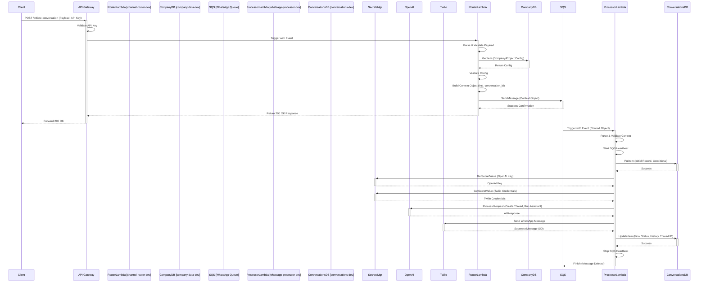
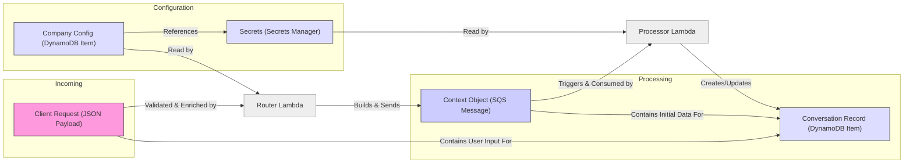

# AI Multi-Communications Engine - HLD Diagrams

This document provides high-level diagrams illustrating the overall architecture and end-to-end flow of the AI Multi-Communications Engine.

## 1. Overall System Architecture

```mermaid
graph TD
    Client[Client Application] -->|1. POST Request (Payload, API Key)| APIGW[API Gateway];
    APIGW -->|2. Validate Key & Trigger| RouterLambda[Router Lambda];
    RouterLambda -->|3. Read Config| CompanyDB[(DynamoDB: Company Config)];
    RouterLambda -->|4. Send Context Object| SQS[SQS Queue];
    SQS -->|5. Trigger| ProcessorLambda[Processor Lambda];
    ProcessorLambda -->|6. Read/Write State| ConversationsDB[(DynamoDB: Conversations)];
    ProcessorLambda -->|7. Read Credentials| SecretsMgr[(Secrets Manager)];
    ProcessorLambda -->|8. Call AI| OpenAI[OpenAI API];
    ProcessorLambda -->|9. Send Message| ChannelAPI[Channel API (e.g., Twilio)];
    ProcessorLambda -->|10. Log Events| CloudWatch[CloudWatch];
    CloudWatch -->|11. Monitor/Alert| Monitoring[Alarms -> SNS];

    style Client fill:#f9f,stroke:#333,stroke-width:2px
    style APIGW fill:#ccf,stroke:#333,stroke-width:2px
    style RouterLambda fill:#ccf,stroke:#333,stroke-width:2px
    style SQS fill:#ccf,stroke:#333,stroke-width:2px
    style ProcessorLambda fill:#ccf,stroke:#333,stroke-width:2px
    style CompanyDB fill:#ddf,stroke:#333,stroke-width:2px
    style ConversationsDB fill:#ddf,stroke:#333,stroke-width:2px
    style SecretsMgr fill:#ddf,stroke:#333,stroke-width:2px
    style CloudWatch fill:#ddf,stroke:#333,stroke-width:2px
    style Monitoring fill:#ddf,stroke:#333,stroke-width:2px
    style OpenAI fill:#cfc,stroke:#333,stroke-width:2px
    style ChannelAPI fill:#cfc,stroke:#333,stroke-width:2px

    subgraph AWS Cloud Infrastructure
        APIGW
        RouterLambda
        CompanyDB
        SQS
        ProcessorLambda
        ConversationsDB
        SecretsMgr
        CloudWatch
        Monitoring
    end

    subgraph External Systems
        Client
        OpenAI
        ChannelAPI
    end
```

## 2. End-to-End Sequence Diagram (Successful WhatsApp Flow)



## 3. Logical Data Model (Key Entities & Relationships)

