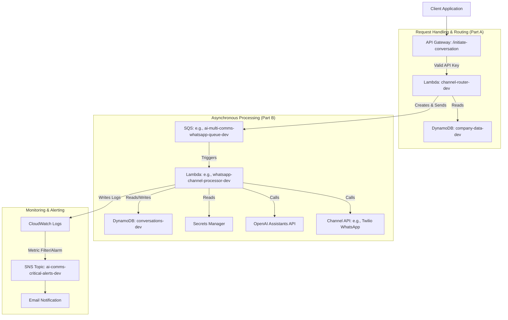

# AI Multi-Communications Engine - High-Level Design (HLD) - v1.0

## 1. Introduction

### 1.1. Purpose
The AI Multi-Communications Engine is a serverless application designed to receive communication requests via a REST API, enrich them with configuration data, process them using AI (specifically OpenAI Assistants), and deliver tailored messages through various communication channels (initially WhatsApp via Twilio). It aims to provide a flexible, scalable, and reliable platform for automated, AI-driven customer interactions.

### 1.2. Scope
This HLD covers the end-to-end flow for the initial implementation focused on the WhatsApp channel within the development (`src_dev`) environment. It includes:
*   API endpoint for initiating conversations.
*   Request validation and routing logic.
*   Configuration management using DynamoDB.
*   Secure credential handling via Secrets Manager.
*   Integration with OpenAI Assistants API.
*   Integration with Twilio API for WhatsApp messaging.
*   Asynchronous processing using SQS.
*   Conversation state management using DynamoDB.
*   Monitoring and alerting using CloudWatch.

### 1.3. Goals
*   **Decoupling:** Separate request reception/routing from channel-specific processing.
*   **Scalability:** Leverage serverless components (API Gateway, Lambda, SQS, DynamoDB) to handle varying loads.
*   **Reliability:** Implement error handling, retries (via SQS), and monitoring for critical failures.
*   **Maintainability:** Modular design with distinct Lambda functions for different responsibilities.
*   **Security:** Use API keys for endpoint authentication and Secrets Manager for sensitive credentials.
*   **Extensibility:** Design allows for adding new communication channels (Email, SMS) with relative ease by adding new Channel Processor Lambdas and SQS queues.

## 2. Architecture Overview

The system follows an event-driven, serverless architecture hosted on AWS.

**Core Components:**

1.  **Client Application:** Any external system capable of making HTTPS POST requests with an API key.
2.  **API Gateway (`ai-multi-comms-dev-api`):** Provides the public HTTPS endpoint (`/initiate-conversation`). Authenticates requests using API Keys associated with Usage Plans. Proxies valid requests to the Channel Router Lambda.
3.  **Channel Router Lambda (`channel-router-dev`):**
    *   Receives requests from API Gateway.
    *   Validates the incoming payload.
    *   Fetches company/project configuration from `company-data-dev` DynamoDB table.
    *   Validates configuration (e.g., project status, allowed channels).
    *   Constructs a standardized `Context Object` containing all necessary data for downstream processing.
    *   Sends the `Context Object` to the appropriate SQS queue based on the requested `channel_method`.
4.  **DynamoDB: `company-data-dev`:** Stores static configuration for companies and projects, including allowed channels, API key references, channel-specific settings (e.g., Twilio numbers), and AI configurations (e.g., Assistant IDs).
5.  **SQS Queues (e.g., `ai-multi-comms-whatsapp-queue-dev`):** Decouple the Channel Router from the Channel Processors. Provide buffering and automatic retry mechanisms. Each channel has its own queue and corresponding Dead Letter Queue (DLQ).
6.  **Channel Processor Lambda (e.g., `whatsapp-channel-processor-dev`):**
    *   Triggered by messages arriving on its associated SQS queue.
    *   Processes the `Context Object`.
    *   Manages SQS message visibility using a heartbeat mechanism for long-running tasks.
    *   Creates/updates conversation state in the `conversations-dev` DynamoDB table (idempotently).
    *   Fetches credentials (OpenAI API key, Twilio SID/Token) from Secrets Manager.
    *   Interacts with the OpenAI Assistants API to generate a response.
    *   Interacts with the specific channel API (e.g., Twilio) to send the message.
    *   Logs execution details and errors to CloudWatch Logs.
7.  **DynamoDB: `conversations-dev`:** Stores the state and history of each conversation, including messages exchanged, status, AI thread IDs, and timestamps.
8.  **AWS Secrets Manager:** Securely stores sensitive credentials like OpenAI API keys and Twilio Account SIDs/Auth Tokens. Accessed by the Channel Processor Lambda using references stored in the `company-data-dev` table.
9.  **External APIs:**
    *   **OpenAI Assistants API:** Used for generating conversational responses.
    *   **Twilio WhatsApp API:** Used for sending messages via WhatsApp.
10. **CloudWatch:** Used for monitoring and alerting.
    *   **Logs:** Collects logs from Lambda functions.
    *   **Metric Filters & Custom Metrics:** Scan logs for specific patterns (e.g., critical errors) and generate metrics.
    *   **Alarms:** Monitor metrics and trigger actions when thresholds are breached.
    *   **SNS Topic (`ai-comms-critical-alerts-dev`):** Receives notifications from CloudWatch Alarms and forwards them to subscribed endpoints (e.g., email).

## 3. Data Flow

1.  Client sends POST request to API Gateway `/initiate-conversation` with payload and `x-api-key`.
2.  API Gateway validates the API key and proxies the request to `channel-router-dev`.
3.  `channel-router-dev` parses, validates payload, fetches config from `company-data-dev`.
4.  If validation passes, `channel-router-dev` builds the `Context Object` (JSON containing original payload, company config, initial conversation data like `conversation_id`).
5.  `channel-router-dev` sends the `Context Object` message to the SQS queue matching the `channel_method` (e.g., WhatsApp queue).
6.  `channel-router-dev` returns a success (HTTP 200) or error response to API Gateway/Client.
7.  SQS triggers the `whatsapp-channel-processor-dev` Lambda with the message.
8.  `whatsapp-channel-processor-dev` parses the `Context Object`.
9.  Starts SQS heartbeat.
10. Creates an initial record in `conversations-dev` (idempotent check on `conversation_id`).
11. Fetches OpenAI and Twilio credentials from Secrets Manager based on references in Context Object.
12. Calls OpenAI API (create/use thread, add message, run assistant, get response).
13. Calls Twilio API to send the WhatsApp message.
14. Updates the record in `conversations-dev` with results (status, message history, thread ID). **Logs CRITICAL if this update fails after send.**
15. Stops SQS heartbeat.
16. Exits successfully (message automatically deleted by SQS) or signals failure (message retried/sent to DLQ).
17. If a critical error was logged, CloudWatch Metric Filter -> Metric -> Alarm -> SNS -> Email notification is triggered.

## 4. Key Design Concepts

*   **Asynchronicity:** SQS decouples the initial request handling from the potentially longer-running AI and channel API interactions, improving API responsiveness and system resilience.
*   **Idempotency:** The Channel Processor Lambda uses conditional writes to DynamoDB based on `conversation_id` to ensure that retried SQS messages do not create duplicate conversation records or process the same request multiple times.
*   **Configuration Driven:** Company/project-specific details (API keys, channel settings, AI assistant IDs) are stored in DynamoDB, allowing runtime configuration without code changes.
*   **Security:** API Gateway handles initial authentication. Secrets Manager handles sensitive credential storage. IAM roles provide least-privilege access for Lambda functions.
*   **Error Handling & Retries:** Standard SQS retry mechanisms and DLQs handle transient failures or malformed messages during processing. Specific critical errors (e.g., post-send DB update failure) trigger explicit CloudWatch alerts.
*   **Monitoring:** CloudWatch provides observability through logs, metrics, and alarms, focusing on critical failure pathways.
*   **Scalability:** All core components are managed AWS serverless services designed for automatic scaling.

## 5. Future Considerations

*   **Adding Channels:** Implement new Channel Processor Lambdas and SQS queues for channels like Email or SMS. Update Channel Router's `sqs_service` to route to new queues.
*   **State Machine:** For more complex workflows, consider replacing the Channel Processor Lambda with an AWS Step Functions state machine.
*   **Rate Limiting:** Implement finer-grained rate limiting if needed (beyond API Gateway Usage Plans), potentially using DynamoDB counters or other strategies within the Lambdas.
*   **CI/CD:** Implement automated deployment pipelines (e.g., using AWS SAM, CloudFormation, CDK, or Serverless Framework).
*   **Advanced Monitoring:** Implement distributed tracing (e.g., AWS X-Ray). 