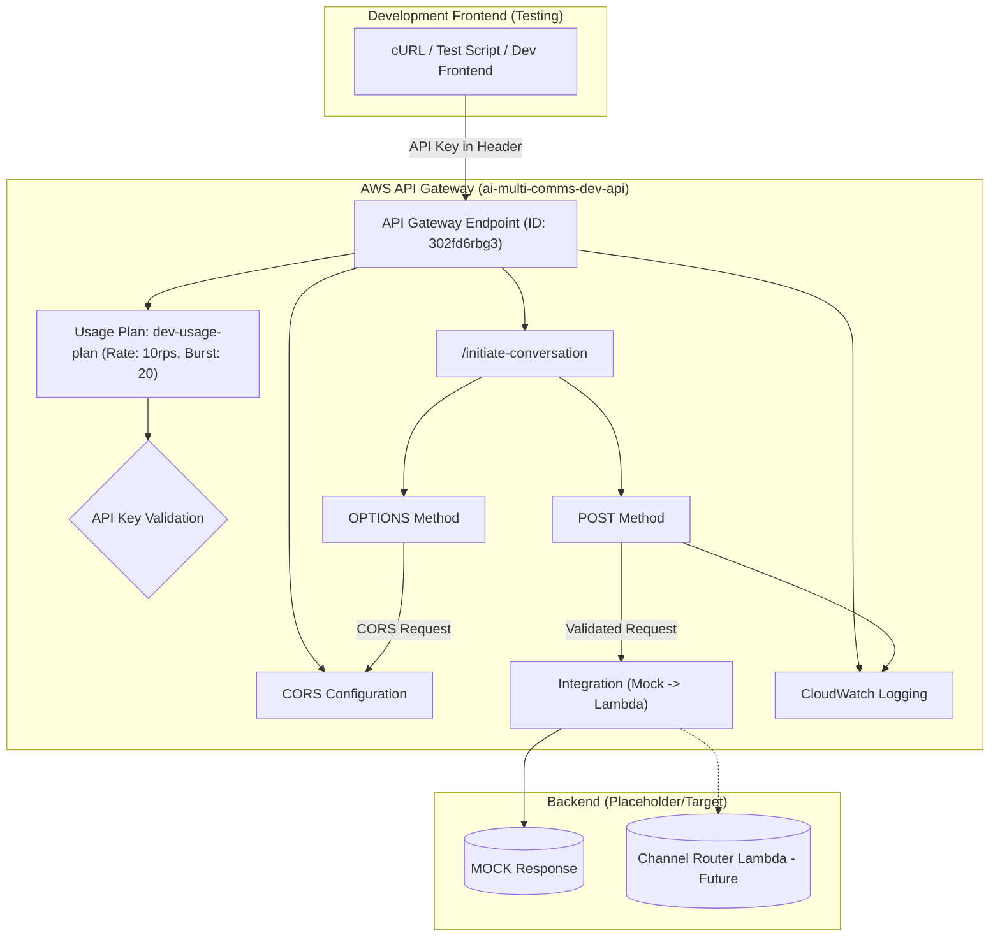

# API Gateway - Low-Level Design (Development Environment)

## 1. Introduction

This document provides a detailed Low-Level Design (LLD) for the API Gateway component configured for the **development environment** (`src_dev`) of the AI Multi-Communications Engine. This API Gateway serves as the primary entry point for frontend applications during the development and testing phase.

Its purpose is to provide a secure, controlled interface for initiating communication workflows, specifically handling requests to the `/initiate-conversation` endpoint.

This configuration was implemented manually using the AWS CLI, deviating from the production IaC approach (CDK) to facilitate hands-on learning and granular control during development.

## 2. Architecture Overview

### 2.1 Component Purpose

The Development API Gateway (`ai-multi-comms-dev-api`) is responsible for:

-   Providing a stable HTTP endpoint for development frontends.
-   Authenticating incoming requests using API Keys managed within API Gateway.
-   Enforcing rate limits via Usage Plans to protect downstream resources.
-   Handling Cross-Origin Resource Sharing (CORS) preflight requests (OPTIONS).
-   Routing validated POST requests to the appropriate backend integration (initially MOCK, later the Channel Router Lambda).
-   Logging request and response details to CloudWatch for monitoring and debugging.

### 2.2 Position in System Architecture (Development)

### 2.3 Technical Implementation

-   **Service**: AWS API Gateway (REST API)
-   **Deployment Method**: AWS CLI (`deploy_api_gateway.sh`)
-   **API Name**: `ai-multi-comms-dev-api`
-   **API ID**: `302fd6rbg3`
-   **Stage**: `dev`
-   **Region**: `eu-north-1` (implicit from cURL example)
-   **Endpoint Type**: REGIONAL

## 3. Detailed Design

### 3.1 API Specification

#### 3.1.1 Resource Path

-   `/initiate-conversation`

#### 3.1.2 Methods

1.  **POST `/initiate-conversation`**
    *   **Purpose**: To receive and process new conversation initiation requests.
    *   **Authorization**: API Key Required (`true`). The key must be associated with the `dev-usage-plan`.
    *   **Request Validator**: Validate body (pending specific schema definition).
    *   **Integration**: 
        *   *Initial*: `MOCK` integration returning a static success response.
        *   *Target*: `AWS_PROXY` integration with the `ChannelRouter` Lambda function.
    *   **API Key Source**: HEADER (expected as `x-api-key`).

2.  **OPTIONS `/initiate-conversation`**
    *   **Purpose**: To handle CORS preflight requests from browsers.
    *   **Authorization**: `NONE`.
    *   **Integration**: `MOCK` integration.
    *   **Method Response**: Status 200.
    *   **Integration Response**: Configured to return necessary CORS headers (`Access-Control-Allow-Headers`, `Access-Control-Allow-Methods`, `Access-Control-Allow-Origin`).

### 3.2 Authentication

-   Authentication is handled solely by API Gateway using API Keys.
-   Requests to the POST method *must* include a valid API key in the `x-api-key` header.
-   The key must be associated with the `dev-usage-plan`.
-   A test key (`test-company-dev`, ID: `cp9r1n0dw0`) was created and associated with the plan.

### 3.3 Usage Plan & Rate Limiting

-   **Plan Name**: `dev-usage-plan`
-   **Plan ID**: `pq2dmx`
-   **Associated Stage**: `ai-multi-comms-dev-api/dev`
-   **Throttling**:
    -   Rate: 10 requests per second
    -   Burst: 20 concurrent requests
-   **Quota**: Disabled (Unlimited requests).

### 3.4 CORS Configuration

-   **`Access-Control-Allow-Methods`**: `'POST,OPTIONS'`
-   **`Access-Control-Allow-Headers`**: `'Content-Type,X-Amz-Date,Authorization,X-Api-Key,X-Amz-Security-Token'`
-   **`Access-Control-Allow-Origin`**: `'*'` (Suitable for development, requires restriction in production).

### 3.5 Logging & Monitoring

-   **CloudWatch Execution Logging**: Enabled for the `dev` stage.
    -   Log Level: `INFO`
    -   Log full request/response data: `true`
-   **Access Logging**: Enabled (using default CloudWatch Logs format).
-   **CloudWatch Metrics**: Enabled (Detailed metrics per resource/method).

### 3.6 Integration Details

#### 3.6.1 Mock Integration (Initial Setup)

-   **Type**: `MOCK`
-   **Purpose**: Allows testing API Gateway configuration (auth, CORS, rate limiting) without a backend Lambda.
-   **Configuration**: Configured via the AWS CLI during initial deployment (`deploy_api_gateway.sh`) to return a static 200 OK response with a predefined JSON body.

#### 3.6.2 Lambda Integration (Target Setup)

-   **Type**: `AWS_PROXY` (Lambda Proxy Integration)
-   **Purpose**: To forward validated requests to the Channel Router Lambda function for processing.
-   **Configuration**: To be updated using AWS CLI (`update_api_gateway_lambda.sh`) once the Lambda function is deployed.

## 4. Deployment & Management

-   **Deployment Tool**: AWS CLI.
-   **Key Scripts**:
    -   `src_dev/docs/api_gateway/deploy_api_gateway.sh`: Initial deployment with MOCK integration.
    -   `src_dev/docs/api_gateway/update_api_gateway_lambda.sh`: Script to switch integration from MOCK to LAMBDA.
-   **Configuration Storage**: Key details (API ID, Key ID, Usage Plan ID) are stored in `src_dev/docs/api_gateway/api_gateway_config.txt` by the deployment script.
-   **Stage Variables**: None defined currently.

## 5. Testing Strategy

-   **Initial Testing (Mock)**:
    -   Uses `curl` commands (examples in `api_gateway_configuration.md`).
    -   Uses the test suite in `src_dev/testing/api_gateway_tests/` (`run_all_tests.sh`) which covers:
        -   CORS (OPTIONS requests).
        -   Authentication (valid/invalid/missing API keys).
        -   Method handling (POST vs other methods).
        -   Content-Type validation.
        -   Basic response validation.
-   **Integration Testing (Lambda)**:
    -   Requires sending valid payloads via `curl` or a test frontend.
    -   Verifying successful invocation of the Channel Router Lambda (via CloudWatch Logs).
    -   Validating the response returned from the Lambda via API Gateway.
    -   Checking that messages arrive in the correct SQS queue.

## 6. Security Considerations

-   **API Keys**: Must be kept confidential. Development keys should not be used in production. Consider rotation.
-   **CORS Origin**: The wildcard `*` origin should be replaced with specific frontend domains in staging/production.
-   **Rate Limiting**: Provides basic protection against DoS/brute-force, but consider AWS WAF for advanced threats.
-   **Input Validation**: While API Gateway can perform basic validation, comprehensive validation should occur in the Channel Router Lambda.
-   **Logging**: Ensure sensitive data is not inadvertently logged if detailed logging remains enabled long-term.

## 7. Future Enhancements (Development Context)

-   Define a formal JSON schema for request body validation within API Gateway.
-   Implement request transformation if needed before hitting the Lambda.
-   Explore custom authorizers if more complex authentication logic is required (unlikely based on current plan). 