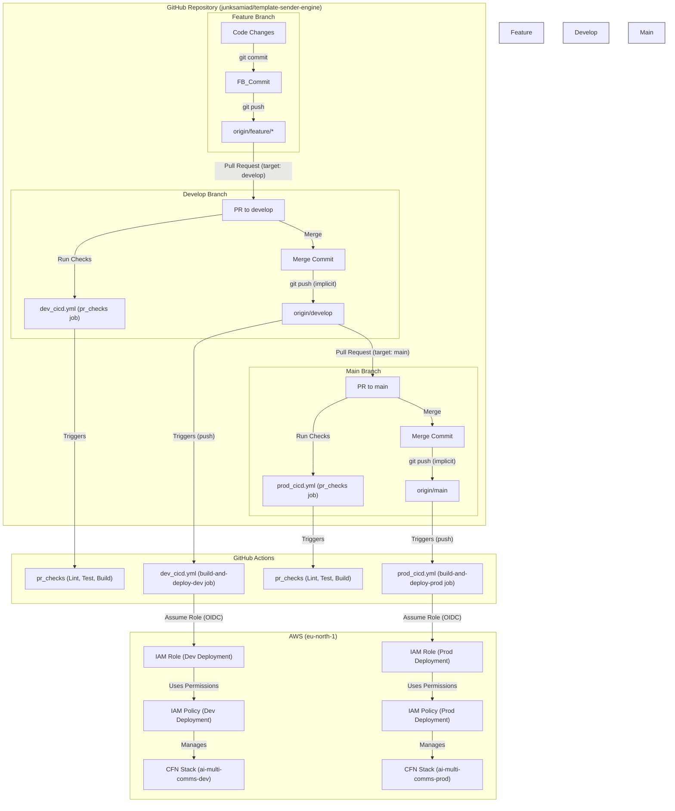

# CI/CD Pipeline - Low-Level Design

## 1. Introduction

This document provides a detailed Low-Level Design (LLD) for the Continuous Integration and Continuous Deployment (CI/CD) pipelines implemented for the AI Multi-Communications Engine project using GitHub Actions.

The pipelines automate the building, testing, and deployment processes for the `dev` and `prod` environments hosted on AWS, triggered by events on the `develop` and `main` branches respectively.

## 2. Architecture Overview

The CI/CD system utilizes GitHub Actions workflows defined in YAML files located in the `.github/workflows/` directory. These workflows interact securely with AWS using OpenID Connect (OIDC) for authentication, assuming specific IAM roles to perform deployment tasks via the AWS SAM CLI.

### 2.1 Branching Strategy Alignment

-   **`develop` Branch:** Represents the integration branch for ongoing development. Pushes to this branch trigger deployment to the **`dev`** AWS environment (`ai-multi-comms-dev` stack). Pull requests targeting `develop` trigger pre-merge checks.
-   **`main` Branch:** Represents the stable, production-ready code. Pushes to this branch (typically after merging from `develop`) trigger deployment to the **`prod`** AWS environment (`ai-multi-comms-prod` stack). Pull requests targeting `main` trigger pre-merge checks.

### 2.2 High-Level Flow

## 3. Detailed Design

### 3.1 GitHub Actions Workflows

Two workflow files define the pipelines:

-   `.github/workflows/dev_cicd.yml`: Handles CI/CD for the `develop` branch and `dev` environment.
-   `.github/workflows/prod_cicd.yml`: Handles CI/CD for the `main` branch and `prod` environment.

#### 3.1.1 Common Structure and Triggers

Both workflows share a similar structure and trigger configuration:

-   **Triggers:**
    -   `on: push: branches: [ develop ]` (for `dev_cicd.yml`) or `[ main ]` (for `prod_cicd.yml`)
    -   `on: pull_request: branches: [ develop ]` (for `dev_cicd.yml`) or `[ main ]` (for `prod_cicd.yml`)
-   **Permissions:** Configured for OIDC (`id-token: write`, `contents: read`).

#### 3.1.2 `pr_checks` Job (Identical in both files)

-   **Purpose:** Runs pre-merge checks on Pull Requests targeting the respective base branch (`develop` or `main`).
-   **Condition:** `if: github.event_name == 'pull_request'`
-   **Steps:**
    1.  `actions/checkout@v4`: Checks out the code from the PR branch.
    2.  `actions/setup-python@v5`: Sets up Python 3.11.
    3.  `Install dependencies`: Runs `pip install -r requirements.txt flake8`.
    4.  `Lint with flake8`: Runs `flake8` based on the `.flake8` configuration file. Excludes `lambda_pkg` directories.
    5.  `Run unit tests`: Sets `PYTHONPATH=$PYTHONPATH:./src_dev` and runs `pytest tests/unit/`.
    6.  `Build SAM application (Check Only)`: Runs `sam build --use-container` to verify the build process.

#### 3.1.3 `build-and-deploy-dev` Job (`dev_cicd.yml`)

-   **Purpose:** Builds and deploys the application to the `dev` environment, then runs integration and E2E tests against the deployed stack.
-   **Condition:** `if: github.event_name == 'push' && github.ref == 'refs/heads/develop'`
-   **Environment:** `environment: dev` (Optional GitHub Environment mapping)
-   **Steps:**
    1.  `actions/checkout@v4`: Checks out the code from the `develop` branch.
    2.  `actions/setup-python@v5`: Sets up Python 3.11.
    3.  `Install dependencies`: Runs `pip install -r requirements.txt`.
    4.  `Configure AWS Credentials`: Uses `aws-actions/configure-aws-credentials@v4` with OIDC.
        -   `role-to-assume`: `arn:aws:iam::337909745089:role/GitHubActions-template-sender-engine-dev`
        -   `aws-region`: `eu-north-1`
    5.  `Build SAM application`: Runs `sam build --use-container`.
    6.  `Deploy SAM application to Dev`: Runs `sam deploy` with:
        -   `--stack-name ai-multi-comms-dev`
        -   `--capabilities CAPABILITY_IAM CAPABILITY_NAMED_IAM`
        -   `--parameter-overrides EnvironmentName=dev LogLevel=DEBUG`
        -   `--no-confirm-changeset`
        -   `--no-fail-on-empty-changeset`
    7.  `Install test dependencies`: Installs `pytest` and `requests`.
    8.  `Get API Gateway Endpoint`: Queries the deployed CloudFormation stack outputs to find the API endpoint URL and exports it as `$GITHUB_ENV.API_ENDPOINT`.
    9.  `Run integration tests`: Executes `pytest tests/integration/`, utilizing the `$API_ENDPOINT` environment variable.
    10. `Run E2E tests`: Executes `pytest tests/e2e/`, utilizing the `$API_ENDPOINT` environment variable.

#### 3.1.4 `build-and-deploy-prod` Job (`prod_cicd.yml`)

-   **Purpose:** Builds and deploys the application to the `prod` environment.
-   **Condition:** `if: github.event_name == 'push' && github.ref == 'refs/heads/main'`
-   **Environment:** `environment: prod` (Optional GitHub Environment mapping)
-   **Steps:** (Similar to dev, but with different targets/parameters)
    1.  `actions/checkout@v4`: Checks out the code from the `main` branch.
    2.  `actions/setup-python@v5`: Sets up Python 3.11.
    3.  `Install dependencies`: Runs `pip install -r requirements.txt`.
    4.  `Configure AWS Credentials`: Uses `aws-actions/configure-aws-credentials@v4` with OIDC.
        -   `role-to-assume`: `arn:aws:iam::337909745089:role/GitHubActions-template-sender-engine-prod`
        -   `aws-region`: `eu-north-1`
    5.  `Build SAM application`: Runs `sam build --use-container`.
    6.  `Deploy SAM application to Prod`: Runs `sam deploy` with:
        -   `--stack-name ai-multi-comms-prod`
        -   `--capabilities CAPABILITY_IAM CAPABILITY_NAMED_IAM`
        -   `--parameter-overrides EnvironmentName=prod LogLevel=INFO`
        -   `--no-confirm-changeset`
        -   `--no-fail-on-empty-changeset`
    *   **Note:** This job does **not** include steps to automatically run integration or E2E tests after deployment.

### 3.2 AWS IAM Configuration (OIDC)

Secure access to AWS is configured using IAM Roles assumed via OIDC.

#### 3.2.1 IAM OIDC Provider

-   **Provider URL:** `https://token.actions.githubusercontent.com`
-   **Audience:** `sts.amazonaws.com`
-   **ARN:** `arn:aws:iam::337909745089:oidc-provider/token.actions.githubusercontent.com`
-   **Purpose:** Establishes trust between the AWS account and GitHub Actions OIDC tokens.

#### 3.2.2 IAM Role (Development Deployment)

-   **Role Name:** `GitHubActions-template-sender-engine-dev`
-   **ARN:** `arn:aws:iam::337909745089:role/GitHubActions-template-sender-engine-dev`
-   **Trust Policy:** Allows `sts:AssumeRoleWithWebIdentity` from the OIDC provider.
    -   **Condition:** `token.actions.githubusercontent.com:sub` uses `StringLike` with value `repo:junksamiad/template-sender-engine:*` (Note: Temporarily broadened from `...:ref:refs/heads/develop` for debugging). **Recommendation:** Revert to the stricter `develop` ref condition.
-   **Attached Permissions Policy:** `GitHubActions-template-sender-engine-dev-Permissions` (v4)

#### 3.2.3 IAM Permissions Policy (Development Deployment)

-   **Policy Name:** `GitHubActions-template-sender-engine-dev-Permissions`
-   **ARN:** `arn:aws:iam::337909745089:policy/GitHubActions-template-sender-engine-dev-Permissions`
-   **Current Default Version:** v4
-   **Purpose:** Grants necessary permissions for `sam deploy` to manage the `dev` stack resources.
-   **Key Permissions Summary:**
    -   CloudFormation (create/describe/execute changesets, manage stacks, etc.)
    -   S3 (manage SAM deployment bucket)
    -   Lambda (manage functions - currently `Resource: "*"`)
    -   API Gateway (`apigateway:*`)
    -   SQS (manage queues matching `ai-multi-comms-*-queue-dev`)
    -   DynamoDB (manage tables matching `ai-multi-comms-dev-*`)
    -   IAM (manage roles/policies matching `ai-multi-comms-dev-*` or `ai-multi-comms-*-role-dev`, `iam:PassRole`)
    -   Secrets Manager (`GetSecretValue`, `DescribeSecret` on `*`)
    -   CloudWatch Logs (manage log groups matching `/aws/lambda/ai-multi-comms-dev-*`)
-   **Note:** Lambda permissions use `Resource: "*"` due to debugging; attempting stricter scoping (`...:function:ai-multi-comms-dev-*`) failed previously.

#### 3.2.4 IAM Role (Production Deployment)

-   **Role Name:** `GitHubActions-template-sender-engine-prod`
-   **ARN:** `arn:aws:iam::337909745089:role/GitHubActions-template-sender-engine-prod`
-   **Trust Policy:** Allows `sts:AssumeRoleWithWebIdentity` from the OIDC provider.
    -   **Condition:** `token.actions.githubusercontent.com:sub` uses `StringLike` with value `repo:junksamiad/template-sender-engine:*` (Note: Temporarily broadened from `...:ref:refs/heads/main` for debugging). **Recommendation:** Revert to the stricter `main` ref condition.
-   **Attached Permissions Policy:** `GitHubActions-template-sender-engine-prod-Permissions` (v2)

#### 3.2.5 IAM Permissions Policy (Production Deployment)

-   **Policy Name:** `GitHubActions-template-sender-engine-prod-Permissions`
-   **ARN:** `arn:aws:iam::337909745089:policy/GitHubActions-template-sender-engine-prod-Permissions`
-   **Current Default Version:** v2
-   **Purpose:** Grants necessary permissions for `sam deploy` to manage the `prod` stack resources.
-   **Key Permissions Summary:** (Similar structure to Dev policy, but scoped to `prod` resources)
    -   CloudFormation (`*`)
    -   S3 (SAM default bucket)
    -   Lambda (`Resource: "*"`)
    -   API Gateway (`*`)
    -   SQS (`...:ai-multi-comms-*-queue-prod`)
    -   DynamoDB (`...:table/ai-multi-comms-prod-*`)
    -   IAM (`...:role/ai-multi-comms-prod-*`, `...:role/ai-multi-comms-*-role-prod`, `iam:PassRole`)
    -   Secrets Manager (`*`)
    -   CloudWatch Logs (`...:log-group:/aws/lambda/ai-multi-comms-prod-*`)
-   **Note:** Lambda permissions use `Resource: "*"` due to debugging; stricter scoping (`...:function:ai-multi-comms-prod-*`) failed previously.

## 4. Deployment Process Flow

### 4.1 Development Environment

1.  Developer creates a feature branch from `develop`.
2.  Developer makes changes and pushes the feature branch to GitHub.
3.  Developer opens a Pull Request targeting `develop`.
4.  The `dev_cicd.yml` workflow triggers the `pr_checks` job (lint, unit tests, build check).
5.  Code is reviewed, and checks must pass.
6.  The Pull Request is merged into `develop`.
7.  The merge causes a push event to `develop`.
8.  The `dev_cicd.yml` workflow triggers the `build-and-deploy-dev` job.
9.  The job builds the SAM application and deploys it to the `ai-multi-comms-dev` stack in AWS.
10. **Post-Deployment:** Integration and E2E tests are automatically executed against the newly deployed `dev` stack.

### 4.2 Production Environment

1.  When `develop` is deemed stable and ready for release, a maintainer opens a Pull Request from `develop` targeting `main`.
2.  The `prod_cicd.yml` workflow triggers the `pr_checks` job (lint, unit tests, build check).
3.  Code changes (diff between `develop` and `main`) are reviewed, and checks must pass.
4.  The Pull Request is merged into `main`.
5.  The merge causes a push event to `main`.
6.  The `prod_cicd.yml` workflow triggers the `build-and-deploy-prod` job.
7.  The job builds the SAM application and deploys it to the `ai-multi-comms-prod` stack in AWS.
8.  **Post-Deployment:** No automated integration or E2E tests are run by this pipeline.

## 5. Future Enhancements

-   **Production Tests:** Consider adding steps to the `prod_cicd.yml` workflow to run integration (`tests/integration/`) and/or E2E tests (`tests/e2e/`) against the deployed `prod` environment, perhaps after a manual approval step.
-   **Stricter IAM Permissions:** Re-evaluate the Lambda permissions (`Resource: "*"`) in the deployment policies and attempt to scope them more tightly if possible (e.g., `arn:aws:lambda:REGION:ACCOUNT:function:STACK_NAME-*`).
-   **Secrets Management:** Consider using GitHub Actions Environments secrets for storing non-AWS secrets or configuration if needed, rather than relying solely on AWS Secrets Manager for deployment-time config.
-   **Manual Approval Step (Prod):** Add a manual approval step in the `prod_cicd.yml` workflow before the deployment to production for an extra layer of control.
-   **Rollback Strategy:** Define a more explicit strategy for handling deployment failures and rollbacks beyond the default CloudFormation behaviour.

## 6. Security Considerations

-   **OIDC:** Using OIDC avoids storing long-lived AWS access keys as GitHub secrets, significantly improving security.
-   **Least Privilege:** The IAM permissions policies attempt to follow least privilege, although compromises were made for Lambda resource scoping during debugging (`Resource: "*"`). These should be reviewed periodically. The roles are separate for `dev` and `prod` deployments.
-   **Trust Policies:** The IAM role trust policies were temporarily broadened (`*:*`) during debugging. **It is strongly recommended to revert these to the stricter conditions** (`repo:junksamiad/template-sender-engine:ref:refs/heads/develop` for dev, `repo:junksamiad/template-sender-engine:ref:refs/heads/main` for prod) to ensure roles can only be assumed from the intended branches.
-   **Pull Request Reviews:** Mandatory PR reviews (enforced via branch protection rules if desired) are crucial before merging code into `develop` or `main`.
-   **Secrets:** Ensure production secrets (Twilio, OpenAI keys) stored in AWS Secrets Manager are correctly configured and secured. 