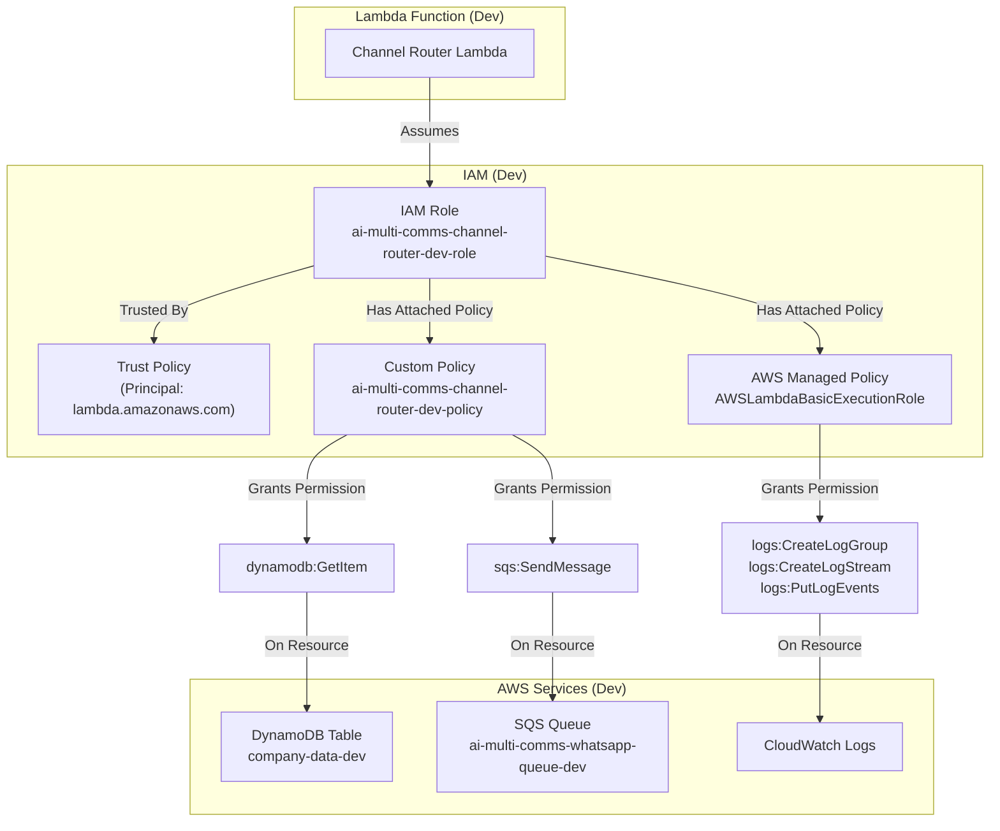

# IAM Role (Channel Router - Dev) - Low-Level Design

## 1. Introduction

This document provides a detailed Low-Level Design (LLD) for the AWS Identity and Access Management (IAM) Role configured for the **Channel Router Lambda function** within the **development environment** (`src_dev`) of the AI Multi-Communications Engine.

This role grants the Channel Router Lambda the necessary permissions to interact with other AWS services (DynamoDB, SQS, CloudWatch Logs) securely, following the principle of least privilege.

This role was implemented manually using the AWS CLI.

## 2. Architecture Overview

### 2.1 Component Purpose

The `ai-multi-comms-channel-router-dev-role` serves as the execution identity for the Channel Router Lambda function. It defines what AWS services and resources the Lambda function is authorized to access when it runs.

Key responsibilities granted by this role:
-   Allow the Lambda service to assume this role.
-   Allow the Lambda to write execution logs to CloudWatch Logs.
-   Allow the Lambda to read configuration data from the `company-data-dev` DynamoDB table.
-   Allow the Lambda to send messages to the `ai-multi-comms-whatsapp-queue-dev` SQS queue.

### 2.2 Position in System Architecture (Development)



### 2.3 Technical Implementation

-   **Service**: AWS Identity and Access Management (IAM)
-   **Deployment Method**: AWS CLI
-   **Role Name**: `ai-multi-comms-channel-router-dev-role`
-   **Role ARN**: `arn:aws:iam::337909745089:role/ai-multi-comms-channel-router-dev-role`
-   **Custom Policy Name**: `ai-multi-comms-channel-router-dev-policy`
-   **Custom Policy ARN**: `arn:aws:iam::337909745089:policy/ai-multi-comms-channel-router-dev-policy` (Current Default Version: v3)

## 3. Detailed Design

### 3.1 Trust Relationship (AssumeRolePolicyDocument)

The role trusts the AWS Lambda service principal (`lambda.amazonaws.com`) to assume it via the `sts:AssumeRole` action.

```json
{
  "Version": "2012-10-17",
  "Statement": [
    {
      "Effect": "Allow",
      "Principal": {
        "Service": "lambda.amazonaws.com"
      },
      "Action": "sts:AssumeRole"
    }
  ]
}
```

### 3.2 Attached Policies

#### 3.2.1 `AWSLambdaBasicExecutionRole` (AWS Managed)

-   **ARN**: `arn:aws:iam::aws:policy/service-role/AWSLambdaBasicExecutionRole`
-   **Purpose**: Grants essential permissions for Lambda functions to write logs to CloudWatch Logs.
    -   `logs:CreateLogGroup`
    -   `logs:CreateLogStream`
    *   `logs:PutLogEvents`

#### 3.2.2 `ai-multi-comms-channel-router-dev-policy` (Custom)

-   **ARN**: `arn:aws:iam::337909745089:policy/ai-multi-comms-channel-router-dev-policy`
-   **Purpose**: Grants specific permissions needed by the Channel Router Lambda.
-   **Policy Document (Version v3)**:
    ```json
    {
        "Version": "2012-10-17",
        "Statement": [
            {
                "Sid": "AllowDynamoDBGetItem",
                "Effect": "Allow",
                "Action": "dynamodb:GetItem",
                "Resource": "arn:aws:dynamodb:eu-north-1:337909745089:table/company-data-dev"
            },
            {
                "Sid": "AllowSQSSendMessage",
                "Effect": "Allow",
                "Action": "sqs:SendMessage",
                "Resource": [
                    "arn:aws:sqs:eu-north-1:337909745089:ai-multi-comms-whatsapp-queue-dev",
                    "arn:aws:sqs:eu-north-1:337909745089:ai-multi-comms-sms-queue-dev",
                    "arn:aws:sqs:eu-north-1:337909745089:ai-multi-comms-email-queue-dev"
                ]
            }
        ]
    }
    ```

## 4. Deployment & Management

-   **Deployment Tool**: AWS CLI
-   **Creation Steps**:
    1.  Role created using `aws iam create-role` with the trust policy.
    2.  `AWSLambdaBasicExecutionRole` attached using `aws iam attach-role-policy`.
    3.  Custom policy defined in JSON and created using `aws iam create-policy`.
    4.  Custom policy attached using `aws iam attach-role-policy`.
-   **Modification**: Permissions can be updated by editing the custom policy (`aws iam create-policy-version`) or attaching/detaching other managed or custom policies.

## 5. Security Considerations

-   **Least Privilege**: The custom policy grants only the necessary `GetItem` and `SendMessage` actions on the specific development resources required *at this stage*.
-   **Resource Specificity**: Permissions are restricted to the specific ARNs of the `company-data-dev` table and the `ai-multi-comms-whatsapp-queue-dev` queue.
-   **Future Permissions**: As development progresses (e.g., adding email/SMS queues, needing Secrets Manager access for downstream credentials), this role's policies will need to be updated accordingly, always adhering to least privilege.

## 6. Future Enhancements (Development Context)

-   Add `sqs:SendMessage` permissions for email and SMS queues when they are created.
-   Add `secretsmanager:GetSecretValue` permission if the Lambda later needs to retrieve secrets referenced in the DynamoDB table (e.g., for OpenAI or Twilio keys used by downstream processors, although the router itself might not need this).
-   Refine DynamoDB permissions if more granular actions (e.g., `Query`) are needed instead of just `GetItem`. 