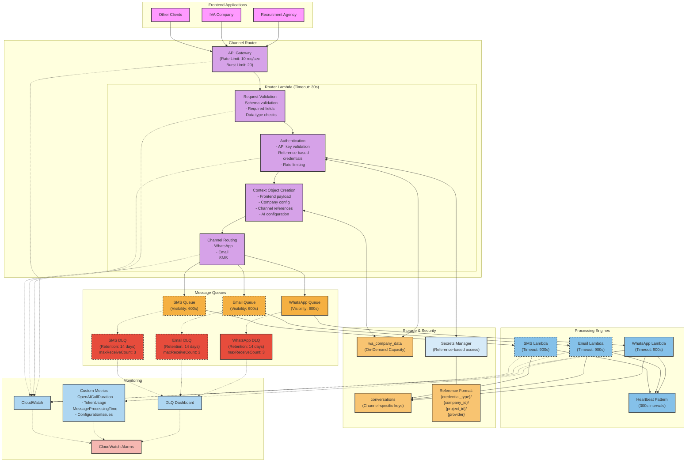
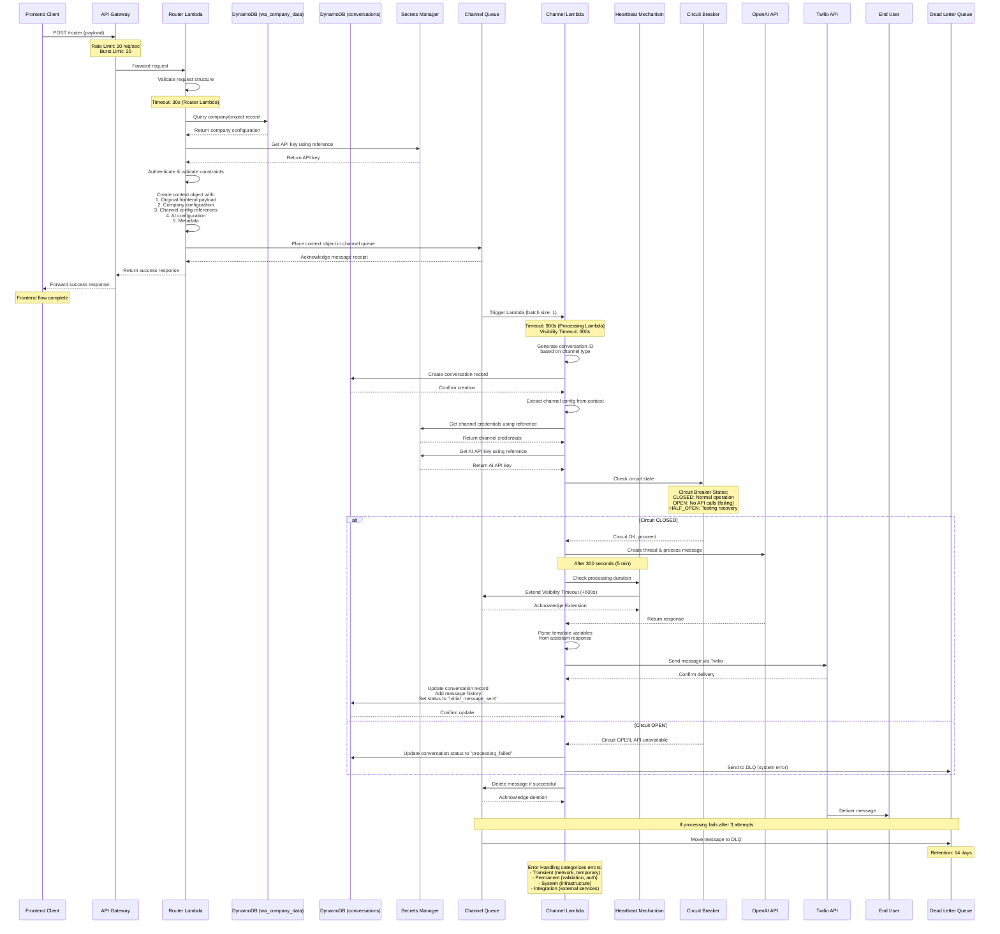
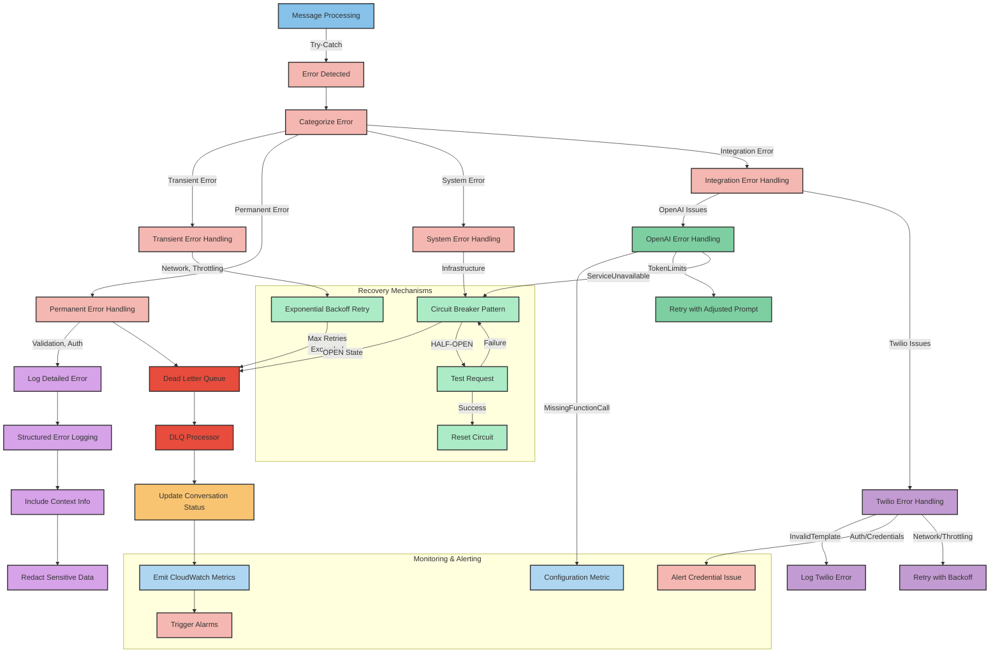
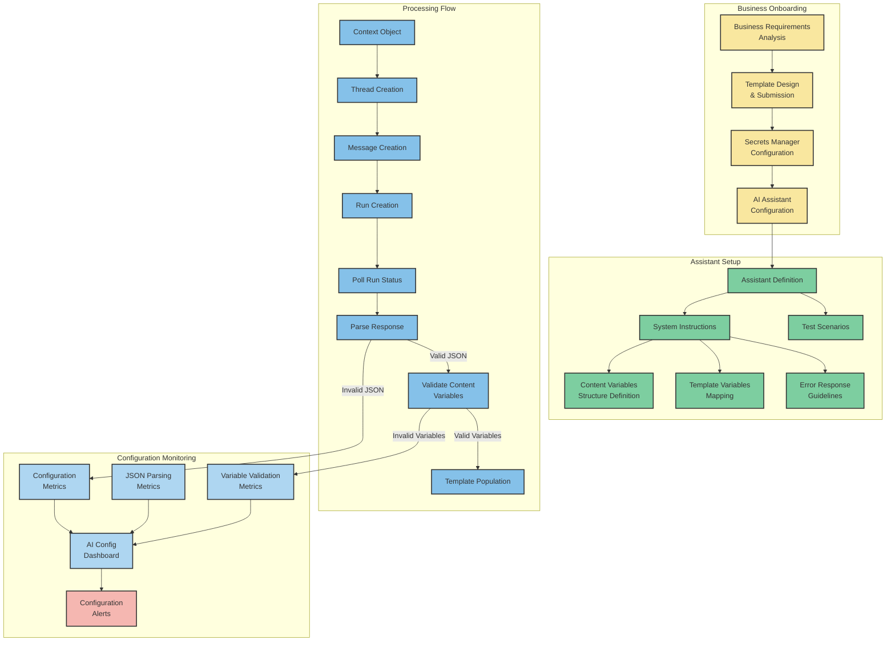
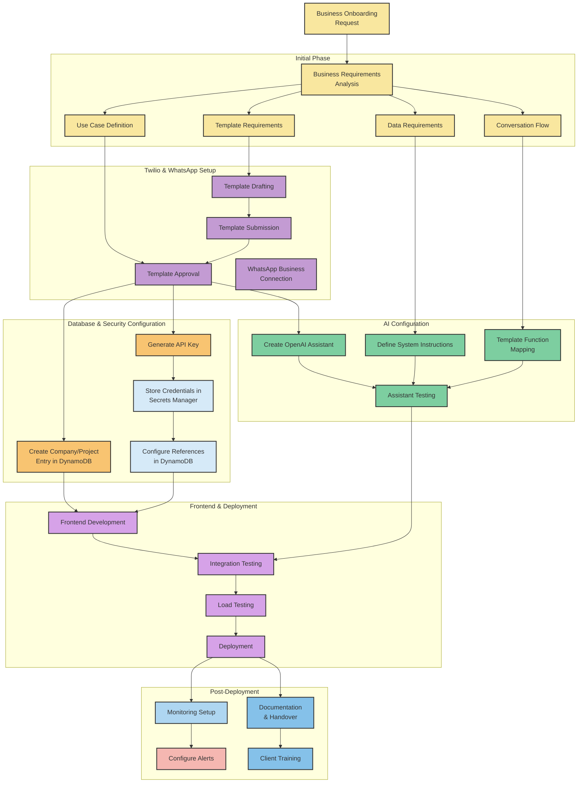

# WhatsApp AI Chatbot - Architecture Diagrams v1.0

This document contains the latest visual representations of the WhatsApp AI chatbot architecture, with updated diagrams that reflect the current implementation of the Channel Router and related components.

## 1. System Overview

```mermaid
graph TD
    FE[Frontend Applications] -->|Send Payload| Router[Channel Router]
    Router -->|Authenticate & Validate| Router
    Router -->|Create Context Object| Router
    Router -->|Place in Queue| Queues[(Message Queues)]
    
    Queues -->|WhatsApp Messages| WhatsAppEngine[WhatsApp Engine]
    Queues -->|Email Messages| EmailEngine[Email Engine]
    Queues -->|SMS Messages| SMSEngine[SMS Engine]
    
    WhatsAppEngine -->|Process Request| Twilio[Twilio API]
    EmailEngine -->|Process Request| EmailSvc[Email Service]
    SMSEngine -->|Process Request| SMSSvc[SMS Service]
    
    WhatsAppEngine -.->|Failed Messages| DLQ[(Dead Letter Queues)]
    EmailEngine -.->|Failed Messages| DLQ
    SMSEngine -.->|Failed Messages| DLQ

    DLQProc[DLQ Processor]
    DLQ --> DLQProc
    
    subgraph "AWS Cloud"
        Router
        Queues
        DLQ
        DLQProc
        WhatsAppEngine
        EmailEngine
        SMSEngine
        
        subgraph "Storage & Security"
            CompanyDB[(DynamoDB<br/>wa_company_data)]
            ConvoDB[(DynamoDB<br/>conversations)]
            SecretsManager[AWS Secrets Manager]
        end
        
        subgraph "External Services Integration"
            OpenAI[OpenAI Assistants API]
            CircuitBreaker[Circuit Breaker]
        end
        
        subgraph "Monitoring"
            CloudWatch[CloudWatch]
            DLQDashboard[DLQ Dashboard]
            AIConfigDashboard[AI Config Dashboard]
            Alarms[CloudWatch Alarms]
        end
        
        Router -->|Query Company/Project| CompanyDB
        Router -->|Get API Key Reference| CompanyDB
        Router -->|Resolve Reference| SecretsManager
        
        WhatsAppEngine -->|Create/Update Conversation| ConvoDB
        WhatsAppEngine -->|Get Credentials References| SecretsManager
        WhatsAppEngine -->|Creates OpenAI Thread| OpenAI
        WhatsAppEngine -->|Manages API Calls| CircuitBreaker
        CircuitBreaker -->|Protected Calls| OpenAI
        OpenAI -->|Structured JSON Response| WhatsAppEngine
        
        SecretsManager -.->|Provide Secrets| WhatsAppEngine
        SecretsManager -.->|Provide Secrets| EmailEngine
        SecretsManager -.->|Provide Secrets| SMSEngine
        
        Router -.->|Logs & Metrics| CloudWatch
        WhatsAppEngine -.->|Logs & Metrics| CloudWatch
        WhatsAppEngine -.->|AI Config Issues| AIConfigDashboard
        EmailEngine -.->|Logs & Metrics| CloudWatch
        SMSEngine -.->|Logs & Metrics| CloudWatch
        
        DLQProc -->|Update Failed Status| ConvoDB
        DLQProc -.->|Metrics| CloudWatch
        DLQ -.->|Monitoring| DLQDashboard
        DLQ -.->|Alerts| Alarms
        AIConfigDashboard -.->|Alerts| Alarms
        Router -.->|Alerts| Alarms
    end
    
    Twilio -->|Send WhatsApp Message| User((End User))
    EmailSvc -->|Send Email| User
    SMSSvc -->|Send SMS| User
    User -->|Reply| Twilio
    
    style FE fill:#f9f,stroke:#333,stroke-width:2px
    style Router fill:#D6A2E8,stroke:#333,stroke-width:2px
    style Queues fill:#F5B041,stroke:#333,stroke-width:2px
    style DLQ fill:#E74C3C,stroke:#333,stroke-width:2px
    style DLQProc fill:#E74C3C,stroke:#333,stroke-width:2px
    style WhatsAppEngine fill:#85C1E9,stroke:#333,stroke-width:2px
    style EmailEngine fill:#85C1E9,stroke:#333,stroke-width:2px,stroke-dasharray: 5 5
    style SMSEngine fill:#85C1E9,stroke:#333,stroke-width:2px,stroke-dasharray: 5 5
    style CompanyDB fill:#F8C471,stroke:#333,stroke-width:2px
    style ConvoDB fill:#F8C471,stroke:#333,stroke-width:2px
    style CircuitBreaker fill:#7DCEA0,stroke:#333,stroke-width:2px
    style OpenAI fill:#7DCEA0,stroke:#333,stroke-width:2px
    style Twilio fill:#C39BD3,stroke:#333,stroke-width:2px
    style EmailSvc fill:#C39BD3,stroke:#333,stroke-width:2px,stroke-dasharray: 5 5
    style SMSSvc fill:#C39BD3,stroke:#333,stroke-width:2px,stroke-dasharray: 5 5
    style User fill:#5D6D7E,stroke:#333,stroke-width:2px,color:#fff
    style CloudWatch fill:#AED6F1,stroke:#333,stroke-width:2px
    style DLQDashboard fill:#AED6F1,stroke:#333,stroke-width:2px
    style AIConfigDashboard fill:#AED6F1,stroke:#333,stroke-width:2px
    style Alarms fill:#F5B7B1,stroke:#333,stroke-width:2px
    style SecretsManager fill:#D6EAF8,stroke:#333,stroke-width:2px
```

## 2. Enhanced Channel Router Architecture

## 3. Context Object Creation and Flow

## 4. Error Handling Strategy

## 5. AI Assistant Configuration and Flow

## 6. Business Onboarding Process

