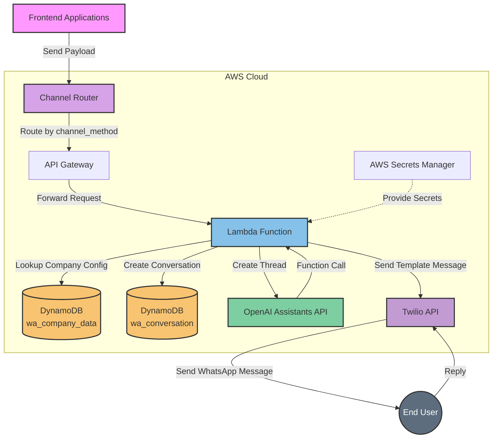
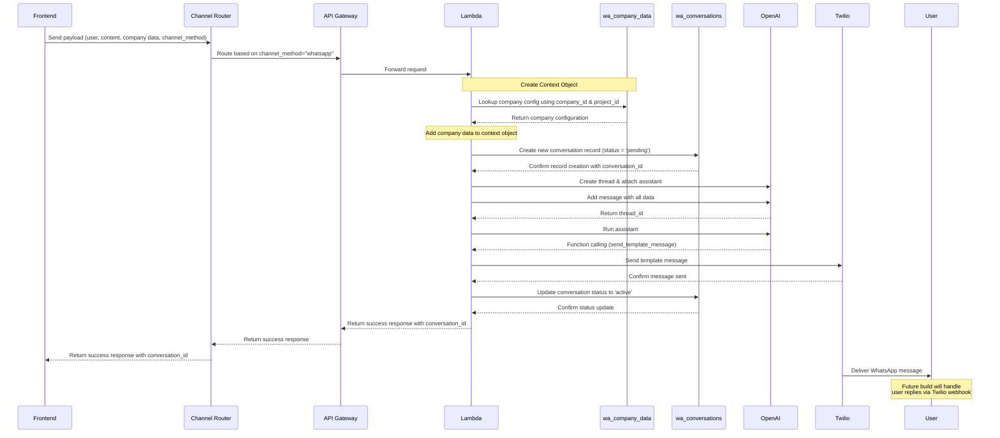
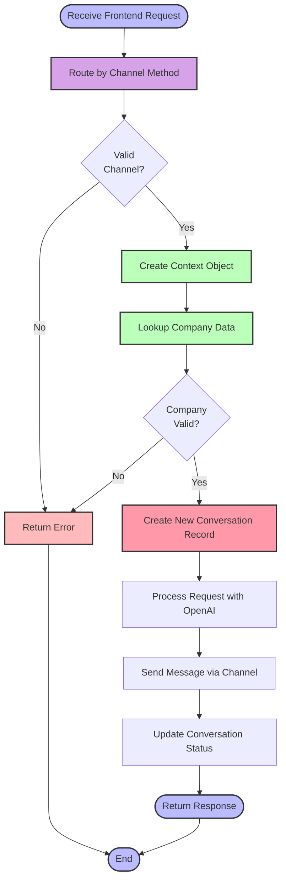
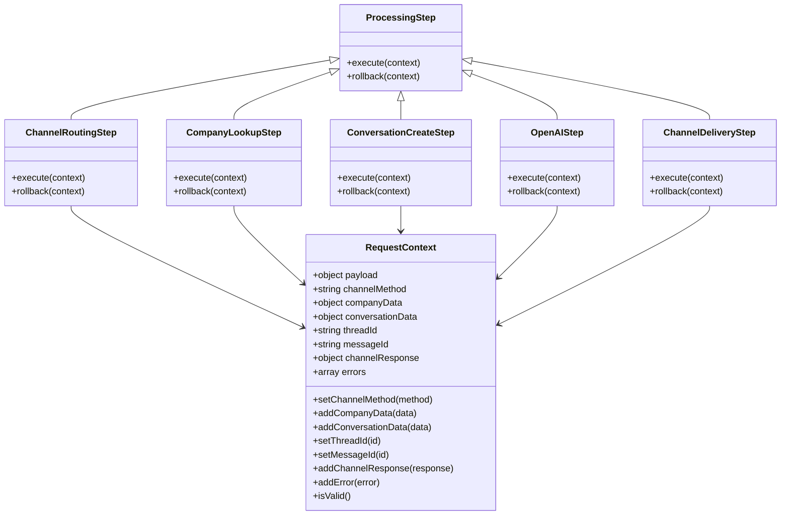
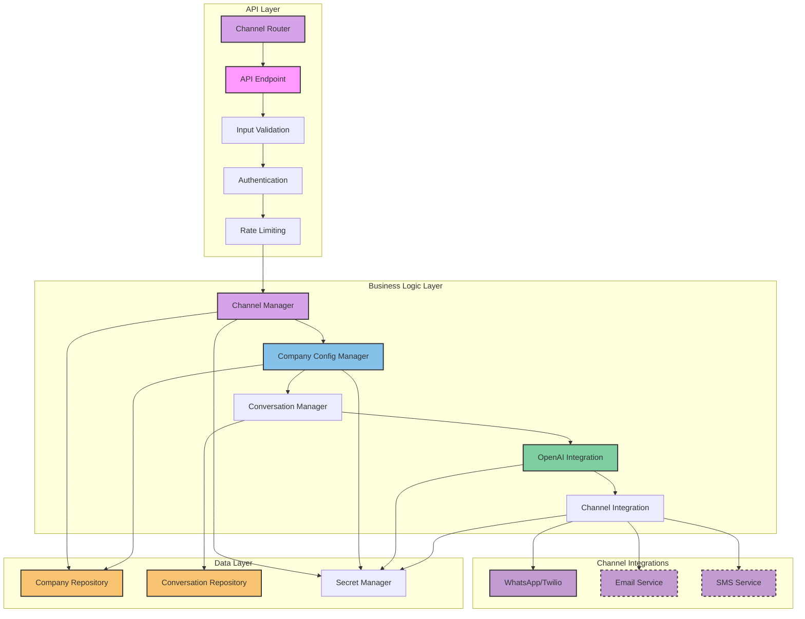
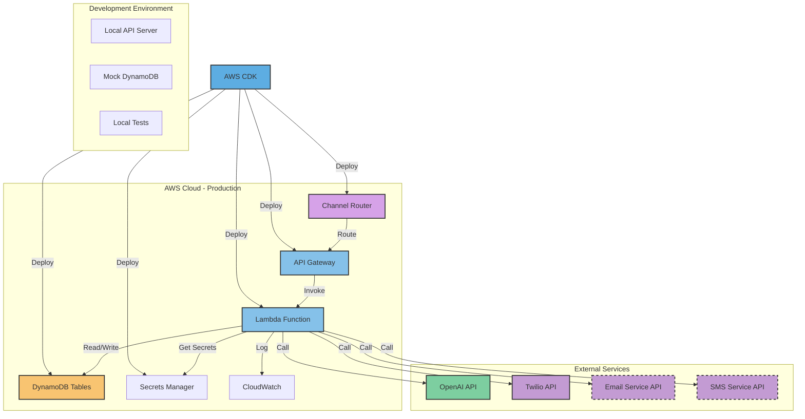
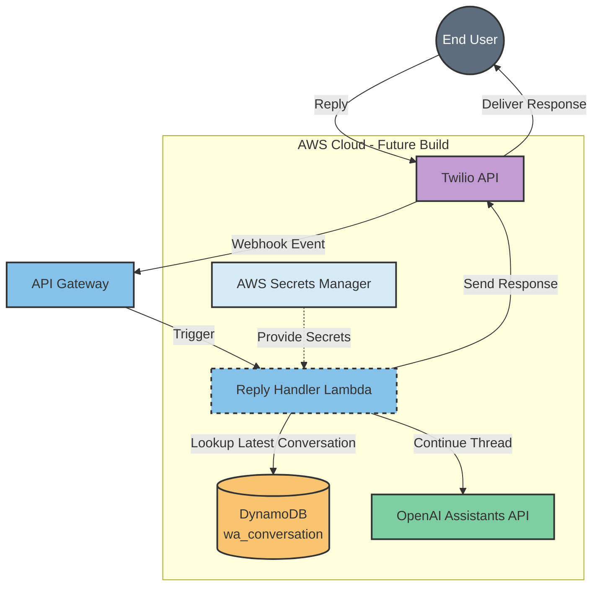

# WhatsApp AI Chatbot Architecture Diagrams

This document contains visual representations of the WhatsApp AI chatbot architecture using Mermaid diagrams.

## System Overview



## Channel Routing Architecture

```mermaid
graph TD
    FE[Frontend Applications] -->|Send Payload| Router[Channel Router]
    
    Router -->|channel_method = "whatsapp"| WhatsAppAPI[WhatsApp API Gateway]
    Router -->|channel_method = "email"| EmailAPI[Email API Gateway]
    Router -->|channel_method = "sms"| SMSAPI[SMS API Gateway]
    
    WhatsAppAPI -->|Forward Request| WhatsAppLambda[WhatsApp Lambda]
    EmailAPI -->|Forward Request| EmailLambda[Email Lambda]
    SMSAPI -->|Forward Request| SMSLambda[SMS Lambda]
    
    subgraph "WhatsApp Implementation"
        WhatsAppLambda -->|Process Request| WhatsAppFlow[WhatsApp Processing Flow]
        WhatsAppFlow -->|Send Message| Twilio[Twilio API]
    end
    
    subgraph "Email Implementation (Future)"
        EmailLambda -->|Process Request| EmailFlow[Email Processing Flow]
        EmailFlow -->|Send Email| EmailService[Email Service]
    end
    
    subgraph "SMS Implementation (Future)"
        SMSLambda -->|Process Request| SMSFlow[SMS Processing Flow]
        SMSFlow -->|Send SMS| SMSService[SMS Service]
    end
    
    Twilio -->|Deliver Message| User((End User))
    EmailService -->|Deliver Email| User
    SMSService -->|Deliver SMS| User
    
    style FE fill:#f9f,stroke:#333,stroke-width:2px
    style Router fill:#D6A2E8,stroke:#333,stroke-width:2px
    style WhatsAppAPI fill:#85C1E9,stroke:#333,stroke-width:2px
    style EmailAPI fill:#85C1E9,stroke:#333,stroke-width:2px,stroke-dasharray: 5 5
    style SMSAPI fill:#85C1E9,stroke:#333,stroke-width:2px,stroke-dasharray: 5 5
    style WhatsAppLambda fill:#85C1E9,stroke:#333,stroke-width:2px
    style EmailLambda fill:#85C1E9,stroke:#333,stroke-width:2px,stroke-dasharray: 5 5
    style SMSLambda fill:#85C1E9,stroke:#333,stroke-width:2px,stroke-dasharray: 5 5
    style EmailService fill:#C39BD3,stroke:#333,stroke-width:2px,stroke-dasharray: 5 5
    style SMSService fill:#C39BD3,stroke:#333,stroke-width:2px,stroke-dasharray: 5 5
    style User fill:#5D6D7E,stroke:#333,stroke-width:2px,color:#fff
```

## Frontend Request Flow



## Simplified Conversation Management Flow



## Context Object Pattern



## Database Schema

```mermaid
erDiagram
    COMPANY_DATA {
        string company_id PK
        string project_id SK
        string company_name
        string project_name
        object openai_config
        object twilio_config
        object email_config
        object sms_config
        object db_secrets
        string created_at
        string updated_at
    }
    
    CONVERSATIONS {
        string phone_number PK
        string conversation_id SK
        string company_id FK
        string project_id FK
        string channel_method
        string company_channel_id
        string account_sid
        string thread_id
        object user_data
        object content_data
        object company_data
        array messages
        string conversation_status
        string last_user_message_at
        string last_system_message_at
        string created_at
        string updated_at
    }
    
    COMPANY_DATA ||--o{ CONVERSATIONS : "has"
```

## Component Architecture



## Deployment Architecture



## Future Reply Handling (Next Build)

