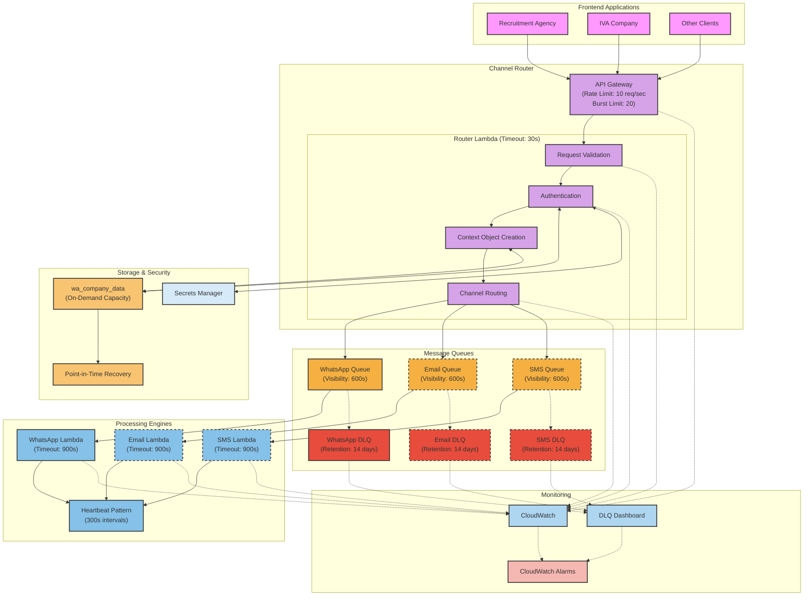
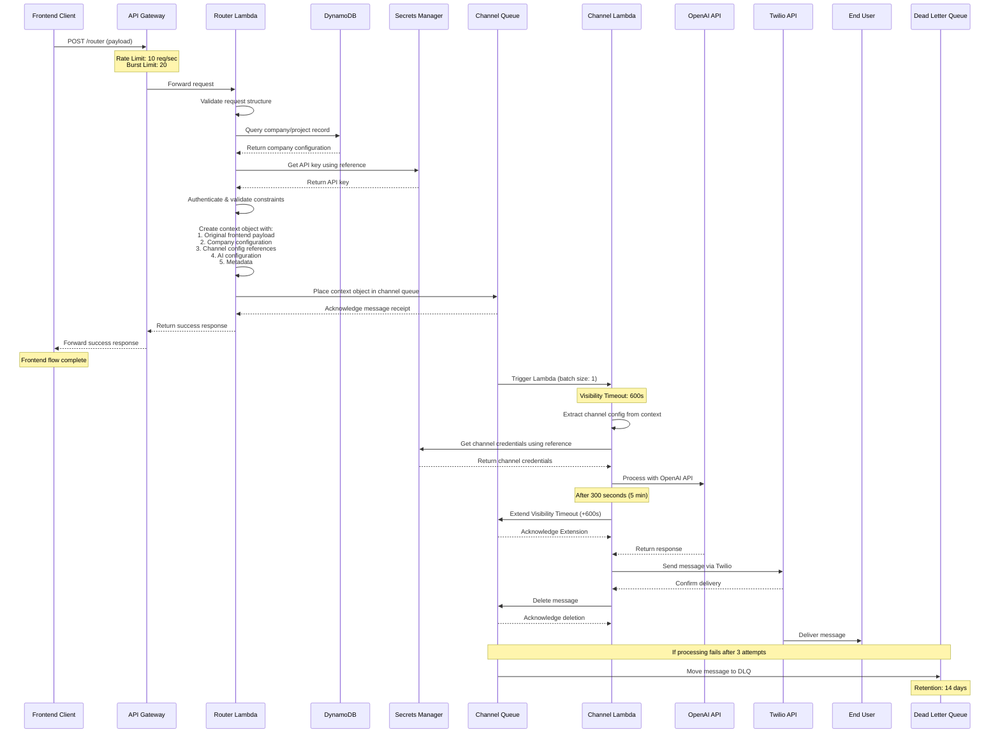
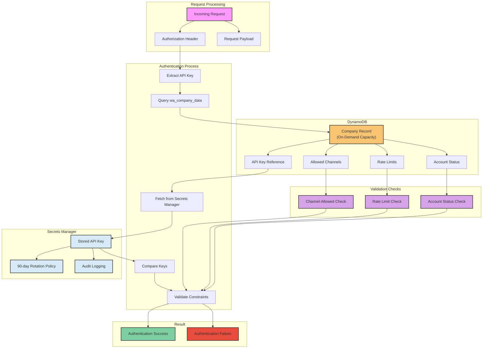
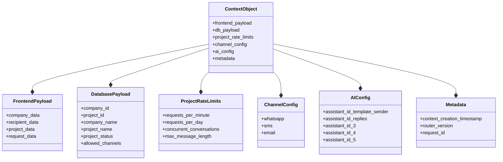
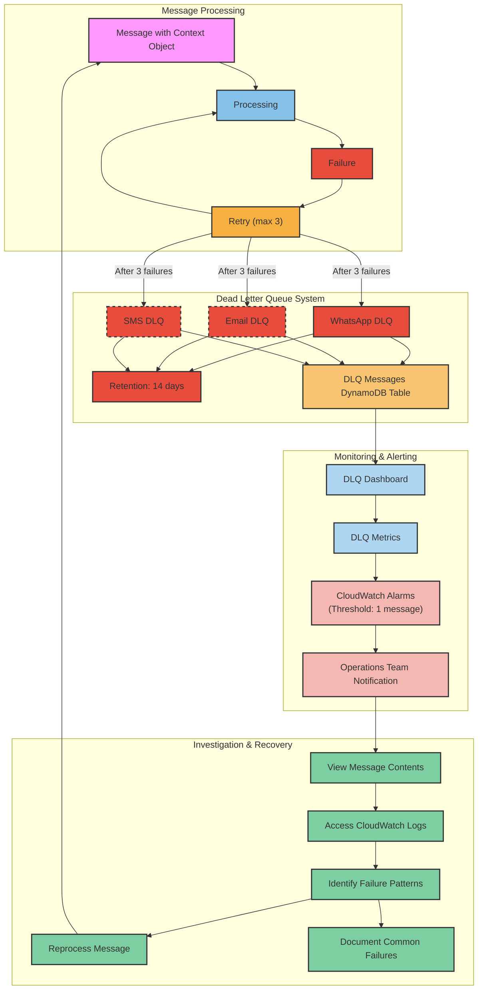
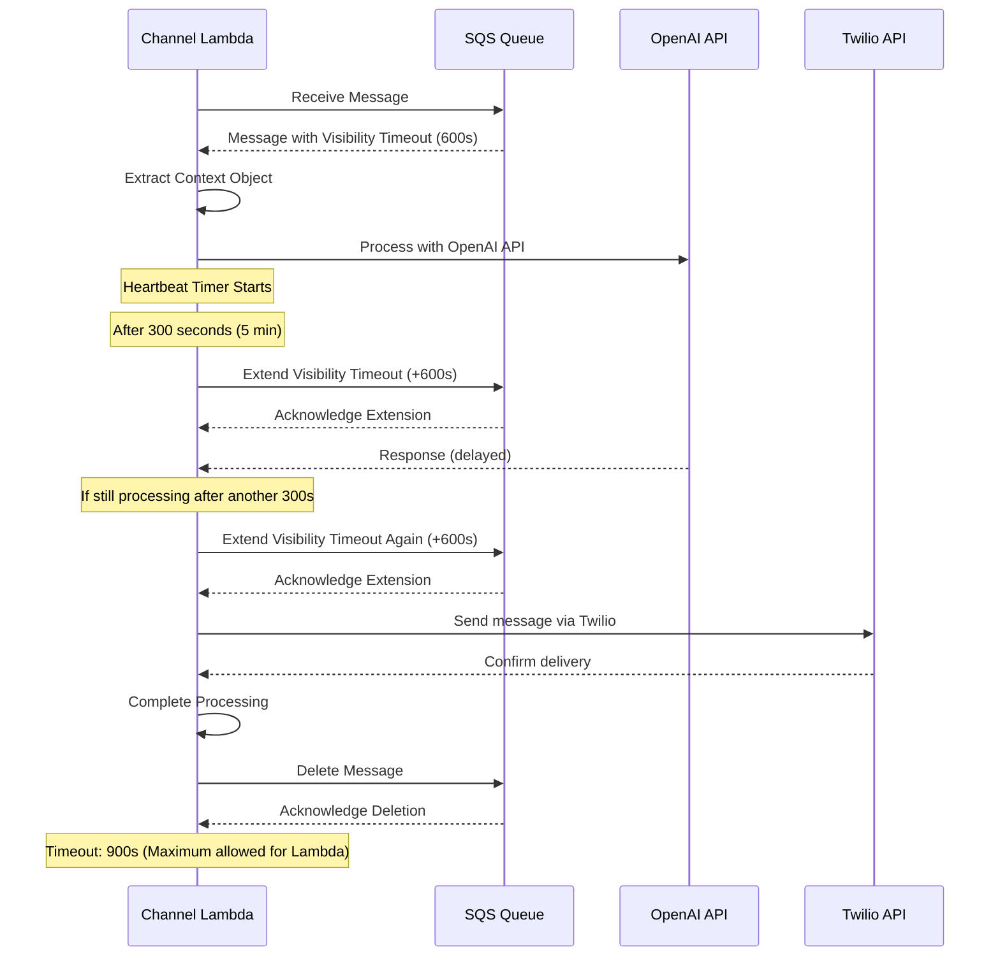

# WhatsApp AI Chatbot - Architecture Diagrams v2.0

This document contains the latest visual representations of the WhatsApp AI chatbot architecture, with updated diagrams that reflect the current implementation of the Channel Router and related components.

## 1. System Overview

```mermaid
graph TD
    FE[Frontend Applications] -->|Send Payload| Router[Channel Router]
    Router -->|Authenticate & Validate| Router
    Router -->|Create Context Object| Router
    Router -->|Place in Queue| Queues[(Message Queues)]
    
    Queues -->|WhatsApp Messages| WhatsAppEngine[WhatsApp Engine]
    Queues -->|Email Messages| EmailEngine[Email Engine]
    Queues -->|SMS Messages| SMSEngine[SMS Engine]
    
    WhatsAppEngine -->|Process Request| Twilio[Twilio API]
    EmailEngine -->|Process Request| EmailSvc[Email Service]
    SMSEngine -->|Process Request| SMSSvc[SMS Service]
    
    WhatsAppEngine -.->|Failed Messages| DLQ[(Dead Letter Queues)]
    EmailEngine -.->|Failed Messages| DLQ
    SMSEngine -.->|Failed Messages| DLQ
    
    subgraph "AWS Cloud"
        Router
        Queues
        DLQ
        WhatsAppEngine
        EmailEngine
        SMSEngine
        
        subgraph "Storage & Security"
            CompanyDB[(DynamoDB<br/>wa_company_data)]
            ConvoDB[(DynamoDB<br/>wa_conversation)]
            MessageProcDB[(DynamoDB<br/>message_processing)]
            DLQDB[(DynamoDB<br/>dlq_messages)]
            SecretsManager[AWS Secrets Manager]
        end
        
        subgraph "External Services Integration"
            OpenAI[OpenAI Assistants API]
        end
        
        subgraph "Monitoring"
            CloudWatch[CloudWatch]
            DLQDashboard[DLQ Dashboard]
            Alarms[CloudWatch Alarms]
        end
        
        Router -->|Query Company/Project| CompanyDB
        Router -->|Get API Key| SecretsManager
        
        WhatsAppEngine -->|Update Conversation| ConvoDB
        WhatsAppEngine -->|Update Processing Status| MessageProcDB
        WhatsAppEngine -->|Create Thread| OpenAI
        OpenAI -->|Function Call| WhatsAppEngine
        
        SecretsManager -.->|Provide Secrets| WhatsAppEngine
        SecretsManager -.->|Provide Secrets| EmailEngine
        SecretsManager -.->|Provide Secrets| SMSEngine
        
        Router -.->|Logs & Metrics| CloudWatch
        WhatsAppEngine -.->|Logs & Metrics| CloudWatch
        EmailEngine -.->|Logs & Metrics| CloudWatch
        SMSEngine -.->|Logs & Metrics| CloudWatch
        
        DLQ -.->|Failed Messages| DLQDB
        DLQ -.->|Monitoring| DLQDashboard
        DLQ -.->|Alerts| Alarms
        Router -.->|Alerts| Alarms
    end
    
    Twilio -->|Send WhatsApp Message| User((End User))
    EmailSvc -->|Send Email| User
    SMSSvc -->|Send SMS| User
    User -->|Reply| Twilio
    
    style FE fill:#f9f,stroke:#333,stroke-width:2px
    style Router fill:#D6A2E8,stroke:#333,stroke-width:2px
    style Queues fill:#F5B041,stroke:#333,stroke-width:2px
    style DLQ fill:#E74C3C,stroke:#333,stroke-width:2px
    style WhatsAppEngine fill:#85C1E9,stroke:#333,stroke-width:2px
    style EmailEngine fill:#85C1E9,stroke:#333,stroke-width:2px,stroke-dasharray: 5 5
    style SMSEngine fill:#85C1E9,stroke:#333,stroke-width:2px,stroke-dasharray: 5 5
    style CompanyDB fill:#F8C471,stroke:#333,stroke-width:2px
    style ConvoDB fill:#F8C471,stroke:#333,stroke-width:2px
    style MessageProcDB fill:#F8C471,stroke:#333,stroke-width:2px
    style DLQDB fill:#F8C471,stroke:#333,stroke-width:2px
    style OpenAI fill:#7DCEA0,stroke:#333,stroke-width:2px
    style Twilio fill:#C39BD3,stroke:#333,stroke-width:2px
    style EmailSvc fill:#C39BD3,stroke:#333,stroke-width:2px,stroke-dasharray: 5 5
    style SMSSvc fill:#C39BD3,stroke:#333,stroke-width:2px,stroke-dasharray: 5 5
    style User fill:#5D6D7E,stroke:#333,stroke-width:2px,color:#fff
    style CloudWatch fill:#AED6F1,stroke:#333,stroke-width:2px
    style DLQDashboard fill:#AED6F1,stroke:#333,stroke-width:2px
    style Alarms fill:#F5B7B1,stroke:#333,stroke-width:2px
    style SecretsManager fill:#D6EAF8,stroke:#333,stroke-width:2px
```



## 2. Enhanced Channel Router Architecture



## 3. Context Object Creation and Flow



## 4. Authentication and Security Flow



## 5. Context Object Structure



## 6. Enhanced DLQ Management System



## 7. Heartbeat Pattern for Long-Running Operations



## 8. Database Schema Overview

```mermaid
erDiagram
    COMPANY_DATA {
        string company_id PK
        string project_id SK
        string company_name
        string project_name
        string api_key_reference
        array allowed_channels
        object rate_limits
        object concurrent_conversations
        string status
        object openai_config
        object channel_config
        string created_at
        string updated_at
    }
    
    CONVERSATIONS {
        string phone_number PK
        string conversation_id SK
        string company_id FK
        string project_id FK
        string channel_method
        string company_channel_id
        string account_sid
        string thread_id
        object user_data
        object content_data
        object company_data
        array messages
        string conversation_status
        string last_user_message_at
        string last_system_message_at
        string created_at
        string updated_at
    }
    
    MESSAGE_PROCESSING {
        string request_id PK
        string channel_method
        string processing_status
        number retry_count
        string company_id FK
        string project_id FK
        object payload
        object error_details
        string created_at
        string updated_at
        string last_processed_at
        string visibility_timeout_expires_at
    }
    
    DLQ_MESSAGES {
        string request_id PK
        string original_queue SK
        string channel_method
        string failure_reason
        number attempt_count
        string company_id FK
        string project_id FK
        object payload
        object error_details
        string created_at
        string first_failure_at
        string last_failure_at
    }
    
    COMPANY_DATA ||--o{ CONVERSATIONS : "has"
    COMPANY_DATA ||--o{ MESSAGE_PROCESSING : "has"
    COMPANY_DATA ||--o{ DLQ_MESSAGES : "has"
``` 