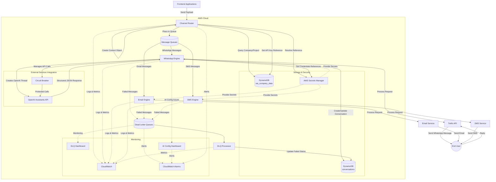
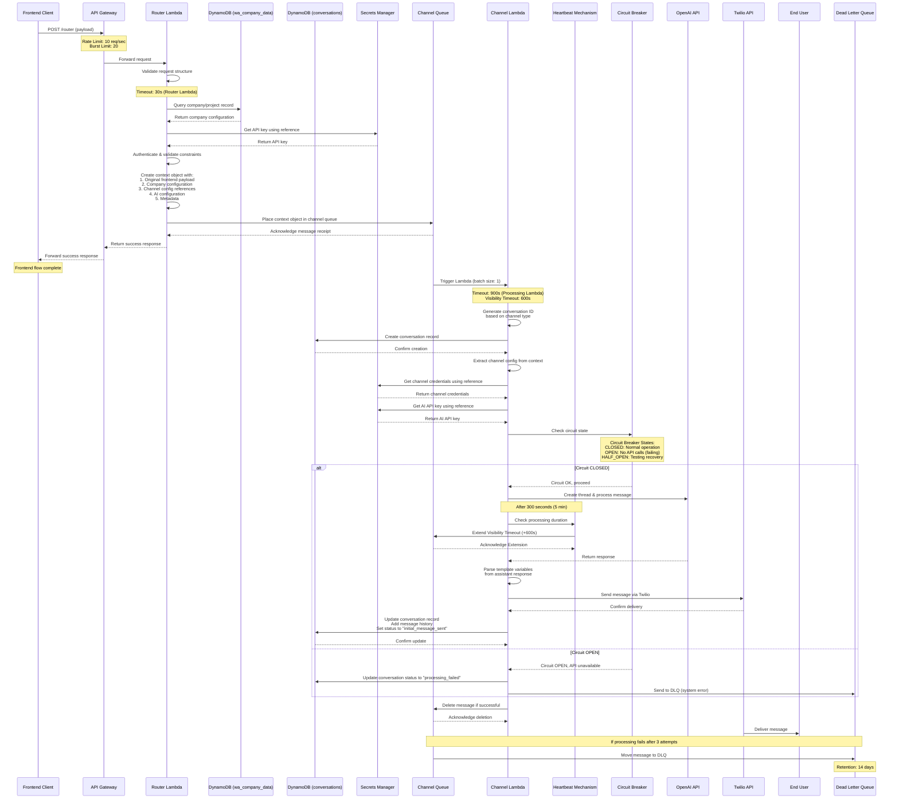
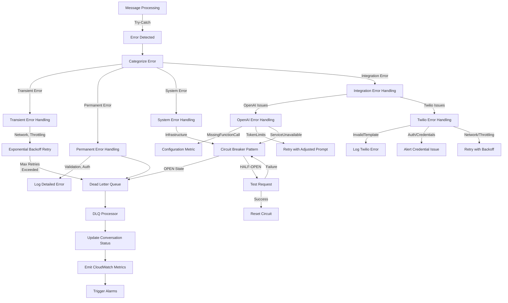
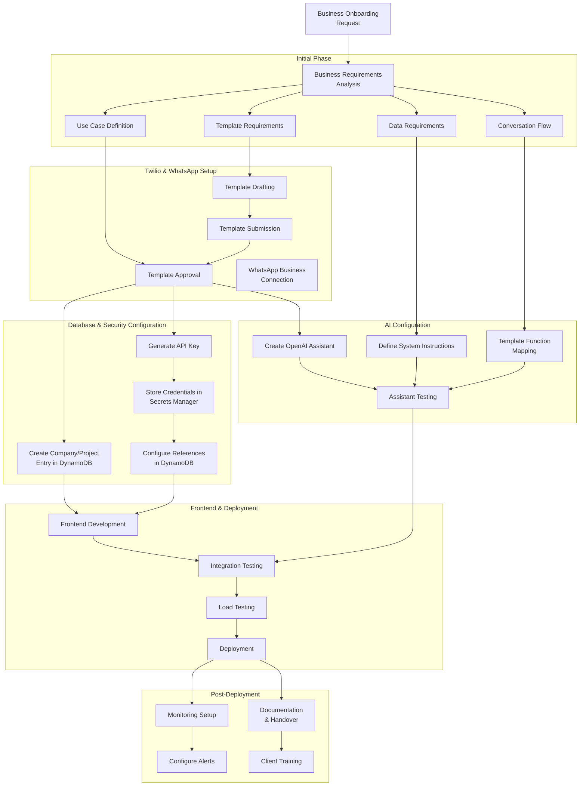

# AI Multi-Communications Engine - High-Level Design v1.0

## 1. Introduction

The AI Multi-Communications Engine is a scalable, cloud-based system designed to enable businesses to send personalized AI-generated messages through multiple communication channels including WhatsApp, Email, and SMS. This document provides a high-level overview of the system architecture, components, data flow, and key features.

The system is built on AWS serverless technologies, with a focus on reliability, security, scalability, and maintainability. It integrates with third-party services such as OpenAI for AI-powered message generation, Twilio for WhatsApp/SMS delivery, and email service providers for email delivery.

## 2. System Purpose and Goals

The AI Multi-Communications Engine serves the following core purposes:

- Allow businesses to send personalized, AI-generated messages across multiple channels
- Support customizable templates and company-specific configurations
- Maintain conversation context for ongoing interactions
- Process and deliver messages reliably, even during service disruptions
- Provide secure credential management for third-party API access
- Monitor system health and provide observability
- Scale automatically based on demand

## 3. High-Level Architecture Overview

## 4. Core Components

The system architecture consists of several core components:

### 4.1 Channel Router

The Channel Router serves as the entry point for all frontend applications, providing a consistent interface regardless of the destination channel. It is responsible for:

- Receiving and validating incoming payloads
- Authenticating API keys against company and project records
- Creating a standardized context object with necessary metadata
- Routing messages to the appropriate channel-specific queue

**Key Technologies**:
- API Gateway for request handling with rate limiting (10 req/sec, 20 burst)
- Lambda function for authentication and routing logic (30s timeout)
- DynamoDB for company/project data retrieval
- AWS Secrets Manager for API key validation
- SQS for message queuing

**Interfaces**:
- Input: JSON payloads from frontend applications
- Output: Context objects placed in channel-specific SQS queues

### 4.2 Message Queues

The system uses separate SQS queues for each supported communication channel:

- WhatsApp Queue
- Email Queue
- SMS Queue

Each queue has an associated Dead Letter Queue (DLQ) for handling failed message processing.

**Key Configurations**:
- Visibility timeout: 600 seconds
- DLQ max receive count: 3
- DLQ retention period: 14 days

### 4.3 Processing Engines

Each channel has a dedicated processing engine implemented as a Lambda function:

#### 4.3.1 WhatsApp Processing Engine
- Consumes messages from the WhatsApp SQS queue
- Creates/updates conversation records in DynamoDB
- Retrieves credentials from AWS Secrets Manager
- Processes messages using OpenAI Assistants API
- Delivers messages via Twilio WhatsApp API
- Implements heartbeat pattern for long-running operations
- Handles errors and manages retries

**Key Technologies**:
- Lambda function with 900s timeout
- Circuit breaker pattern for external API calls
- OpenAI Assistants API for AI-powered message generation
- Twilio API for WhatsApp message delivery

#### 4.3.2 Email Processing Engine
Similar to the WhatsApp engine but optimized for email delivery.

#### 4.3.3 SMS Processing Engine
Similar to the WhatsApp engine but optimized for SMS delivery.

### 4.4 Data Storage

#### 4.4.1 DynamoDB Tables

**wa_company_data Table**:
- Stores company and project configurations
- Contains API key references and channel-specific settings
- Includes rate limits and service constraints

**conversations Table**:
- Stores conversation records for all channels
- Tracks message history and processing status
- Uses channel-specific compound keys for efficient querying
- Maintains OpenAI thread IDs and metadata

#### 4.4.2 AWS Secrets Manager

Stores sensitive credentials using a reference-based approach:
- API keys for frontend authentication
- OpenAI API keys
- Twilio credentials
- Email service credentials
- SMS service credentials

### 4.5 Monitoring & Observability

The system includes comprehensive monitoring and observability features:

- CloudWatch metrics and logs for all components
- Custom dashboards for system health monitoring
- Dead Letter Queue monitoring
- AI configuration monitoring
- CloudWatch alarms for critical issues
- Structured error logging

## 5. Key Processing Flows

### 5.1 Message Processing Flow

### 5.2 Context Object Flow

The Context Object serves as the standardized data structure passed between system components:

1. **Creation**: Generated by Channel Router based on frontend payload and company config
2. **Enrichment**: Channel-specific configurations added
3. **Queue Placement**: Placed in appropriate channel queue
4. **Processing**: Processed by channel engines
5. **Persistence**: Key elements stored in conversation record

### 5.3 Error Handling Strategy

## 6. Security Architecture

The system implements multiple layers of security:

### 6.1 Authentication
- API key-based authentication for frontend applications
- Reference-based credential management
- API Gateway authorization

### 6.2 Secure Credential Management
- AWS Secrets Manager for all sensitive credentials
- No credentials stored in code or environment variables
- Reference-based credential retrieval

### 6.3 Data Security
- Data encryption in transit (HTTPS, TLS)
- Data encryption at rest (DynamoDB encryption)
- IAM role-based access control
- Least privilege principle applied to all components

### 6.4 Network Security
- VPC for network isolation
- Security groups for network access control
- Private subnets for sensitive components

## 7. Scalability and Performance

The system is designed to scale efficiently under varying loads:

### 7.1 Automatic Scaling
- Serverless architecture adapts to demand
- SQS queues buffer incoming requests
- Lambda concurrency controls prevent overwhelming downstream services

### 7.2 Performance Optimizations
- Asynchronous processing model
- Efficient DynamoDB access patterns
- Circuit breaker pattern for external services
- Heartbeat pattern for long-running operations

### 7.3 Limitations and Constraints
- API Gateway rate limits: 10 req/sec, 20 burst
- Lambda timeouts: 30s (Router), 900s (Processing)
- SQS visibility timeout: 600s
- Lambda memory: 1024 MB
- Configurable per-client rate limits (planned)

## 8. System Integration Points

### 8.1 Frontend Integration
- REST API endpoint for message submission
- JSON payload specification
- API key authentication
- Immediate acknowledgment response

### 8.2 OpenAI Integration
- Assistants API for message processing
- Thread-based conversation management
- Structured JSON response format
- Error handling and circuit breaking

### 8.3 Twilio Integration
- WhatsApp Business API
- Template message support
- Message delivery confirmation
- Dynamic variable substitution

### 8.4 Email Service Integration
Supports integration with email service providers.

### 8.5 SMS Service Integration
Supports integration with SMS service providers.

## 9. Business Onboarding Process

## 10. Monitoring and Observability

### 10.1 CloudWatch Dashboards

The system includes the following CloudWatch dashboards:

1. **Main System Dashboard**:
   - Overall system health
   - Component status
   - Processing volumes
   - Error rates

2. **Channel Router Dashboard**:
   - Incoming request volume
   - Authentication failures
   - Queue placement success/failure
   - Processing times

3. **Processing Engine Dashboards**:
   - Queue consumption rates
   - Processing success/failure
   - External API call statistics
   - Processing durations

4. **DLQ Dashboard**:
   - Queue depths
   - Message age distribution
   - Failure categories
   - Reprocessing status

5. **AI Configuration Dashboard**:
   - OpenAI API success/failure
   - Token usage
   - Response structure issues
   - Assistant configuration problems

### 10.2 Alarms and Notifications

Critical alarms are configured for:
- Processing failures exceeding thresholds
- DLQ depth exceeding thresholds
- API authentication failures
- External service degradation
- Lambda errors and timeouts

### 10.3 Logging Strategy

The system implements structured logging with:
- Consistent JSON format
- Request ID for cross-component tracing
- Error categorization and codes
- Log levels (DEBUG, INFO, WARN, ERROR)
- Sensitive data redaction

## 11. Future Enhancements

Planned enhancements for future versions include:

1. **Additional Channels**:
   - Facebook Messenger integration
   - Instagram messaging
   - Custom web chat

2. **Enhanced AI Features**:
   - Sentiment analysis
   - Language translation
   - Conversational context awareness
   - Multi-step conversation flows

3. **Operational Improvements**:
   - Automated DLQ processing
   - Enhanced monitoring dashboards
   - Cost optimization
   - Per-client rate limiting

4. **Business Features**:
   - Business analytics dashboard
   - Conversation insights
   - Custom template libraries
   - A/B testing for message templates

## 12. LLD Documentation Reference

This HLD document provides a high-level overview of the system. For detailed component-specific information, refer to the following Low-Level Design documentation:

### 12.1 Channel Router
- [Channel Router Documentation](../lld/channel-router/channel-router-documentation-v1.0.md)
- [Channel Router Diagrams](../lld/channel-router/channel-router-diagrams-v1.0.md)
- [Error Handling](../lld/channel-router/error-handling-v1.0.md)
- [Message Queue Architecture](../lld/channel-router/message-queue-architecture-v1.0.md)

### 12.2 Context Object
- [Context Object Schema](../lld/context-object/context-object-v1.0.md)

### 12.3 Database
- [Conversations DB Schema](../lld/db/conversations-db-schema-v1.0.md)
- [wa_company_data DB Schema](../lld/db/wa-company-data-db-schema-v1.0.md)

### 12.4 Secrets Manager
- [AWS Referencing](../lld/secrets-manager/aws-referencing-v1.0.md)

### 12.5 Frontend
- [Frontend Documentation](../lld/frontend/frontend-documentation-v1.0.md)

### 12.6 WhatsApp Processing Engine
- [Overview and Architecture](../lld/processing-engines/whatsapp/01-overview-architecture.md)
- [SQS Integration](../lld/processing-engines/whatsapp/02-sqs-integration.md)
- [Conversation Management](../lld/processing-engines/whatsapp/03-conversation-management.md)
- [Credential Management](../lld/processing-engines/whatsapp/04-credential-management.md)
- [OpenAI Integration](../lld/processing-engines/whatsapp/05-openai-integration.md)
- [Twilio Processing and Final DB Update](../lld/processing-engines/whatsapp/06-twilio-processing-and-final-db-update.md)
- [Error Handling Strategy](../lld/processing-engines/whatsapp/07-error-handling-strategy.md)
- [Monitoring and Observability](../lld/processing-engines/whatsapp/08-monitoring-observability.md)
- [Business Onboarding](../lld/processing-engines/whatsapp/09-business-onboarding.md)

### 12.7 Monitoring
- [CloudWatch Dashboard Setup](../lld/cloudwatch-dashboard/cloudwatch-dashboard-setup-v1.0.md) 