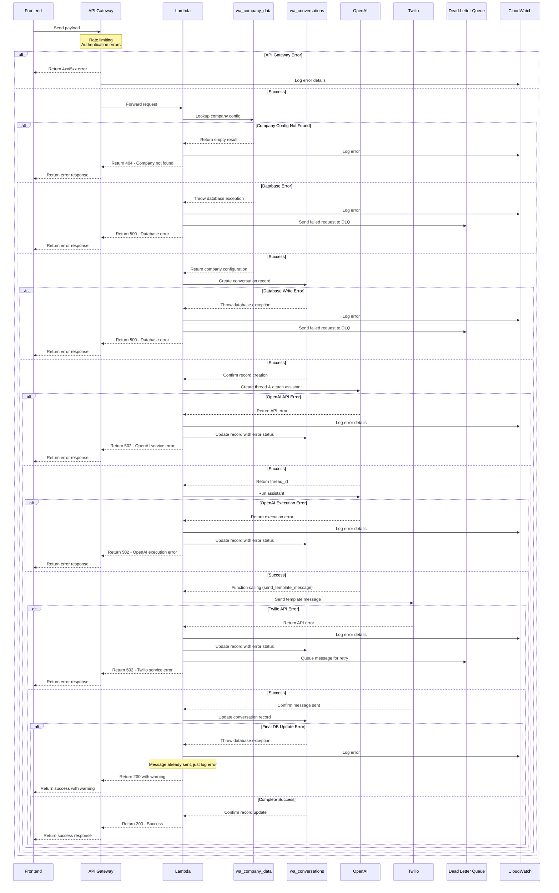
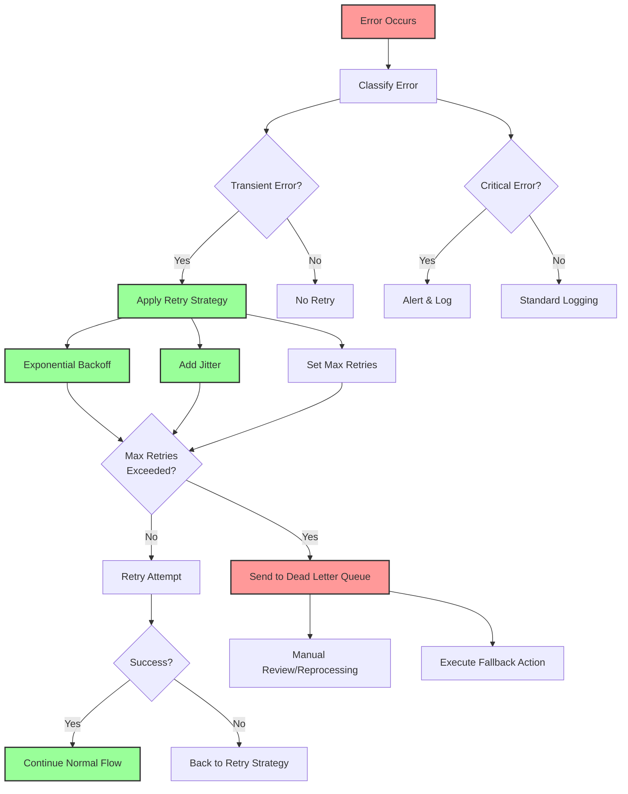
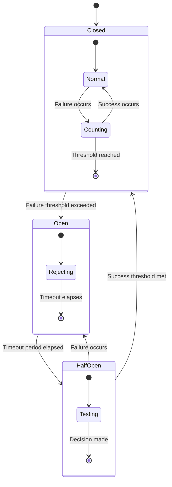
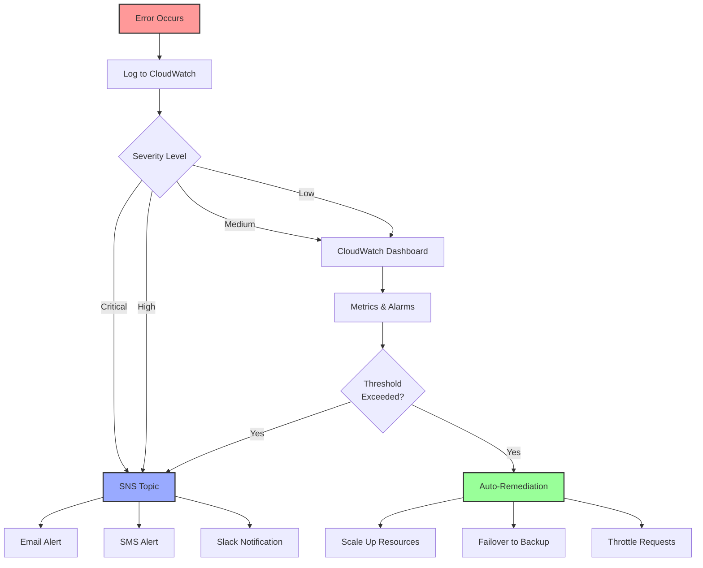

# Error Handling Strategies for WhatsApp AI Chatbot

This document outlines error handling strategies for different components of the WhatsApp AI chatbot system.

## Error Handling Flow Diagram

## Error Handling Strategy by Component

```mermaid
graph TD
    subgraph "API Gateway Errors"
        RateLimit[Rate Limiting Exceeded]
        AuthError[Authentication Failure]
        BadRequest[Malformed Request]
    end
    
    subgraph "Lambda Function Errors"
        Timeout[Lambda Timeout]
        MemoryExceeded[Memory Limit Exceeded]
        CodeError[Code Exception]
    end
    
    subgraph "DynamoDB Errors"
        ProvisionedThroughput[Throughput Exceeded]
        ConditionalCheckFailed[Conditional Check Failed]
        ItemSizeTooLarge[Item Size Too Large]
    end
    
    subgraph "OpenAI API Errors"
        RateLimitExceeded[Rate Limit Exceeded]
        InvalidRequest[Invalid Request]
        ModelOverloaded[Model Overloaded]
    end
    
    subgraph "Twilio API Errors"
        InvalidNumber[Invalid Phone Number]
        TemplateMismatch[Template Parameter Mismatch]
        AccountIssue[Account/Billing Issue]
    end
    
    RateLimit -->|429 Response| RetryWithBackoff[Retry with Exponential Backoff]
    AuthError -->|401 Response| LogAndAlert[Log Error & Alert Admin]
    BadRequest -->|400 Response| ValidateRequest[Validate Request Schema]
    
    Timeout -->|Monitor| AdjustTimeout[Adjust Timeout Settings]
    MemoryExceeded -->|Monitor| IncreaseMemory[Increase Memory Allocation]
    CodeError -->|Try/Catch| FallbackBehavior[Implement Fallback Behavior]
    
    ProvisionedThroughput -->|Retry| AutoScaling[Enable Auto Scaling]
    ConditionalCheckFailed -->|Handle| RetryLogic[Implement Retry Logic]
    ItemSizeTooLarge -->|Redesign| SplitItems[Split Large Items]
    
    RateLimitExceeded -->|Queue| TokenBucket[Implement Token Bucket]
    InvalidRequest -->|Validate| RequestValidation[Validate Before Sending]
    ModelOverloaded -->|Fallback| SimplerModel[Use Simpler Model]
    
    InvalidNumber -->|Validate| NumberValidation[Validate Phone Numbers]
    TemplateMismatch -->|Check| TemplateValidation[Validate Template Parameters]
    AccountIssue -->|Monitor| AccountAlerts[Set Up Account Alerts]
    
    style RetryWithBackoff fill:#f9a,stroke:#333,stroke-width:2px
    style LogAndAlert fill:#f9a,stroke:#333,stroke-width:2px
    style ValidateRequest fill:#f9a,stroke:#333,stroke-width:2px
    style AdjustTimeout fill:#aaf,stroke:#333,stroke-width:2px
    style IncreaseMemory fill:#aaf,stroke:#333,stroke-width:2px
    style FallbackBehavior fill:#aaf,stroke:#333,stroke-width:2px
    style AutoScaling fill:#afa,stroke:#333,stroke-width:2px
    style RetryLogic fill:#afa,stroke:#333,stroke-width:2px
    style SplitItems fill:#afa,stroke:#333,stroke-width:2px
    style TokenBucket fill:#faa,stroke:#333,stroke-width:2px
    style RequestValidation fill:#faa,stroke:#333,stroke-width:2px
    style SimplerModel fill:#faa,stroke:#333,stroke-width:2px
    style NumberValidation fill:#aff,stroke:#333,stroke-width:2px
    style TemplateValidation fill:#aff,stroke:#333,stroke-width:2px
    style AccountAlerts fill:#aff,stroke:#333,stroke-width:2px
```

## Retry Strategy

## Circuit Breaker Pattern for External Services

## Error Monitoring and Alerting

