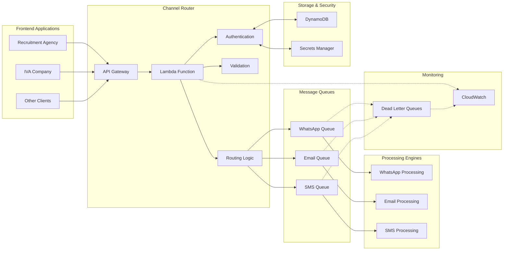
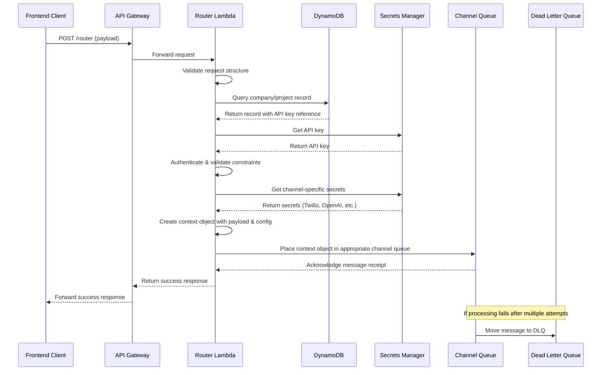
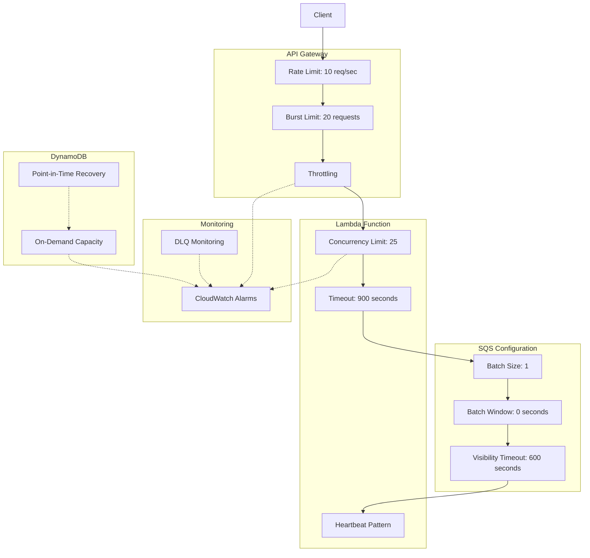
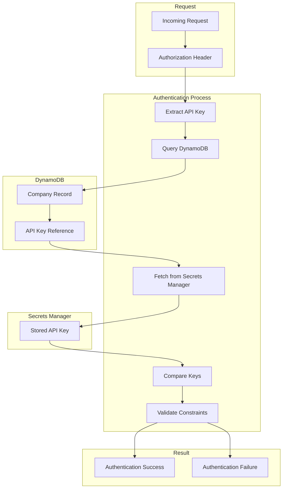
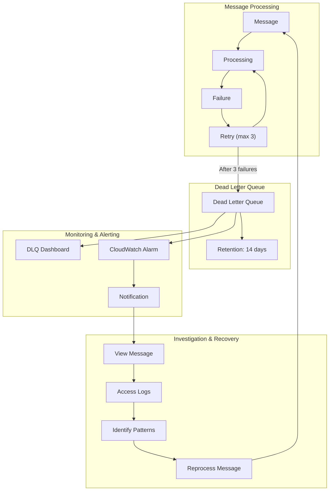
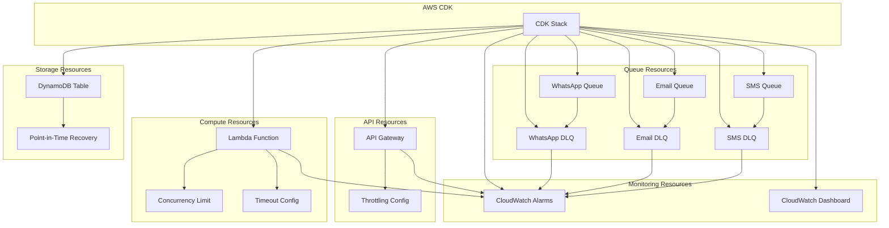
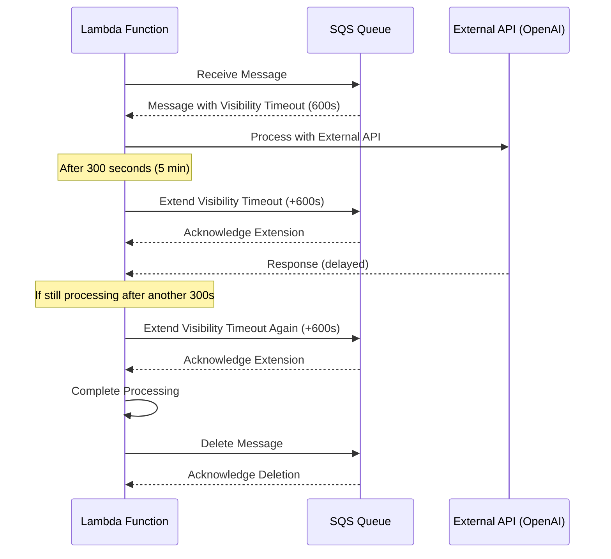

# Channel Router - Architecture Diagrams

## 1. High-Level Architecture

## 2. Request Flow Sequence

## 3. Rate Limiting & Concurrency Architecture

## 4. Authentication Flow

## 5. Dead Letter Queue Management

## 6. Infrastructure Deployment

## 7. Heartbeat Pattern Implementation

