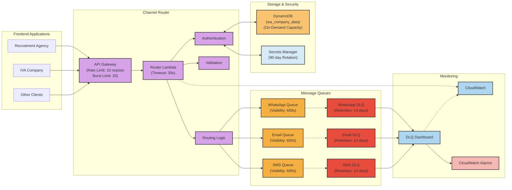
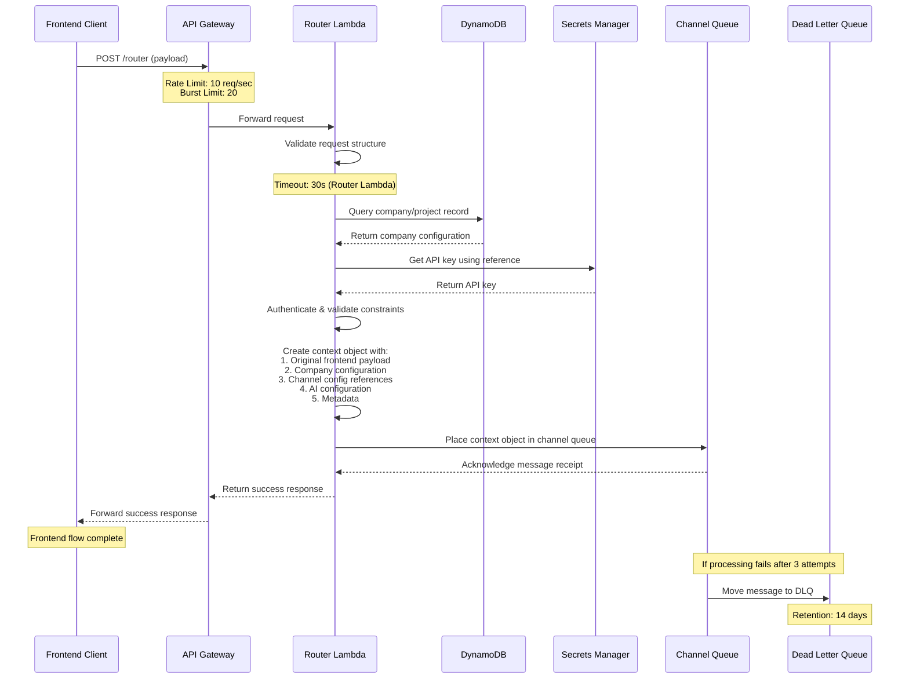
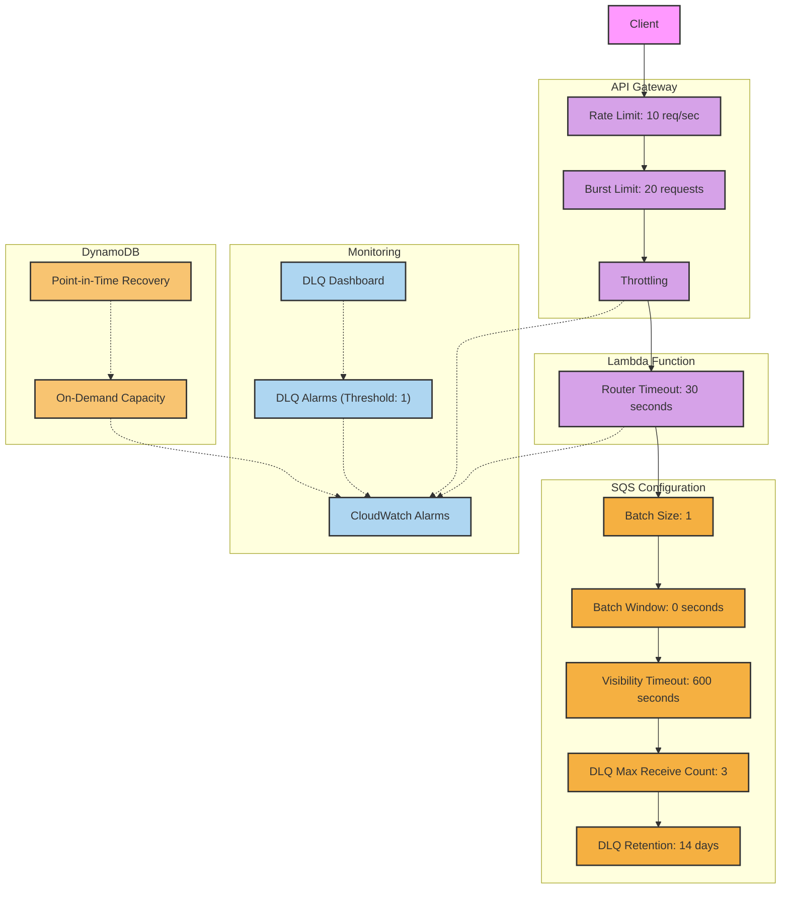
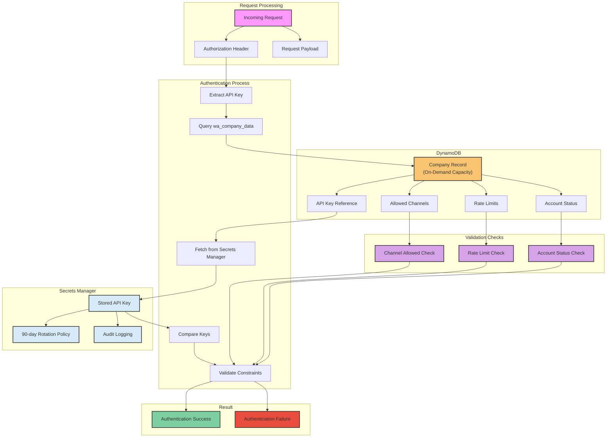
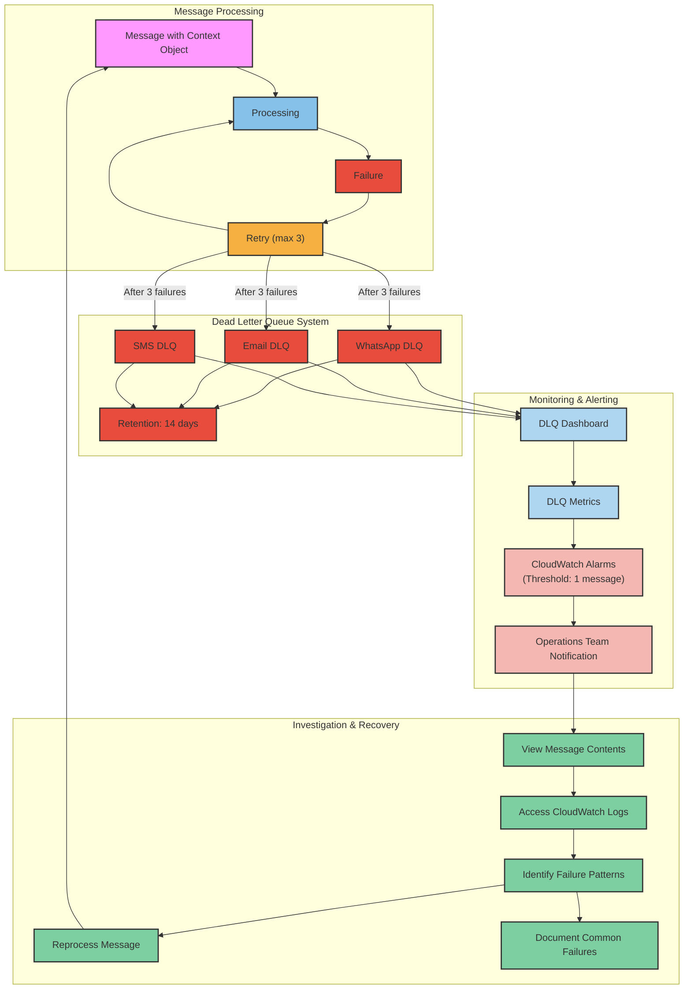
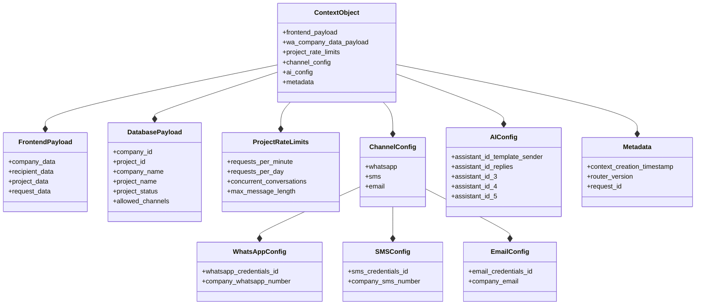

# Channel Router - Architecture Diagrams

## 1. High-Level Architecture

## 2. Request Flow Sequence

## 3. Rate Limiting & Concurrency Architecture

## 4. Authentication Flow

## 5. Dead Letter Queue Management System

## 6. Infrastructure Deployment with CDK

```mermaid
flowchart TD
    subgraph "AWS CDK"
        CDK["Channel Router CDK Stack"]
    end
    
    subgraph "API Resources"
        APIG["API Gateway"]
        THROTTLE["Throttling Config<br/>Rate: 10 req/sec<br/>Burst: 20"]
    end
    
    subgraph "Compute Resources"
        LAMBDA["Router Lambda Function"]
        TIMEOUT["Timeout: 30 seconds"]
    end
    
    subgraph "Queue Resources"
        WHATSAPP["WhatsApp Queue<br/>Visibility: 600s"]
        EMAIL["Email Queue<br/>Visibility: 600s"]
        SMS["SMS Queue<br/>Visibility: 600s"]
        WDLQ["WhatsApp DLQ<br/>Retention: 14 days"]
        EDLQ["Email DLQ<br/>Retention: 14 days"]
        SDLQ["SMS DLQ<br/>Retention: 14 days"]
    end
    
    subgraph "Storage Resources"
        DYNTABLE["wa_company_data Table"]
        PITR["Point-in-Time Recovery"]
        OD["On-Demand Capacity"]
    end
    
    subgraph "Monitoring Resources"
        ALARMS["CloudWatch Alarms"]
        DLQALARMS["DLQ Alarms<br/>(Threshold: 1)"]
        DASHBOARD["CloudWatch Dashboard"]
        DLQDASH["DLQ Dashboard"]
    end
    
    CDK --> APIG
    CDK --> LAMBDA
    CDK --> WHATSAPP
    CDK --> EMAIL
    CDK --> SMS
    CDK --> WDLQ
    CDK --> EDLQ
    CDK --> SDLQ
    CDK --> DYNTABLE
    CDK --> ALARMS
    CDK --> DASHBOARD
    CDK --> DLQALARMS
    CDK --> DLQDASH
    
    APIG --> THROTTLE
    LAMBDA --> TIMEOUT
    DYNTABLE --> PITR
    DYNTABLE --> OD
    
    WHATSAPP --> WDLQ
    EMAIL --> EDLQ
    SMS --> SDLQ
    
    WDLQ --> DLQALARMS
    EDLQ --> DLQALARMS
    SDLQ --> DLQALARMS
    
    style CDK fill:#85C1E9,stroke:#333,stroke-width:2px
    style APIG fill:#D6A2E8,stroke:#333,stroke-width:2px
    style THROTTLE fill:#D6A2E8,stroke:#333,stroke-width:2px
    style LAMBDA fill:#D6A2E8,stroke:#333,stroke-width:2px
    style TIMEOUT fill:#D6A2E8,stroke:#333,stroke-width:2px
    style WHATSAPP fill:#F5B041,stroke:#333,stroke-width:2px
    style EMAIL fill:#F5B041,stroke:#333,stroke-width:2px
    style SMS fill:#F5B041,stroke:#333,stroke-width:2px
    style WDLQ fill:#E74C3C,stroke:#333,stroke-width:2px
    style EDLQ fill:#E74C3C,stroke:#333,stroke-width:2px
    style SDLQ fill:#E74C3C,stroke:#333,stroke-width:2px
    style DYNTABLE fill:#F8C471,stroke:#333,stroke-width:2px
    style PITR fill:#F8C471,stroke:#333,stroke-width:2px
    style OD fill:#F8C471,stroke:#333,stroke-width:2px
    style ALARMS fill:#F5B7B1,stroke:#333,stroke-width:2px
    style DLQALARMS fill:#F5B7B1,stroke:#333,stroke-width:2px
    style DASHBOARD fill:#AED6F1,stroke:#333,stroke-width:2px
    style DLQDASH fill:#AED6F1,stroke:#333,stroke-width:2px
```

## 7. Context Object Structure

> **Note**: The diagrams above have been updated to specifically reflect the Channel Router component as described in the channel_router_documentation-v1.0.md file. Key changes include:
> 1. Corrected the Router Lambda timeout to 30 seconds (not 900)
> 2. Added details about API Gateway rate limits (10 req/sec, 20 burst)
> 3. Specified that DLQs have a retention period of 14 days
> 4. Added the DLQ Dashboard monitoring with threshold of 1 message
> 5. Clarified the context object structure
> 6. Removed Processing Engines from the Channel Router diagrams as they're separate components
> 7. Added styling to improve clarity and readability
> 8. Specified the DynamoDB table as wa_company_data with On-Demand Capacity
> 9. Added the 90-day rotation policy for API keys in Secrets Manager 