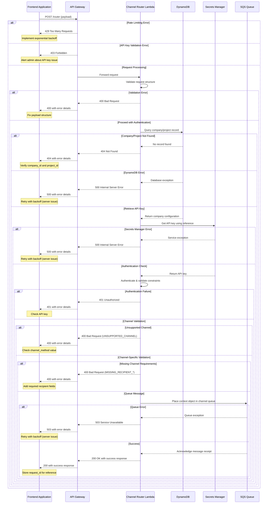

# Error Handling Between Frontend and Channel Router

This document outlines the error handling strategies specifically for the communication between the frontend applications and the Channel Router component of the WhatsApp AI chatbot system.

## 1. Error Handling Flow Overview



## 2. Error Types and Handling Strategies

### 2.1 Frontend Request Validation Errors

| Error Scenario | HTTP Status | Error Code | Error Message | Frontend Handling Strategy |
|----------------|-------------|------------|---------------|----------------------------|
| Missing request_id | 400 | MISSING_REQUEST_ID | "request_id is required in request_data" | Generate valid UUID v4 and retry |
| Invalid request_id format | 400 | INVALID_REQUEST_ID | "request_id must be a valid UUID v4" | Validate UUID format before sending |
| Missing channel_method | 400 | MISSING_CHANNEL | "channel_method is required in request_data" | Add required field and retry |
| Unsupported channel | 400 | UNSUPPORTED_CHANNEL | "Channel method '{method}' is not supported" | Use only supported channel values |
| Missing/invalid timestamp | 400 | INVALID_TIMESTAMP | "initial_request_timestamp must be a valid ISO 8601 timestamp" | Generate fresh ISO 8601 timestamp and retry |
| Timestamp too old | 400 | TIMESTAMP_EXPIRED | "Request timestamp is too old (>5 minutes)" | Generate fresh timestamp and retry |
| Missing recipient_tel for WhatsApp | 400 | MISSING_RECIPIENT_TEL | "WhatsApp channel requires recipient_tel" | Add recipient_tel field and retry |
| Missing recipient_email for Email | 400 | MISSING_RECIPIENT_EMAIL | "Email channel requires recipient_email" | Add recipient_email field and retry |
| Payload too large | 400 | PAYLOAD_TOO_LARGE | "Payload size exceeds maximum allowed (100KB)" | Reduce payload size and retry |

### 2.2 Authentication and Authorization Errors

| Error Scenario | HTTP Status | Error Code | Error Message | Frontend Handling Strategy |
|----------------|-------------|------------|---------------|----------------------------|
| Authentication failure | 401 | UNAUTHORIZED | "Invalid or missing API key" | Verify API key with administrator |
| Project not found | 404 | PROJECT_NOT_FOUND | "Company or project not found" | Verify company_id and project_id values |
| Channel not allowed | 403 | CHANNEL_NOT_ALLOWED | "Channel '{method}' is not allowed for this project" | Use only allowed channels for the project |
| Account suspended | 403 | ACCOUNT_SUSPENDED | "Account is suspended" | Contact administrator to resolve account issues |

### 2.3 Rate Limiting and Resource Errors

| Error Scenario | HTTP Status | Error Code | Error Message | Frontend Handling Strategy |
|----------------|-------------|------------|---------------|----------------------------|
| Rate limit exceeded | 429 | RATE_LIMIT_EXCEEDED | "Rate limit exceeded. Try again later." | Implement exponential backoff based on retry_after value |
| API Gateway throttling | 429 | THROTTLED | "Request throttled by API Gateway" | Implement exponential backoff (1s, 2s, 4s, etc.) |
| Queue service unavailable | 503 | QUEUE_UNAVAILABLE | "Message queue service is currently unavailable" | Retry with exponential backoff up to 5 times |
| Internal error | 500 | INTERNAL_ERROR | "An internal error occurred" | Retry with exponential backoff up to 5 times |

## 3. Frontend Retry Implementation Guidelines

### 3.1 Exponential Backoff Algorithm

```javascript
/**
 * Implements exponential backoff for retrying API calls
 * @param {function} apiCallFn - The API call function to retry
 * @param {object} options - Options for the retry mechanism
 * @returns {Promise} - Promise that resolves with the API response
 */
async function retryWithExponentialBackoff(apiCallFn, options = {}) {
  const {
    maxRetries = 5,
    initialDelayMs = 1000,
    maxDelayMs = 32000,
    retryStatusCodes = [429, 500, 502, 503, 504]
  } = options;
  
  let retries = 0;
  let delay = initialDelayMs;
  
  while (true) {
    try {
      return await apiCallFn();
    } catch (error) {
      // Extract status code and retry-after from error response
      const statusCode = error.response?.status;
      const retryAfter = error.response?.headers?.['retry-after'];
      
      // If max retries reached or not a retryable status code, throw the error
      if (retries >= maxRetries || !retryStatusCodes.includes(statusCode)) {
        throw error;
      }
      
      // Calculate delay (use retry-after if provided, otherwise exponential backoff)
      let waitTime = retryAfter ? retryAfter * 1000 : delay;
      waitTime = Math.min(waitTime, maxDelayMs);
      
      // Add jitter (±10% randomness) to prevent thundering herd
      const jitter = waitTime * 0.1 * (Math.random() * 2 - 1);
      waitTime = Math.max(initialDelayMs, waitTime + jitter);
      
      console.log(`Retrying after ${waitTime}ms (Attempt ${retries + 1} of ${maxRetries})`);
      
      // Wait before retrying
      await new Promise(resolve => setTimeout(resolve, waitTime));
      
      // Increase retry count and delay for next iteration
      retries++;
      delay = Math.min(delay * 2, maxDelayMs);
    }
  }
}

// Example usage
async function sendRequestWithRetry(payload) {
  return retryWithExponentialBackoff(
    async () => {
      // Add fresh timestamp before each attempt
      payload.request_data.initial_request_timestamp = new Date().toISOString();
      
      // Make the API call
      const response = await axios.post('https://api.example.com/v1/router', payload, {
        headers: {
          'Content-Type': 'application/json',
          'Authorization': `Bearer ${apiKey}`
        }
      });
      
      return response.data;
    },
    {
      // Don't retry 4xx errors except for 429 (rate limiting)
      retryStatusCodes: [429, 500, 502, 503, 504]
    }
  );
}
```

### 3.2 Error Response Handling in Frontend

```javascript
/**
 * Handles API error responses and provides user-friendly feedback
 * @param {Error} error - The error object from the API call
 * @returns {string} - User-friendly error message
 */
function handleApiError(error) {
  // Default error message
  let userMessage = "An unexpected error occurred. Please try again later.";
  
  // Extract error details if available
  const statusCode = error.response?.status;
  const errorCode = error.response?.data?.error_code;
  const errorMessage = error.response?.data?.message;
  const requestId = error.response?.data?.request_id;
  
  // Log detailed error for debugging
  console.error('API Error:', {
    statusCode,
    errorCode, 
    errorMessage,
    requestId,
    fullError: error
  });
  
  // Generate user-friendly messages based on error type
  switch (statusCode) {
    case 400:
      userMessage = `Validation error: ${errorMessage || 'Please check your input data.'}`;
      break;
    case 401:
      userMessage = "Authentication failed. Please check your API key or contact support.";
      break;
    case 403:
      userMessage = `Access denied: ${errorMessage || 'You do not have permission to use this functionality.'}`;
      break;
    case 404:
      userMessage = `Not found: ${errorMessage || 'The requested resource was not found.'}`;
      break;
    case 429:
      userMessage = "Rate limit exceeded. Please try again after a few moments.";
      break;
    case 500:
    case 502:
    case 503:
    case 504:
      userMessage = "Server error. Our team has been notified and is working on it.";
      break;
  }
  
  // Add request ID for reference if available
  if (requestId) {
    userMessage += ` (Request ID: ${requestId})`;
  }
  
  return userMessage;
}
```

### 3.3 Idempotency Handling for Retries

To ensure idempotency during retries, the frontend should:

1. **Generate and Reuse Request ID**: Generate a unique UUID v4 for each logical request and reuse the same ID for all retry attempts of that request.

2. **Update Timestamp on Retry**: Update the timestamp for each retry attempt to ensure the request is not rejected for having an expired timestamp.

3. **Maintain Retry Counter**: Keep track of retry counts to implement proper backoff and eventual abandonment.

```javascript
/**
 * Creates an idempotent request object for API calls with retry support
 * @param {object} basePayload - The core payload without request_data
 * @returns {object} - Functions to get current payload and handle retries
 */
function createIdempotentRequest(basePayload) {
  // Generate a unique request ID that will be reused across retries
  const requestId = generateUuidV4();
  let retryCount = 0;
  
  return {
    // Get current payload with fresh timestamp
    getCurrentPayload: function() {
      return {
        ...basePayload,
        request_data: {
          request_id: requestId,
          channel_method: basePayload.channel_method || "whatsapp",
          initial_request_timestamp: new Date().toISOString()
        }
      };
    },
    
    // Get metadata about this request
    getMetadata: function() {
      return {
        requestId,
        retryCount,
        firstAttemptAt: retryCount === 0 ? new Date() : null
      };
    },
    
    // Record a retry attempt
    recordRetry: function() {
      retryCount++;
      return retryCount;
    }
  };
}
```

## 4. Error Response Structure

### 4.1 Channel Router Error Response Format

All error responses from the Channel Router follow this structure:

```json
{
  "status": "error",
  "error_code": "ERROR_CODE",
  "message": "Human-readable error message",
  "request_id": "same-as-sent-request-id-if-available"
}
```

### 4.2 HTTP Status Code Usage

| HTTP Status | Usage Scenarios |
|-------------|-----------------|
| 200 OK | Successful request acceptance and queuing |
| 400 Bad Request | Validation errors, missing fields, invalid format |
| 401 Unauthorized | Invalid or missing API key |
| 403 Forbidden | Valid API key but insufficient permissions |
| 404 Not Found | Company or project not found |
| 429 Too Many Requests | Rate limit or throttling exceeded |
| 500 Internal Server Error | Unexpected server-side errors |
| 502 Bad Gateway | Error communicating with dependent services |
| 503 Service Unavailable | Queue service or other dependent service unavailable |

## 5. Monitoring and Debugging

### 5.1 Request Tracing

1. The `request_id` serves as a correlation ID throughout the system.
2. All error responses include the original `request_id` when available.
3. All logs related to a request should include this ID.

### 5.2 Frontend Logging Best Practices

1. **Log All API Requests**: Record outgoing request payloads (excluding sensitive data)
2. **Log All API Responses**: Record HTTP status and response bodies
3. **Record Timing Information**: Track API call durations for performance monitoring
4. **Track Retry Attempts**: Log each retry with attempt number and delay
5. **Include Request ID**: Always include the request_id in logs for correlation

### 5.3 Troubleshooting Common Errors

| Error Code | Common Causes | Troubleshooting Steps |
|------------|---------------|------------------------|
| INVALID_REQUEST_ID | Improperly generated UUID | Verify UUID v4 generation function |
| MISSING_RECIPIENT_TEL | Missing phone number for WhatsApp channel | Check recipient_data for WhatsApp messages |
| UNAUTHORIZED | Incorrect or revoked API key | Verify API key with administrator |
| RATE_LIMIT_EXCEEDED | Too many requests in a short period | Implement request batching or throttling |
| QUEUE_UNAVAILABLE | SQS service disruption | Check AWS Service Health Dashboard |

## 6. Implementing Error-Resilient Frontend UI

### 6.1 User Feedback Guidelines

1. **Immediate Acknowledgment**: Provide immediate visual feedback when a request is sent
2. **Progress Indication**: Show progress during API calls and retry attempts
3. **Meaningful Error Messages**: Translate technical errors into user-friendly messages
4. **Recovery Options**: Provide clear actions users can take to resolve errors
5. **Persistence**: Save form data locally to prevent loss during errors

### 6.2 UI Error Handling Implementation

```javascript
// React component example for error handling in UI
function SendWhatsAppButton({ payload, onSuccess }) {
  const [status, setStatus] = useState('idle'); // idle, loading, success, error
  const [errorMessage, setErrorMessage] = useState(null);
  const [isRetrying, setIsRetrying] = useState(false);
  
  // Create idempotent request helper
  const idempotentRequest = useMemo(() => createIdempotentRequest(payload), [payload]);
  
  const sendMessage = async () => {
    setStatus('loading');
    setErrorMessage(null);
    setIsRetrying(false);
    
    try {
      const result = await sendRequestWithRetry(idempotentRequest.getCurrentPayload());
      setStatus('success');
      onSuccess(result);
    } catch (error) {
      setStatus('error');
      setErrorMessage(handleApiError(error));
    }
  };
  
  const retryRequest = async () => {
    setStatus('loading');
    setIsRetrying(true);
    idempotentRequest.recordRetry();
    
    try {
      const result = await sendRequestWithRetry(idempotentRequest.getCurrentPayload());
      setStatus('success');
      onSuccess(result);
    } catch (error) {
      setStatus('error');
      setErrorMessage(handleApiError(error));
    } finally {
      setIsRetrying(false);
    }
  };
  
  return (
    <div>
      <button 
        onClick={sendMessage} 
        disabled={status === 'loading'}
      >
        {status === 'loading' ? 'Sending...' : 'Send WhatsApp Message'}
      </button>
      
      {status === 'error' && (
        <div className="error-container">
          <p className="error-message">{errorMessage}</p>
          <button onClick={retryRequest} disabled={isRetrying}>
            {isRetrying ? 'Retrying...' : 'Retry'}
          </button>
        </div>
      )}
      
      {status === 'success' && (
        <div className="success-message">
          Message sent successfully! Request ID: {idempotentRequest.getMetadata().requestId}
        </div>
      )}
    </div>
  );
}
```

## 7. Channel-Specific Error Handling

### 7.1 WhatsApp Channel Specifics

| Error Scenario | HTTP Status | Error Code | Error Message |
|----------------|-------------|------------|---------------|
| Invalid phone format | 400 | INVALID_PHONE_FORMAT | "Phone number must be in E.164 format (e.g., +447700900123)" |
| Missing first name | 400 | MISSING_FIRST_NAME | "recipient_first_name is required for WhatsApp channel" |

### 7.2 Email Channel Specifics (Future)

| Error Scenario | HTTP Status | Error Code | Error Message |
|----------------|-------------|------------|---------------|
| Invalid email format | 400 | INVALID_EMAIL_FORMAT | "Email address format is invalid" |
| Missing subject in project_data | 400 | MISSING_EMAIL_SUBJECT | "email_subject is required in project_data for email channel" |

### 7.3 SMS Channel Specifics (Future)

| Error Scenario | HTTP Status | Error Code | Error Message |
|----------------|-------------|------------|---------------|
| Invalid phone format | 400 | INVALID_PHONE_FORMAT | "Phone number must be in E.164 format (e.g., +447700900123)" |
| SMS content too long | 400 | SMS_CONTENT_TOO_LONG | "SMS content exceeds maximum length (160 characters)" |

## 8. Health Checks and Status Monitoring

For applications requiring proactive monitoring, the system exposes a health check endpoint:

```
GET https://api.example.com/v1/health
```

Response:

```json
{
  "status": "healthy", // or "degraded" or "unhealthy"
  "components": {
    "router": "healthy",
    "queues": {
      "whatsapp": "healthy",
      "email": "healthy",
      "sms": "healthy"
    }
  },
  "timestamp": "2023-06-15T14:30:45.789Z"
}
```

This endpoint can be polled by frontend applications to proactively detect service issues before attempting to send messages.

## 9. DLQ Processor Lambda Function

While the Channel Router handles immediate errors during request acceptance, many errors can occur during asynchronous processing after the request has already been queued and acknowledged. To complete the error handling lifecycle, a dedicated DLQ Processor Lambda function processes messages that have exhausted their retry attempts.

### 9.1 Purpose and Functionality

The DLQ Processor Lambda function:

1. Consumes messages from each channel's Dead Letter Queue
2. Parses the original message context
3. Looks up the associated conversation record in DynamoDB
4. Updates the conversation status to "failed"
5. Records detailed error information for troubleshooting
6. Publishes metrics for monitoring and alerting

This approach ensures that even asynchronous errors are properly tracked and visible to both users and operations staff.

### 9.2 Implementation

```javascript
// DLQ Processor Lambda
exports.handleDLQ = async (event) => {
  for (const record of event.Records) {
    try {
      const originalMessage = JSON.parse(record.body);
      const originalBody = JSON.parse(originalMessage.body);
      
      // Extract key information from the original message
      const { frontend_payload, channel_config } = originalBody;
      const { company_data, recipient_data, request_data } = frontend_payload;
      
      // Generate the same conversation ID 
      const conversationId = generateConversationId(
        company_data.company_id,
        company_data.project_id,
        request_data.request_id,
        channel_config[request_data.channel_method].company_phone_number || 
        channel_config[request_data.channel_method].company_email
      );
      
      // Look up the conversation in DynamoDB
      const conversation = await getConversationRecord(
        request_data.channel_method === 'email' ? 
          recipient_data.recipient_email : 
          recipient_data.recipient_tel, 
        conversationId
      );
      
      // Update status to failed
      await updateConversationStatus(conversation, 'failed', {
        error_message: "Message processing failed after maximum retry attempts",
        component: "unknown" // We don't know exactly which component failed from DLQ
      });
      
      console.log('Updated conversation status to failed', {
        conversation_id: conversationId,
        request_id: request_data.request_id
      });
      
    } catch (error) {
      console.error('Error processing DLQ message', error);
      // Continue with other records even if one fails
    }
  }
};
```

### 9.3 Frontend Integration

Frontends do not interact directly with the DLQ Processor, but should be designed to handle scenarios where:

1. An initial successful submission (HTTP 200) might result in a failed processing status
2. Applications with status checking capabilities should check conversation status periodically
3. UI elements should display appropriate messaging for conversations that failed async processing

Example of frontend status checking:

```javascript
/**
 * Polls for message processing status
 * @param {string} conversationId - The ID of the conversation to check
 * @param {function} onStatusChange - Callback for status changes
 */
function pollMessageStatus(conversationId, onStatusChange) {
  const CHECK_INTERVAL_MS = 5000; // 5 seconds
  const MAX_CHECKS = 12; // Check for up to 1 minute
  
  let checks = 0;
  
  const intervalId = setInterval(async () => {
    try {
      const status = await checkMessageStatus(conversationId);
      
      // Call the status change handler
      onStatusChange(status);
      
      // Clear interval if we have a terminal status
      if (status === 'initial_message_sent' || status === 'failed') {
        clearInterval(intervalId);
      }
      
      // Stop checking after max attempts
      checks++;
      if (checks >= MAX_CHECKS) {
        clearInterval(intervalId);
        onStatusChange('unknown');
      }
    } catch (error) {
      console.error('Error checking message status', error);
    }
  }, CHECK_INTERVAL_MS);
  
  // Return a function to cancel polling
  return () => clearInterval(intervalId);
}
```

## 10. Conclusion

Effective error handling between the frontend and Channel Router requires:

1. **Consistent error formats** that provide actionable information
2. **Intelligent retry strategies** that respect rate limits and avoid overwhelming the system
3. **Proper idempotency handling** to prevent duplicate processing
4. **Clear user feedback** that translates technical errors into actionable guidance
5. **Comprehensive logging** that facilitates troubleshooting

By implementing these strategies, the system can maintain high reliability even when components experience transient failures or limitations. 