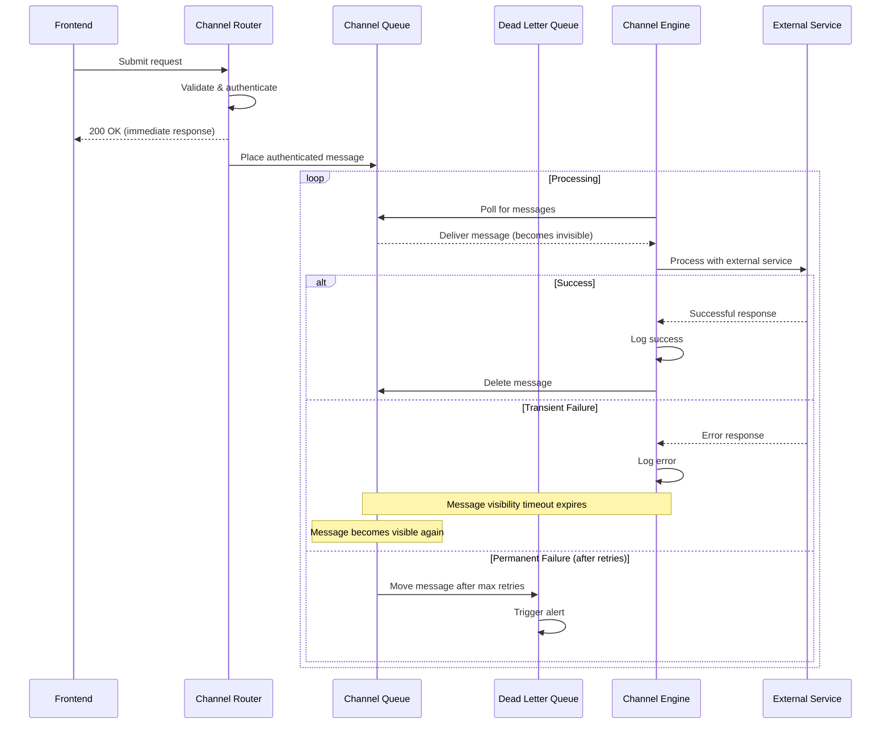

# Message Queue Architecture for Multi-Channel Messaging System

This document outlines the message queue architecture for our multi-channel messaging system, explaining the flow, benefits, and implementation details.

## Complete Flow with Message Queues

1. **Frontend Submission**:
   - User submits request through a frontend
   - Router receives the request

2. **Immediate Acknowledgment**:
   - Router validates basic structure and authenticates
   - Router returns immediate 200 OK response to frontend
   - User sees "Request submitted successfully" or similar message

3. **Queue Placement**:
   - Router places the authenticated request in the appropriate channel queue
   - Message includes all necessary data and a unique request_id

4. **Asynchronous Processing**:
   - Channel engine polls its queue for new messages
   - When a message is received, it becomes temporarily invisible to other consumers
   - Channel engine begins processing the request

5. **External Service Interaction**:
   - Channel engine communicates with external services (Twilio, OpenAI, etc.)
   - Processing may involve multiple steps

6. **Success Path**:
   - If processing completes successfully:
     - Channel engine logs the success
     - Channel engine **deletes the message from the queue** (this is key)
     - Success metrics are updated

7. **Failure Path**:
   - If processing fails:
     - Channel engine logs the error
     - If it's a transient error (e.g., temporary Twilio outage):
       - Channel engine **does not delete the message**
       - Message becomes visible again after visibility timeout
       - Another processing attempt occurs (with backoff)
     - If it fails multiple times (e.g., 3 attempts):
       - Message is moved to Dead Letter Queue
       - Alerts are triggered

## Architecture Diagram



## Key Benefits in Our Architecture

This approach gives us several advantages:

1. **Resilience to AI Service Outages**:
   - If OpenAI is down temporarily, messages wait in queue
   - When service returns, processing continues automatically
   - No manual intervention needed for transient failures

2. **Handling Traffic Spikes**:
   - During peak times (e.g., recruitment campaign launch)
   - Router quickly acknowledges all requests
   - Channel engines process at their own pace
   - No requests are lost, even if temporarily overwhelmed

3. **Simplified Error Handling**:
   - Retry logic is handled by the queue system
   - Failed messages are automatically reprocessed
   - Permanent failures are captured in DLQ

4. **Operational Visibility**:
   - CloudWatch metrics on queue depth show backlog
   - DLQ monitoring shows persistent failures
   - Processing latency can be tracked

## Implementation Details

For AWS implementation, we'll use:

1. **SQS Standard Queues** for each channel:
   - WhatsAppQueue
   - EmailQueue
   - SMSQueue

2. **Visibility Timeout** set appropriately:
   - How long a message is invisible during processing
   - Should be longer than typical processing time
   - Example: 2 minutes for WhatsApp, 5 minutes for email

3. **Dead Letter Queues** for each channel:
   - Configure maxReceiveCount (typically 3-5)
   - Set up CloudWatch alarms on DLQ depth

4. **Lambda Consumers**:
   - Lambda functions triggered by queue messages
   - Process in batches for efficiency
   - Explicitly delete messages only on success

## Example AWS CDK Implementation

```typescript
// For each channel (WhatsApp example)
const whatsappDlq = new sqs.Queue(this, 'WhatsAppDLQ', {
  retentionPeriod: cdk.Duration.days(14) // Keep failed messages for 14 days
});

// Main processing queue
const whatsappQueue = new sqs.Queue(this, 'WhatsAppQueue', {
  visibilityTimeout: cdk.Duration.seconds(120), // 2 minutes
  deadLetterQueue: {
    queue: whatsappDlq,
    maxReceiveCount: 3
  }
});

// Lambda to process messages
const whatsappProcessor = new lambda.Function(this, 'WhatsappProcessor', {
  runtime: lambda.Runtime.NODEJS_14_X,
  handler: 'index.handler',
  code: lambda.Code.fromAsset('lambda/whatsapp'),
  timeout: cdk.Duration.seconds(60),
  environment: {
    OPENAI_API_KEY: process.env.OPENAI_API_KEY,
    TWILIO_ACCOUNT_SID: process.env.TWILIO_ACCOUNT_SID
  }
});

// Connect queue to Lambda
whatsappProcessor.addEventSource(new SqsEventSource(whatsappQueue, {
  batchSize: 10
}));

// Alarm for DLQ
new cloudwatch.Alarm(this, 'WhatsAppDLQAlarm', {
  metric: whatsappDlq.metricApproximateNumberOfMessagesVisible(),
  threshold: 1,
  evaluationPeriods: 1,
  alarmDescription: 'Messages in WhatsApp DLQ'
});
```

## Handling Different Failure Types

Our system distinguishes between different types of failures:

1. **Transient Failures** (retry automatically):
   - Temporary API outages
   - Rate limiting
   - Network timeouts

2. **Permanent Failures** (move to DLQ):
   - Invalid phone numbers
   - Authentication failures
   - Malformed requests

## Channel-Specific Considerations

### WhatsApp Channel

- **Visibility Timeout**: 2-3 minutes (Twilio API calls typically resolve quickly)
- **Retry Strategy**: Exponential backoff for rate limiting
- **DLQ Handling**: Alert on invalid phone numbers or template issues

### Email Channel (Future)

- **Visibility Timeout**: 5 minutes (email sending can take longer)
- **Batch Processing**: Group similar emails for efficiency
- **Bounce Handling**: Track bounces via SNS notifications

### SMS Channel (Future)

- **Visibility Timeout**: 2 minutes
- **Cost Optimization**: Prioritize messages during peak times
- **Regulatory Compliance**: Ensure compliance with SMS regulations

## Monitoring and Operations

To maintain visibility into the queue-based system:

1. **CloudWatch Dashboards**:
   - Queue depth by channel
   - Processing latency
   - Error rates
   - DLQ message count

2. **Alerting**:
   - DLQ thresholds
   - Queue depth thresholds
   - Processing latency thresholds

3. **Operational Procedures**:
   - DLQ message inspection and reprocessing
   - Queue purging in emergency situations
   - Scaling consumers during traffic spikes

## Conclusion

This message queue architecture provides our multi-channel messaging system with:

- Immediate user feedback
- Robust background processing
- Resilience against service outages
- Ability to handle traffic spikes
- Comprehensive error handling
- Operational visibility

By implementing this pattern, we maintain a clean separation between our router and channel engines while ensuring reliable message delivery across all channels. 