# WhatsApp Processing Engine - System Diagrams

> **Diagrams and Visual References for the WhatsApp Processing Engine**

## 1. System Architecture Overview

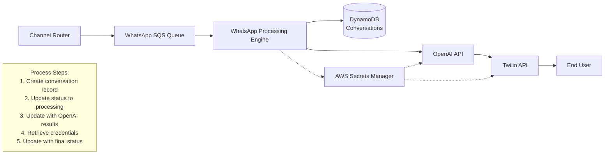

Process flow:
1. Create conversation record in DynamoDB with status "received"
2. Update conversation status to "processing"
3. Update conversation with OpenAI processing results
4. Retrieve API credentials from Secrets Manager when needed:
   - For OpenAI API access before AI processing
   - For Twilio API access before message delivery
5. Update conversation with final status after delivery

## 2. Message Processing Flow

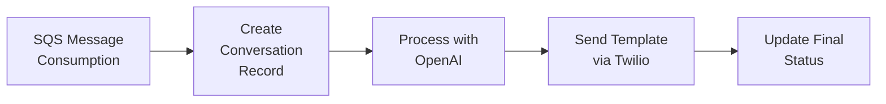

## 3. SQS Heartbeat Pattern

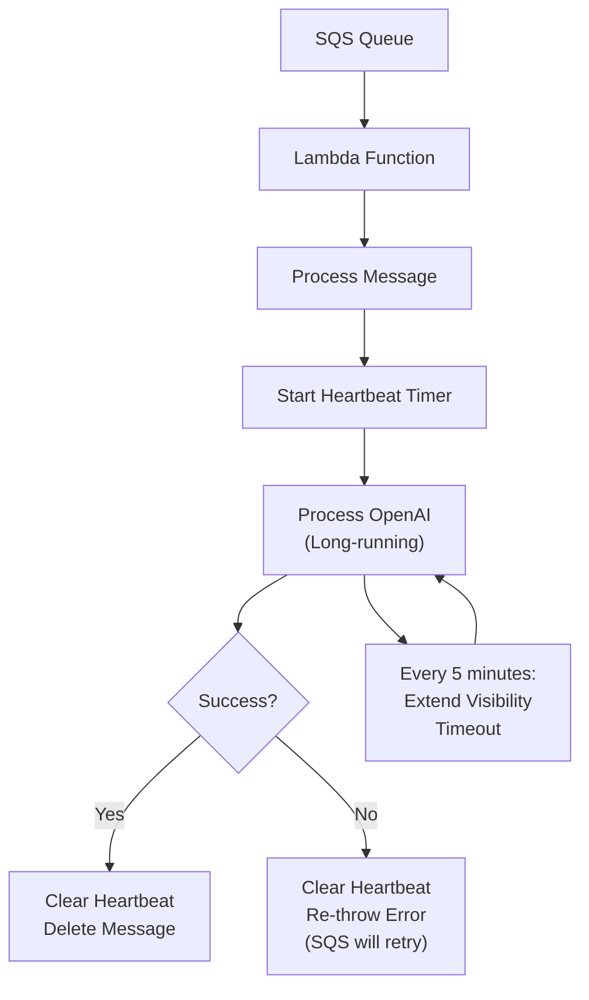

## 4. Credential Management Flow

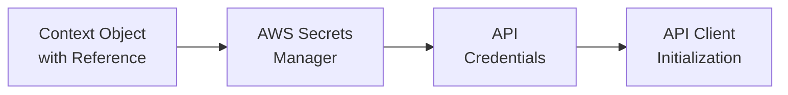

## 5. OpenAI Integration Flow

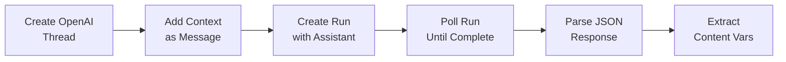

## 6. Template Message Sending Flow

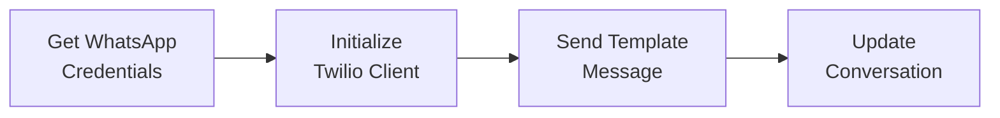

## 7. Error Handling Strategy

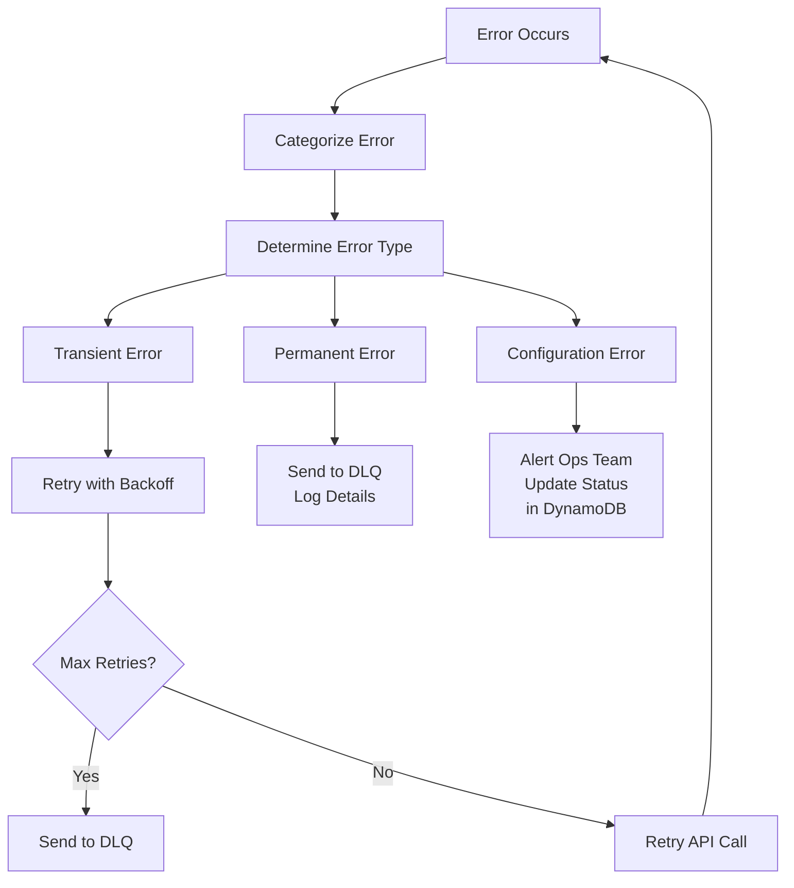

## 8. Conversation Status Lifecycle

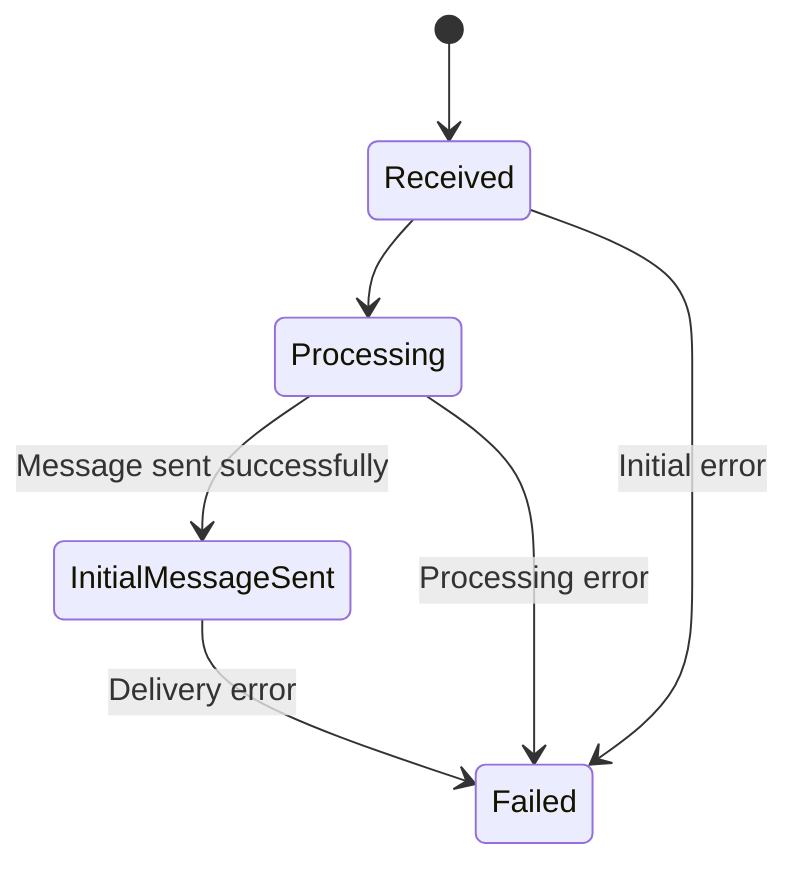

## 9. Monitoring & Observability Architecture

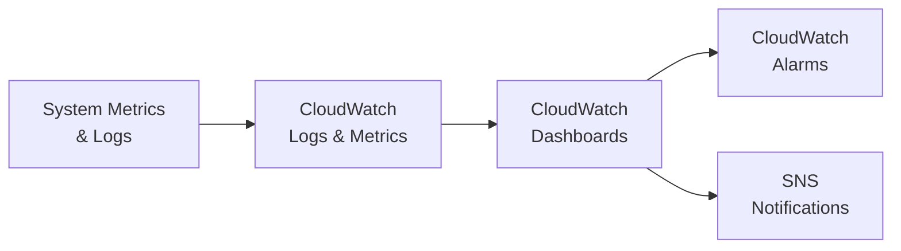

## 10. OpenAI Run Polling Loop

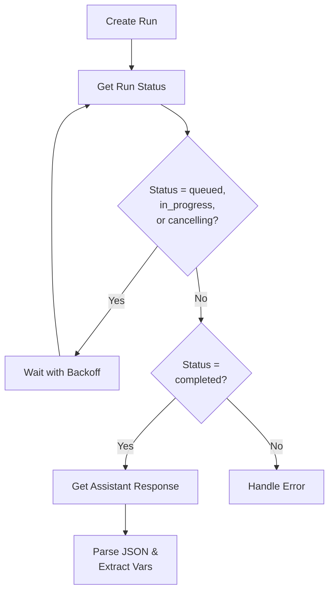

## 11. Alarm Notification Flow

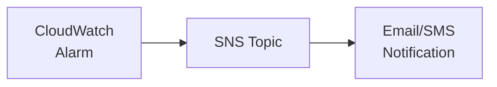

## 12. DynamoDB Conversation Record Schema

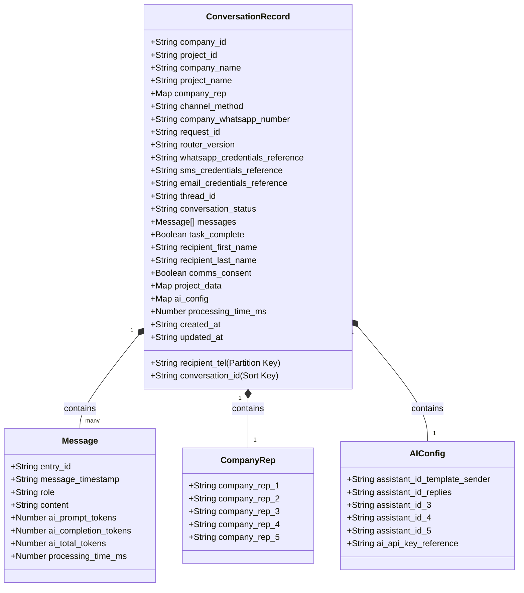

## 13. Exponential Backoff for API Calls

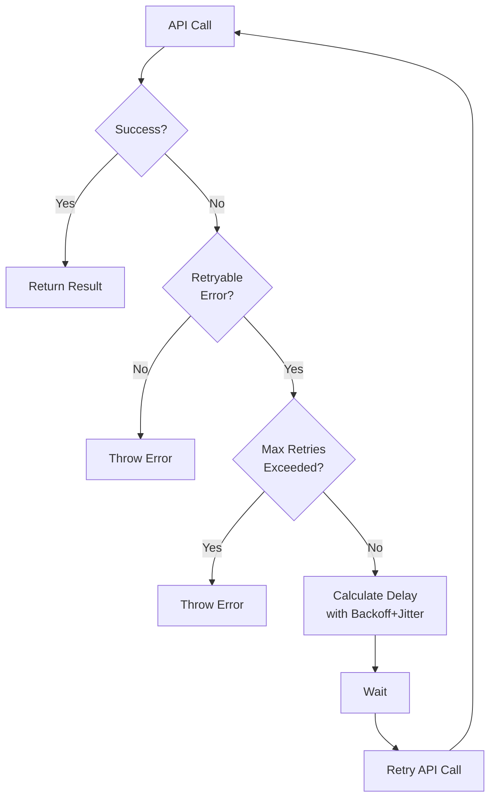

## 14. Adaptive Rate Limiting for API Calls

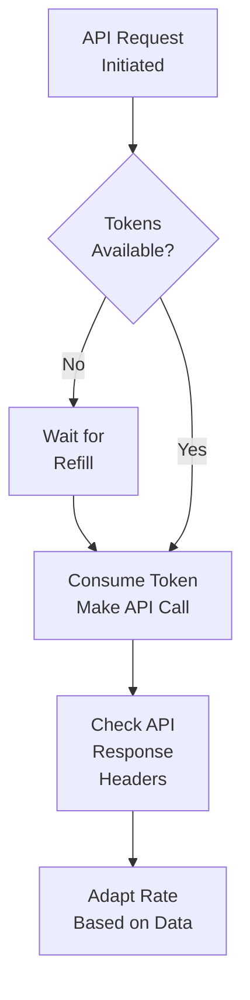

## 15. Circuit Breaker Pattern

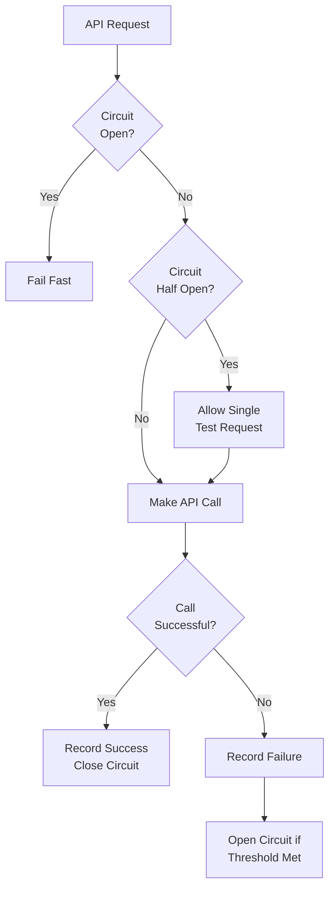