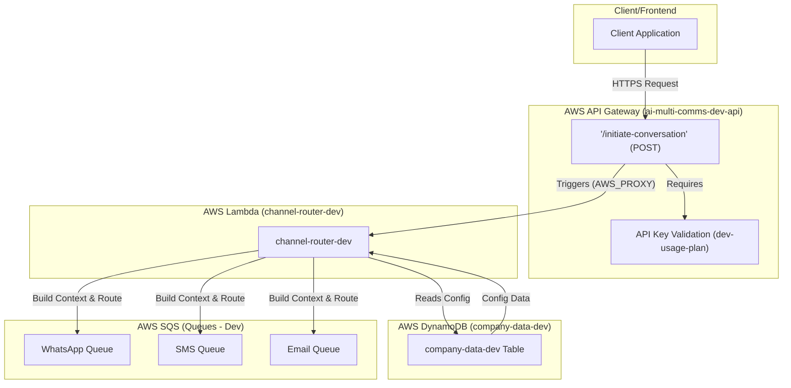
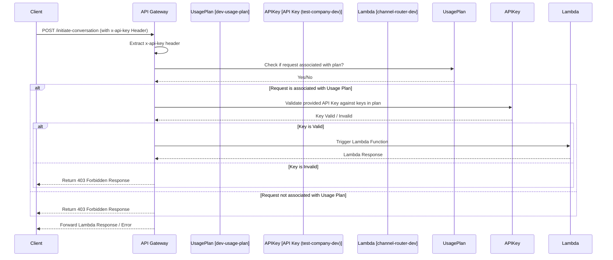
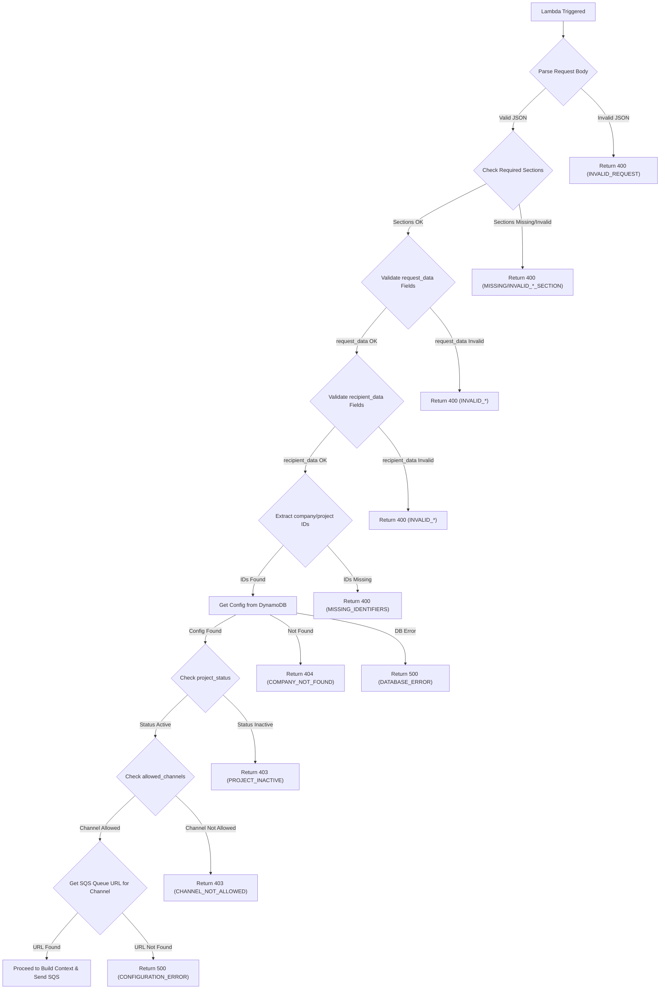
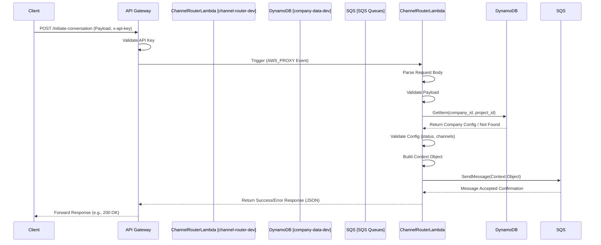
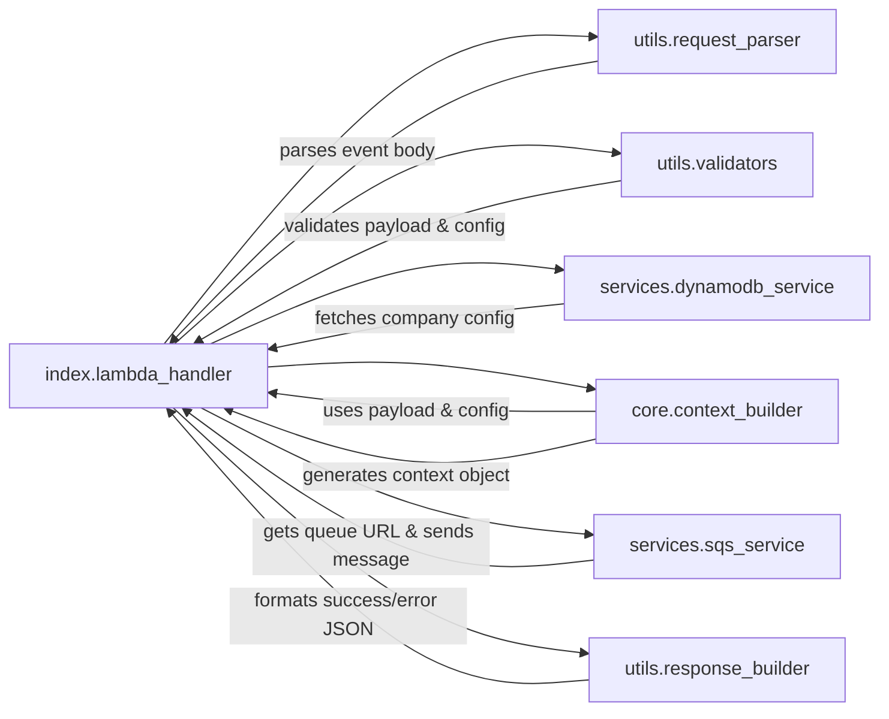
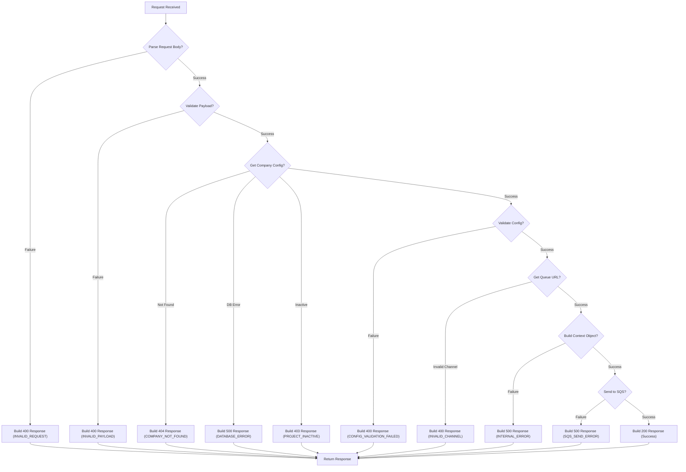

# Channel Router - Diagrams

## 1. High-Level System Architecture (Development)

This diagram shows the main AWS services involved in Part A (Channel Router) of the system.

## 2. Authentication Flow

This diagram focuses on the authentication step performed by API Gateway using the mandatory `x-api-key` header.

## 3. Lambda Validation Flow

This diagram details the sequence of validation steps performed *inside* the Channel Router Lambda function after it receives a request.

This document provides supplementary diagrams visualizing the data flows, structure, and interactions related to the Channel Router Lambda (`channel-router-dev`).

## 4. High-Level Sequence Diagram

This diagram shows the end-to-end flow initiated by a client request.

## 5. Context Object Structure

This diagram outlines the main components of the JSON `Context Object` generated by `context_builder.py` and sent to SQS.

```mermaid
graph TD
    ContextObject --> Metadata
    ContextObject --> FrontendPayload[frontend_payload]
    ContextObject --> CompanyDataPayload[company_data_payload]
    ContextObject --> ConversationData[conversation_data]

    Metadata --> router_version
    Metadata --> timestamp

    FrontendPayload --> company_data
    FrontendPayload --> recipient_data
    FrontendPayload --> request_data
    FrontendPayload --> project_data(Optional)

    CompanyDataPayload --> company_id
    CompanyDataPayload --> project_id
    CompanyDataPayload --> allowed_channels
    CompanyDataPayload --> project_status
    CompanyDataPayload --> channel_config
    CompanyDataPayload --> ai_config(Optional)
    CompanyDataPayload --> company_rep(Optional)
    CompanyDataPayload --> rate_limits

    ConversationData --> conversation_id
    ConversationData --> thread_id(Placeholder: null)
    ConversationData --> content_variables(Placeholder: null)
    ConversationData --> message(Placeholder: null)
    ConversationData --> conversation_status(Placeholder: &quot;initiated&quot;)
    ConversationData --> latest_message_timestamp(Placeholder: null)
    ConversationData --> message_count(Placeholder: 0)
    ConversationData --> channel_metadata
    ConversationData --> function_call(Placeholder: false)
    ConversationData --> function_type(Placeholder: null)

    subgraph channel_metadata
        channel_method
        delivery_status(Placeholder: null)
        message_sid(Placeholder: null)
    end

```

## 6. Lambda Module Interactions

This diagram shows the primary call flow between the Python modules within the `channel-router-dev` Lambda function.

## 7. Error Handling Flow

This diagram illustrates how different error conditions are handled and mapped to HTTP responses.

