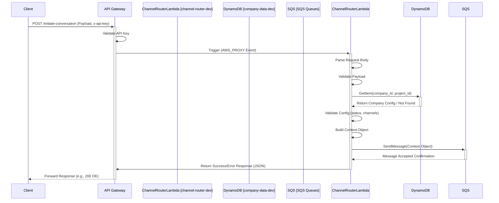

# Channel Router Lambda - Low-Level Design (LLD) - v1.0

## 1. Introduction

This document provides the low-level design for the `channel-router-dev` Lambda function within the AI Multi-Communications Engine's development (`src_dev`) environment. Its primary purpose is to serve as the initial entry point for incoming communication requests via API Gateway. It validates the request, fetches company/project configuration, constructs a standardized `Context Object`, and routes the request to the appropriate downstream SQS queue based on the requested communication channel.

This document reflects the state of the service as deployed and tested following the initial build phase (Part 1 of `dev_imp_plan.md`).

## 2. Architecture Overview

The Channel Router Lambda operates within the following flow:

1.  **Client Request:** A client sends an HTTP POST request to the `/initiate-conversation` endpoint of the `ai-multi-comms-dev-api` API Gateway. The request must include a valid API key in the `x-api-key` header and a JSON body containing the conversation initiation payload.
2.  **API Gateway:** Validates the API key using a Usage Plan. If valid, it forwards the entire request (headers, body, etc.) to the `channel-router-dev` Lambda function via `AWS_PROXY` integration.
3.  **Lambda Execution:** The `channel-router-dev` Lambda is triggered.
4.  **Request Processing:** The Lambda function (`index.lambda_handler`) orchestrates the processing:
    *   Parses the incoming request body.
    *   Validates the structure and content of the payload.
    *   Extracts `company_id` and `project_id`.
    *   Fetches the corresponding configuration from the `company-data-dev` DynamoDB table.
    *   Validates the fetched configuration (e.g., checks `project_status`, `allowed_channels`).
    *   Builds the standardized `Context Object` containing metadata, frontend payload, company config, and initial conversation data.
    *   Determines the target SQS queue URL based on the `channel_method` specified in the request.
    *   Sends the `Context Object` as a message to the target SQS queue.
5.  **SQS Queue:** The message containing the `Context Object` is queued for the downstream Channel Processor Lambda (e.g., `ai-multi-comms-whatsapp-queue-dev`).
6.  **Lambda Response:** The Lambda function formats and returns a success (HTTP 200) or error (HTTP 4xx/5xx) response to API Gateway.
7.  **API Gateway Response:** Forwards the Lambda's response back to the original client.

## 3. Component Details

### 3.1. API Gateway (`ai-multi-comms-dev-api`)

*   **Endpoint:** `/initiate-conversation`
*   **Method:** `POST`
*   **Authentication:** API Key (`x-api-key` header) validated via Usage Plan (`dev-usage-plan`).
*   **Integration:** `AWS_PROXY` integration with the `channel-router-dev` Lambda function.
*   **Reference:** `src_dev/docs & setup/lld/api_gateway.md`

### 3.2. Lambda Function (`channel-router-dev`)

*   **Runtime:** Python 3.x (e.g., 3.11)
*   **Handler:** `index.lambda_handler`
*   **Memory/Timeout:** Standard Lambda defaults (adjust as needed based on performance).
*   **Core Logic Flow (`index.lambda_handler`):**
    1.  Initialize logging.
    2.  Parse the request body using `request_parser.parse_request_body`.
    3.  Validate the parsed payload structure and required fields using `validators.validate_payload`.
    4.  Extract `company_id` and `project_id` from the payload.
    5.  Retrieve company configuration using `dynamodb_service.get_company_config`.
    6.  Validate the fetched company config (status, allowed channels) using `validators.validate_company_config`.
    7.  Build the context object using `context_builder.build_context_object`, passing the payload, config, and Lambda `VERSION`.
    8.  Determine the target SQS queue URL using `sqs_service.get_target_queue_url`.
    9.  Send the serialized context object to SQS using `sqs_service.send_message_to_sqs`.
    10. Build a success response using `response_builder.build_success_response`.
    11. Catch exceptions and build appropriate error responses using `response_builder.build_error_response`.
*   **Code Structure (`src_dev/channel-router/lambda/`):**
    *   `index.py`: Main handler, orchestrates calls to other modules.
    *   `core/context_builder.py`: Responsible for constructing the `Context Object`. Includes `build_context_object`, `generate_conversation_data_dict`, `_create_conversation_id`.
    *   `services/dynamodb_service.py`: Handles interaction with the `company-data-dev` table. Includes `get_company_config`.
    *   `services/sqs_service.py`: Handles interaction with SQS. Includes `get_target_queue_url`, `send_message_to_sqs`.
    *   `utils/request_parser.py`: Parses the incoming HTTP request body. Includes `parse_request_body`.
    *   `utils/validators.py`: Contains validation logic for payload and config. Includes `validate_payload`, `validate_company_config`.
    *   `utils/response_builder.py`: Formats HTTP success and error responses. Includes `build_success_response`, `build_error_response`.
*   **Error Handling:** Exceptions during processing (validation errors, DB errors, SQS errors) are caught in `index.py`. Specific error codes (e.g., `INVALID_PAYLOAD`, `COMPANY_NOT_FOUND`, `PROJECT_INACTIVE`, `INVALID_CHANNEL`, `SQS_SEND_ERROR`, `DATABASE_ERROR`) are mapped to appropriate HTTP status codes (400, 404, 403, 500) and returned in a structured JSON error response via `response_builder.build_error_response`.
*   **Logging:** Uses standard Python `logging`. Log level is configurable via the `LOG_LEVEL` environment variable. Logs are sent to CloudWatch Logs.

### 3.3. DynamoDB Table (`company-data-dev`)

*   **Purpose:** Stores company and project-specific configuration.
*   **Access:** Read-only access (`dynamodb:GetItem`) via the `get_company_config` function in `services/dynamodb_service.py`.
*   **Key Schema:**
    *   Partition Key: `company_id` (String)
    *   Sort Key: `project_id` (String)
*   **Relevant Attributes Used:** `project_status`, `allowed_channels`, `channel_config` (specifically nested config for the requested `channel_method`), `api_key_reference`.
*   **Reference:** `src_dev/docs & setup/lld/company-data-db-dev.md`

### 3.4. SQS Queues

*   **Purpose:** Decouple the Channel Router from downstream Channel Processors. Receives the `Context Object`.
*   **Queues Used (Initially):** `ai-multi-comms-whatsapp-queue-dev` (Standard Queue). Others like `email` and `sms` can be added later.
*   **Access:** Send-only access (`sqs:SendMessage`) via the `send_message_to_sqs` function in `services/sqs_service.py`.
*   **Queue Selection:** The target queue URL is determined by `get_target_queue_url` based on the `channel_method` from the request payload and cross-referenced with the `allowed_channels` from the company config.
*   **DLQ:** Each primary queue has an associated Dead Letter Queue (e.g., `ai-multi-comms-whatsapp-dlq-dev`) configured (Max Receives: 3).
*   **Reference:** `src_dev/docs & setup/lld/whatsapp-sqs-dlq-dev.md` (for WhatsApp queue details).

### 3.5. IAM Role (`ai-multi-comms-channel-router-dev-role`)

*   **Purpose:** Grants necessary permissions to the `channel-router-dev` Lambda function.
*   **Key Permissions:**
    *   `dynamodb:GetItem` on `company-data-dev` table ARN.
    *   `sqs:SendMessage` on target SQS queue ARNs (e.g., `ai-multi-comms-whatsapp-queue-dev`).
    *   `logs:CreateLogGroup`, `logs:CreateLogStream`, `logs:PutLogEvents` (via `AWSLambdaBasicExecutionRole` or similar).

## 4. Context Object Structure

The `Context Object` is the standardized data structure passed from the Channel Router to the downstream SQS queue. Its structure is primarily defined and generated by the `build_context_object` function within `core/context_builder.py`.

Key sections include:

*   **`metadata`**: Information about the routing process (router version, timestamps).
*   **`frontend_payload`**: The original validated payload received from the client.
*   **`company_data_payload`**: The relevant configuration data fetched from the `company-data-dev` table (with Decimals converted).
*   **`conversation_data`**: Initial conversation state information generated by `generate_conversation_data_dict` (includes `conversation_id`, `channel_metadata`, placeholders for status, messages, etc.).

Refer to `src_dev/channel-router/lambda/core/context_builder.py` for the definitive structure.

## 5. Deployment

*   **Method:** Manual deployment via AWS CLI.
*   **Package:** A `.zip` file created containing all code and dependencies from the `src_dev/channel-router/lambda/` directory.
*   **Command:** `aws lambda update-function-code --function-name channel-router-dev --zip-file fileb://deployment_package.zip` (or similar).

## 6. Configuration (Environment Variables)

The `channel-router-dev` Lambda function relies on the following environment variables:

*   **`COMPANY_TABLE_NAME_DEV`**: Name of the DynamoDB table holding company config (e.g., `company-data-dev`).
*   **`WHATSAPP_QUEUE_URL`**: The URL of the target SQS queue for WhatsApp messages.
*   **`EMAIL_QUEUE_URL`**: (If implemented) URL for the email SQS queue.
*   **`SMS_QUEUE_URL`**: (If implemented) URL for the SMS SQS queue.
*   **`LOG_LEVEL`**: Controls the logging verbosity (e.g., `INFO`, `DEBUG`). Defaults to `INFO`.
*   **`VERSION`**: The version identifier for this deployment of the Channel Router (e.g., `0.1.0`). Included in the Context Object metadata. 