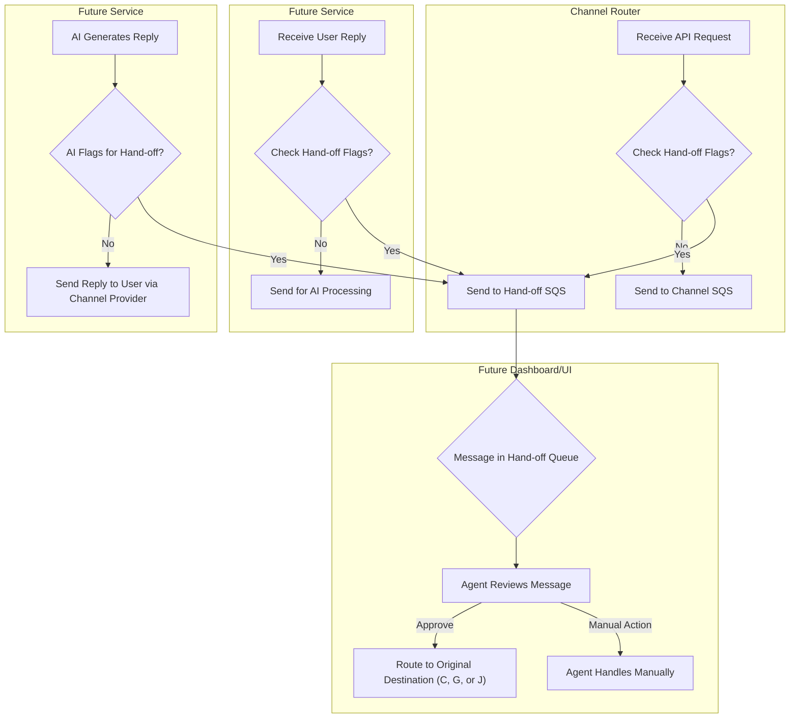

# Human Hand-off SQS Queue - Design Concept

## 1. Introduction

This document outlines the design concept for a human hand-off mechanism within the AI Multi-Communications Engine. The core component is a dedicated SQS queue, tentatively named `ai-multi-comms-handoff-queue-dev`, which serves as a staging area for messages requiring human review or intervention before proceeding through the standard automated flow (either initial sending via a channel or AI-powered reply generation).

This mechanism allows for greater control, quality assurance, and handling of edge cases or sensitive interactions.

## 2. Purpose

The primary goals of the hand-off queue are:

1.  **Pre-emptive Review (Initial Messages):** Allow administrators to configure specific projects or sender contacts (phone/email) so that *initial outgoing messages* are routed for human review *before* being sent to the channel SQS queue (e.g., WhatsApp queue).
2.  **Pre-emptive Review (Incoming Replies):** Allow administrators to configure specific projects or sender contacts so that *incoming user replies* are routed for human review *before* being processed by the AI for generating a subsequent response.
3.  **AI-Initiated Hand-off:** Enable the AI assistant processing replies to flag a conversation for human review based on its own analysis (e.g., detecting user frustration, confusion, requests to speak to a human, or tasks outside its scope).
4.  **Centralized Monitoring:** Provide a single point (the SQS queue and associated dashboard/UI) for human agents/admins to monitor and manage these flagged communications.

## 3. Architecture Overview

Messages are diverted to the `ai-multi-comms-handoff-queue-dev` under specific conditions, interrupting the standard flow:

*   **Initial Request Flow:** Instead of the Channel Router sending the `Context Object` directly to the channel-specific queue (e.g., `ai-multi-comms-whatsapp-queue-dev`), it sends it to the hand-off queue if configured conditions are met.
*   **Incoming Reply Flow (Future):** Instead of a reply processing service sending the user's reply context for AI processing, it sends it to the hand-off queue if configured conditions are met.
*   **AI Reply Flow (Future):** Instead of an AI processing service sending the AI-generated reply to the channel provider (e.g., Twilio), it sends the context/reply to the hand-off queue if the AI flags it for review.

## 4. Components

### 4.1. SQS Queue

*   **Name:** `ai-multi-comms-handoff-queue-dev` (Tentative)
*   **Type:** Standard SQS Queue.
*   **Purpose:** Holds messages (likely containing the full `Context Object` or a derivative structure including conversation state and reason for hand-off) awaiting human review.

### 4.2. Company Data Configuration (`company-data-dev` Table Fields)

These fields, added to the company/project configuration item, control the pre-emptive hand-off based on configuration:

*   `auto_queue_initial_message` (Boolean, default: `false`):
    *   If `true`, all *initial outgoing messages* for this project are routed to the hand-off queue, unless overridden by specific sender lists.
*   `auto_queue_initial_message_from_number` (List of Strings, default: `[]`):
    *   If `auto_queue_initial_message` is `true`, hand-off only applies if this list is empty OR if the recipient's phone number matches an entry in this list.
*   `auto_queue_initial_message_from_email` (List of Strings, default: `[]`):
    *   If `auto_queue_initial_message` is `true`, hand-off only applies if this list is empty OR if the recipient's email matches an entry in this list.
*   `auto_queue_reply_message` (Boolean, default: `false`):
    *   If `true`, all *incoming user replies* for this project are routed to the hand-off queue before AI processing, unless overridden by specific sender lists.
*   `auto_queue_reply_message_from_number` (List of Strings, default: `[]`):
    *   If `auto_queue_reply_message` is `true`, hand-off only applies if this list is empty OR if the sender's phone number matches an entry in this list.
*   `auto_queue_reply_message_from_email` (List of Strings, default: `[]`):
    *   If `auto_queue_reply_message` is `true`, hand-off only applies if this list is empty OR if the sender's email matches an entry in this list.

### 4.3. Conversation Data (`conversations-dev` Table Fields)

These fields, added to the conversation record, facilitate AI-initiated hand-off:

*   `hand_off_to_human` (Boolean, default: `false`):
    *   Set to `true` by the AI processing service if it determines human intervention is required for the *next* response.
*   `hand_off_to_human_reason` (String, default: `null`):
    *   Populated by the AI processing service with a brief explanation when `hand_off_to_human` is set to `true` (e.g., "User requested human agent", "Detected high user frustration", "Complex query requiring escalation").

## 5. Logic Implementation Points

Checks and routing logic need to be implemented in several places:

1.  **Channel Router Lambda (`channel-router-dev`):**
    *   **Location:** Likely within `index.lambda_handler` *before* calling `sqs_service.send_message_to_sqs` or potentially integrated into `validators.validate_company_config`.
    *   **Logic:** Check `auto_queue_initial_message`. If true, check `auto_queue_initial_message_from_number`/`email` against the recipient data. If conditions met, get the hand-off queue URL and send the `Context Object` there instead of the channel queue.
2.  **Incoming Reply Processor (Future Service):**
    *   **Location:** Within the service that receives incoming webhooks/callbacks from channel providers (e.g., Twilio).
    *   **Logic:** Before queuing the reply for AI processing, check `auto_queue_reply_message`. If true, check `auto_queue_reply_message_from_number`/`email` against the sender data. If conditions met, send the reply context to the hand-off queue instead of the AI processing queue.
3.  **AI Reply Processor (Future Service):**
    *   **Location:** Within the service that orchestrates AI reply generation (e.g., after receiving a response from OpenAI Assistant run).
    *   **Logic:** After the AI generates a reply, check the `conversation_data.hand_off_to_human` flag (which the AI run should have updated in the DB or returned in its response). If `true`, send the AI response context (including `hand_off_to_human_reason`) to the hand-off queue instead of sending the reply directly to the user via the channel provider.

## 6. Dashboard Functionality (Future)

A separate UI/Dashboard will be needed to:

*   Poll and display messages from the `ai-multi-comms-handoff-queue-dev`.
*   Show the reason for hand-off (configuration flag or AI reason).
*   Allow human agents/admins to:
    *   **Approve:** Release the message to its original intended destination (channel SQS queue, AI processing queue, or channel provider).
    *   **Reject/Handle Manually:** Take over the conversation, potentially sending a manual reply or closing the interaction.
    *   View conversation history.

## 7. Configuration

The `auto_queue_*` flags are configured per project within the `company-data-dev` DynamoDB table. This configuration will eventually be managed via an administrative interface linked to this table. 