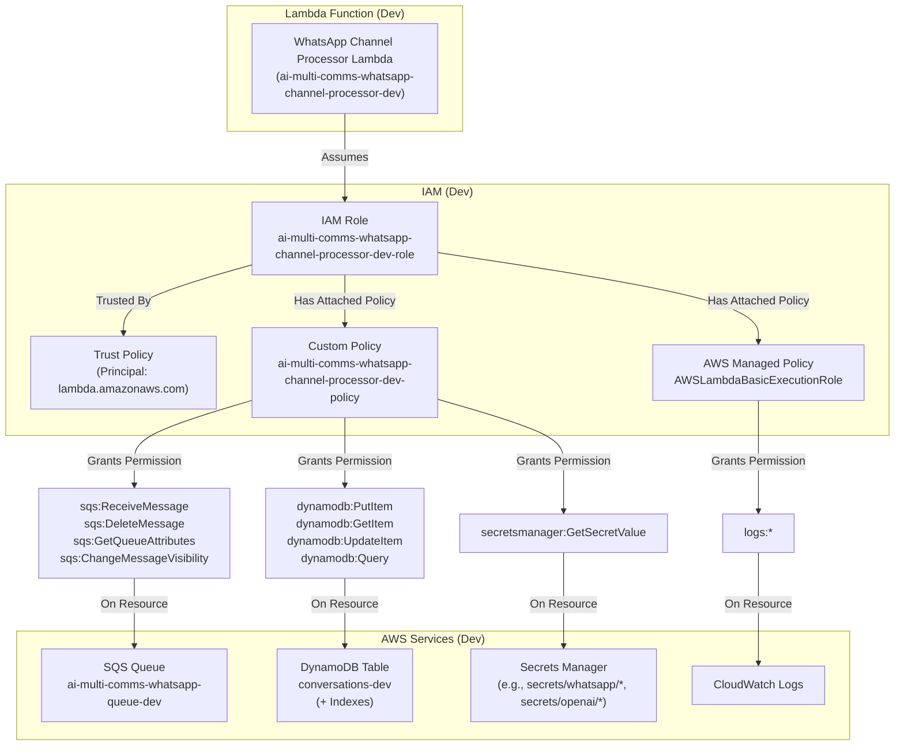

# IAM Role (WhatsApp Channel Processor - Dev) - Low-Level Design

## 1. Introduction

This document provides a detailed Low-Level Design (LLD) for the AWS Identity and Access Management (IAM) Role configured *initially* for the **WhatsApp Channel Processor Lambda function** within the **development environment** (`src_dev`) of the AI Multi-Communications Engine.

This role grants the Channel Processor Lambda (`ai-multi-comms-whatsapp-channel-processor-dev` - proposed function name) the necessary permissions to interact with other AWS services (SQS, DynamoDB, Secrets Manager, CloudWatch Logs) securely for processing WhatsApp messages, following the principle of least privilege.

This role will be implemented manually using the AWS CLI. As other channels (Email, SMS) are added, this policy may be updated, or separate roles/policies may be created.

## 2. Architecture Overview

### 2.1 Component Purpose

The `ai-multi-comms-whatsapp-channel-processor-dev-role` will serve as the execution identity for the WhatsApp Channel Processor Lambda function (`ai-multi-comms-whatsapp-channel-processor-dev`). It defines what AWS services and resources the Lambda function is authorized to access when it runs.

Key responsibilities granted by this role (for WhatsApp processing):
- Allow the Lambda service to assume this role.
- Allow the Lambda to write execution logs to CloudWatch Logs.
- Allow the Lambda to read/delete messages from the `ai-multi-comms-whatsapp-queue-dev` SQS queue and manage message visibility (heartbeat).
- Allow the Lambda to read, write, and update items in the `conversations-dev` DynamoDB table and its indexes.
- Allow the Lambda to retrieve specific secrets (e.g., Twilio, OpenAI credentials) from AWS Secrets Manager.

### 2.2 Position in System Architecture (Development)



### 2.3 Technical Implementation (Proposed)

-   **Service**: AWS Identity and Access Management (IAM)
-   **Deployment Method**: AWS CLI
-   **Role Name**: `ai-multi-comms-whatsapp-channel-processor-dev-role`
-   **Role ARN**: `arn:aws:iam::337909745089:role/ai-multi-comms-whatsapp-channel-processor-dev-role` (Generated)
-   **Custom Policy Name**: `ai-multi-comms-whatsapp-channel-processor-dev-policy`
-   **Custom Policy ARN**: `arn:aws:iam::337909745089:policy/ai-multi-comms-whatsapp-channel-processor-dev-policy` (Generated)

## 3. Detailed Design

### 3.1 Trust Relationship (AssumeRolePolicyDocument)

The role trusts the AWS Lambda service principal (`lambda.amazonaws.com`) to assume it via the `sts:AssumeRole` action.

```json
{
  "Version": "2012-10-17",
  "Statement": [
    {
      "Effect": "Allow",
      "Principal": {
        "Service": "lambda.amazonaws.com"
      },
      "Action": "sts:AssumeRole"
    }
  ]
}
```

### 3.2 Attached Policies

#### 3.2.1 `AWSLambdaBasicExecutionRole` (AWS Managed)

-   **ARN**: `arn:aws:iam::aws:policy/service-role/AWSLambdaBasicExecutionRole`
-   **Purpose**: Grants essential permissions for Lambda functions to write logs to CloudWatch Logs.

#### 3.2.2 `ai-multi-comms-whatsapp-channel-processor-dev-policy` (Custom - Default Version: v3)

-   **Purpose**: Grants specific permissions needed by the WhatsApp Channel Processor Lambda.
-   **Policy Document (Actual - v3)**:
    ```json
    {
        "Version": "2012-10-17",
        "Statement": [
            {
                "Sid": "AllowSQSAccessWhatsAppQueue",
                "Effect": "Allow",
                "Action": [
                    "sqs:ReceiveMessage",
                    "sqs:DeleteMessage",
                    "sqs:GetQueueAttributes",
                    "sqs:ChangeMessageVisibility"
                ],
                "Resource": "arn:aws:sqs:eu-north-1:337909745089:ai-multi-comms-whatsapp-queue-dev"
            },
            {
                "Sid": "AllowDynamoDBAccessConversationsTable",
                "Effect": "Allow",
                "Action": [
                    "dynamodb:PutItem",
                    "dynamodb:GetItem",
                    "dynamodb:UpdateItem",
                    "dynamodb:Query"
                ],
                "Resource": [
                    "arn:aws:dynamodb:eu-north-1:337909745089:table/conversations-dev",
                    "arn:aws:dynamodb:eu-north-1:337909745089:table/conversations-dev/index/*"
                ]
            },
            {
                "Sid": "AllowSecretsManagerAccess",
                "Effect": "Allow",
                "Action": "secretsmanager:GetSecretValue",
                "Resource": [
                    "arn:aws:secretsmanager:eu-north-1:337909745089:secret:whatsapp-credentials/*/*/twilio-*",
                    "arn:aws:secretsmanager:eu-north-1:337909745089:secret:openai-api-key/whatsapp-*"
                ]
            }
        ]
    }
    ```

    **Note on Secrets Manager Wildcards:**
    The wildcards (`*`) used in the `Resource` ARNs for the `secretsmanager:GetSecretValue` action are intentional. They allow this single policy to grant access to secrets created for new companies and projects (e.g., `whatsapp-credentials/new-company/new-project/twilio`) without requiring manual IAM policy updates for each onboarding. While runtime access is still limited by the specific secret reference requested by the Lambda, this pattern-based approach is necessary for operational scalability in a multi-project system, balancing strict least privilege with maintainability.

## 4. Deployment & Management

-   **Deployment Tool**: AWS CLI
-   **Creation Steps**:
    1.  Define trust policy JSON.
    2.  Create role using `aws iam create-role` with the trust policy.
    3.  Attach `AWSLambdaBasicExecutionRole` using `aws iam attach-role-policy`.
    4.  Define custom policy JSON (using correct REGION/ACCOUNT_ID).
    5.  Create custom policy using `aws iam create-policy`.
    6.  Attach custom policy using `aws iam attach-role-policy`.
-   **Modification**: Permissions can be updated by editing the custom policy (`aws iam create-policy-version`) or attaching/detaching other policies.

## 5. Security Considerations

-   **Least Privilege**: The custom policy grants only the necessary actions on the specific development resources required for the Channel Processor's function.
-   **Resource Specificity**: Permissions are restricted to specific SQS queues, DynamoDB tables/indexes, and Secrets Manager path patterns.
-   **Future Permissions**: As other channels (Email, SMS) are implemented, the policy might need adjustments (e.g., adding permissions for their respective SQS queues if this Lambda handles them, or creating separate roles/policies).

## 6. Future Enhancements (Development Context)

-   Refine Secrets Manager resource paths if naming conventions change.
-   Consider separate roles/policies if Email/SMS processing logic becomes significantly different or requires vastly different permissions. 