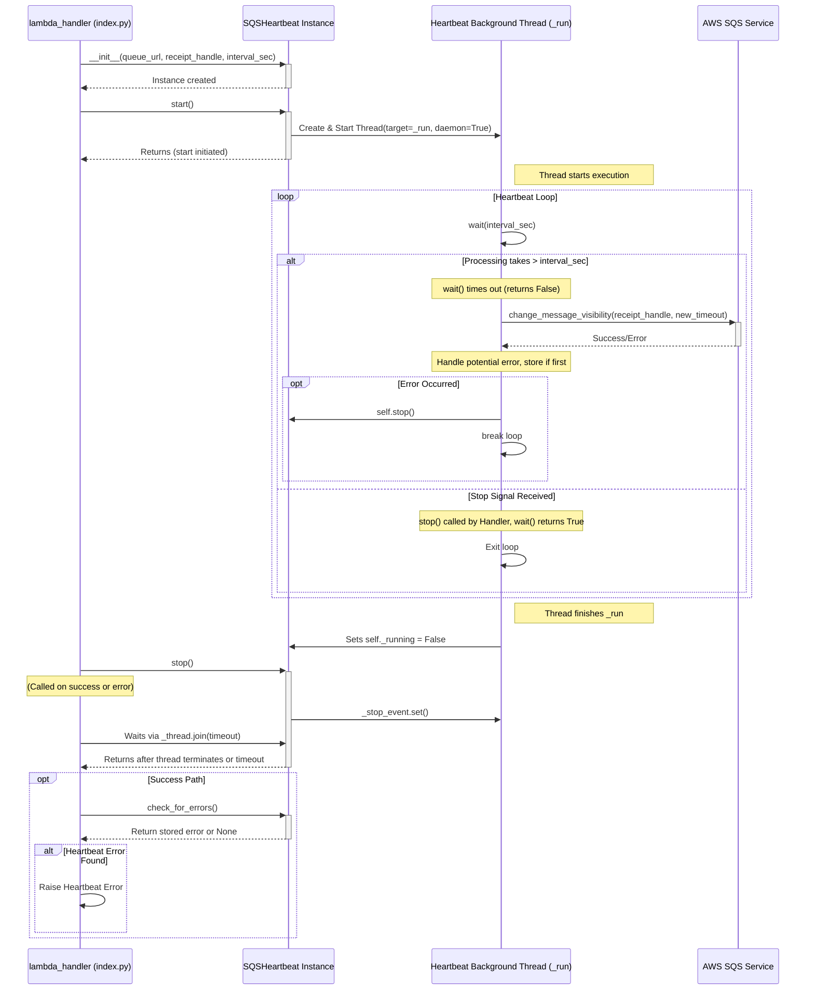

# SQS Heartbeat Utility - Low-Level Design

## 1. Introduction

This document provides the Low-Level Design (LLD) for the `SQSHeartbeat` utility class located at `src_dev/channel-processor/whatsapp/lambda/utils/sqs_heartbeat.py`.

The primary purpose of this utility is to prevent premature SQS message reprocessing when the Channel Processor Lambda (`whatsapp-channel-processor-dev`) performs long-running tasks, specifically interactions with external APIs like OpenAI, which might exceed the SQS queue's configured visibility timeout. It achieves this by periodically extending the message's visibility timeout using a background thread.

## 2. Component Overview

### 2.1 Purpose & Functionality

-   **Visibility Timeout Extension:** The core function is to call the AWS SQS `ChangeMessageVisibility` API for a specific message (`receiptHandle`) before its current timeout expires.
-   **Background Operation:** Runs in a separate background `threading.Thread` to avoid blocking the main Lambda processing logic.
-   **Graceful Control:** Provides `start()` and `stop()` methods for the main thread to manage the background thread's lifecycle.
-   **Error Handling:** Captures errors occurring within the background thread (e.g., AWS API errors, unexpected exceptions) and makes them accessible to the main thread via `check_for_errors()`.
-   **State Management:** Uses `threading.Event` for signaling stop requests and `threading.Lock` for thread-safe access to shared state variables (error status, running flag).
-   **Daemon Thread:** The background thread is configured as a daemon thread (`daemon=True`) so it doesn't prevent the Lambda execution environment from shutting down once the main handler finishes.

### 2.2 Interaction Flow

## 3. Class Structure (`SQSHeartbeat`)

### 3.1. `__init__(self, queue_url, receipt_handle, interval_sec, visibility_timeout_sec)`

-   **Purpose:** Initializes the heartbeat instance.
-   **Parameters:**
    -   `queue_url` (str): URL of the SQS queue.
    -   `receipt_handle` (str): Receipt handle of the message.
    -   `interval_sec` (int): How often (in seconds) to attempt extension.
    -   `visibility_timeout_sec` (int, optional): The new timeout duration (in seconds) to set on each extension. Defaults to 600 seconds.
-   **Logic:**
    -   Validates input parameters (non-empty URL/handle, positive interval, timeout > interval).
    -   Stores parameters as instance variables.
    -   Initializes internal state: `_stop_event` (threading.Event), `_thread` (None), `_error` (None), `_running` (False), `_lock` (threading.Lock).
    -   Initializes `_sqs_client` (boto3.client('sqs')) with error handling.

### 3.2. `_run(self)`

-   **Purpose:** The target function executed by the background thread. Contains the main heartbeat loop.
-   **Logic:**
    -   Loops indefinitely (`while not self._stop_event.wait(self.interval_sec)`):
        -   The `wait()` pauses execution for `interval_sec` or until `_stop_event` is set.
        -   If `wait()` returns `False` (timeout occurred), it proceeds.
        -   Calls `self._sqs_client.change_message_visibility(...)`.
        -   Handles `ClientError` and general `Exception`:
            -   Logs the error.
            -   Stores the *first* encountered error in `self._error` (protected by `self._lock`).
            -   Calls `self.stop()` to signal termination.
            -   Breaks the loop.
    -   After the loop finishes (normally or via break), sets `self._running = False` (protected by `self._lock`).

### 3.3. `start(self)`

-   **Purpose:** Starts the background heartbeat thread. Called by the main application thread.
-   **Logic:**
    -   Uses `self._lock` for thread safety.
    -   Checks if already running; returns early if so.
    -   Resets `self._stop_event` and `self._error`.
    -   Creates `threading.Thread(target=self._run, daemon=True)`.
    -   Starts the thread via `self._thread.start()`.
    -   Sets `self._running = True`.

### 3.4. `stop(self)`

-   **Purpose:** Signals the background thread to stop and waits for it to terminate. Called by the main application thread.
-   **Logic:**
    -   Checks if the thread was ever started (`self._thread` is not None).
    -   Sets `self._stop_event` if not already set.
    -   Calls `self._thread.join(timeout=...)` to wait for the background thread to finish. Uses a timeout slightly longer than `interval_sec`.
    -   Logs a warning if the thread doesn't terminate within the timeout.
    -   Sets `self._thread = None`.

### 3.5. `check_for_errors(self)`

-   **Purpose:** Allows the main thread to retrieve any error captured by the background thread.
-   **Logic:**
    -   Uses `self._lock` for thread safety.
    -   Returns the value of `self._error`.

### 3.6. `running` (Property)

-   **Purpose:** Provides a thread-safe way to check if the heartbeat is currently active.
-   **Logic:**
    -   Uses `self._lock` for thread safety.
    -   Returns `True` only if `self._running` flag is true AND the `self._thread` object exists and `is_alive()`.

## 4. Configuration

-   **`interval_sec`:** Set during instantiation, typically derived from the `SQS_HEARTBEAT_INTERVAL_MS` Lambda environment variable (converted to seconds). Recommended to be significantly less than the SQS queue's visibility timeout.
-   **`visibility_timeout_sec`:** Set during instantiation, defaults to 600. Should ideally match the SQS queue's visibility timeout.

## 5. Dependencies

-   Python `threading` module.
-   `boto3` library.
-   AWS IAM permissions: The Lambda execution role needs `sqs:ChangeMessageVisibility` permission on the target queue ARN.

## 6. Integration Notes (`index.py`)

-   Import `SQSHeartbeat` from `.utils.sqs_heartbeat`.
-   Instantiate `SQSHeartbeat` after successfully parsing the SQS message and validating the context, ensuring `receiptHandle` is available.
-   Call `heartbeat.start()` immediately after instantiation.
-   Call `heartbeat.stop()` in both the success path (end of `try` block) and the error path (`except` block) to ensure the thread is properly stopped.
-   On the success path, *after* calling `heartbeat.stop()`, call `heartbeat.check_for_errors()`. If an error is returned, raise it to fail the overall message processing, as the visibility might not have been reliably maintained.
-   **Important Interaction:** AWS requires an SQS queue's visibility timeout to be >= the triggered Lambda's timeout. If the queue timeout needs to be increased to meet this requirement (e.g., queue=905s, lambda=900s), be aware of the `visibility_timeout_sec` parameter used by this class. If not specified during instantiation, it defaults to `DEFAULT_VISIBILITY_TIMEOUT_EXTENSION_SEC` (currently 600s). This means the heartbeat will extend the timeout *to* 600s, not the queue's full timeout. While this still prevents premature reprocessing, it's a suboptimal use of the full buffer. A future refinement could involve passing the queue's actual timeout to the `SQSHeartbeat` constructor. 