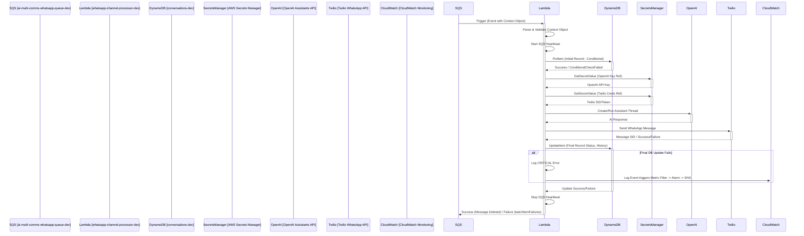

# WhatsApp Channel Processor Lambda - Low-Level Design (LLD) - v1.0

## 1. Introduction

This document provides the low-level design for the `whatsapp-channel-processor-dev` Lambda function within the AI Multi-Communications Engine's development (`src_dev`) environment. Its primary purpose is to process `Context Object` messages received from the `ai-multi-comms-whatsapp-queue-dev` SQS queue. It orchestrates interactions with DynamoDB, Secrets Manager, OpenAI, and Twilio to generate an AI response and send it via WhatsApp, ensuring idempotency and handling potential long-running tasks.

This document reflects the state of the service as deployed and tested following the initial build and monitoring setup phase (Part 2 of `dev_imp_plan.md`).

## 2. Architecture Overview

The WhatsApp Channel Processor Lambda operates within the following flow:

1.  **SQS Trigger:** The `ai-multi-comms-whatsapp-queue-dev` SQS queue triggers the `whatsapp-channel-processor-dev` Lambda upon receiving a message containing the `Context Object` from the Channel Router.
2.  **Lambda Execution:** The `whatsapp-channel-processor-dev` Lambda function (`index.lambda_handler`) is invoked with the SQS event payload.
3.  **Message Processing (Loop):** The handler iterates through each SQS record in the event.
4.  **Core Logic (Per Message):**
    *   Parses the `Context Object` from the SQS message body.
    *   Validates the `Context Object` structure and required fields.
    *   Initiates an SQS Heartbeat mechanism to extend message visibility during processing.
    *   Attempts to create an initial conversation record in the `conversations-dev` DynamoDB table idempotently (using `conversation_id` and `recipient_tel`).
    *   Fetches necessary credentials (OpenAI API Key, Twilio SID/Token) from AWS Secrets Manager using references in the `Context Object`.
    *   Interacts with the OpenAI Assistants API: creates/uses a thread, adds the message, runs the assistant, retrieves the response.
    *   Interacts with the Twilio WhatsApp API to send the AI-generated message to the recipient.
    *   Updates the conversation record in `conversations-dev` with the results (message history, status, thread ID, etc.).
    *   Stops the SQS Heartbeat mechanism.
5.  **SQS Message Handling:**
    *   If processing succeeds for a message, the handler finishes, and AWS automatically deletes the message from the SQS queue.
    *   If processing fails, the handler logs the error, attempts a final DB status update, stops the heartbeat, and signals failure to SQS (e.g., via `batchItemFailures`) to prevent deletion and allow retries/DLQ routing.
6.  **Monitoring:** Critical errors (specifically, failure to update DynamoDB after sending the message) are monitored via CloudWatch Logs Metric Filters and Alarms, triggering SNS notifications.

## 3. Component Details

### 3.1. SQS Trigger (`ai-multi-comms-whatsapp-queue-dev`)

*   **Purpose:** Provides `Context Object` messages to the Lambda.
*   **Configuration:** Configured as an event source for the `whatsapp-channel-processor-dev` Lambda.
*   **Visibility Timeout:** Increased to accommodate processing time (e.g., 6 minutes / 360 seconds). Managed by SQS Heartbeat during function execution.
*   **DLQ:** `ai-multi-comms-whatsapp-dlq-dev` (Max Receives: 3).
*   **Reference:** `src_dev/docs & setup/lld/whatsapp-sqs-dlq-dev.md`.

### 3.2. Lambda Function (`whatsapp-channel-processor-dev`)

*   **Runtime:** Python 3.x (e.g., 3.11)
*   **Handler:** `index.lambda_handler`
*   **Memory/Timeout:** Configured with sufficient memory and a timeout longer than the expected maximum processing time (e.g., 5 minutes / 300 seconds).
*   **Core Logic Flow (`index.lambda_handler`):**
    1.  Initialize logging.
    2.  Loop through SQS `Records`.
    3.  Inside loop:
        *   Extract `receiptHandle` and `body` (Context Object JSON).
        *   Deserialize and validate Context Object (`utils.context_processor`).
        *   Initialize and start `SQSHeartbeat` (`utils.sqs_heartbeat`).
        *   Initialize services (`DynamoDBService`, `SecretsManagerService`, `OpenAIProcessor`, `TwilioService`).
        *   Attempt idempotent conversation creation (`dynamodb_service.create_initial_conversation`). Handle `ConditionalCheckFailedException`.
        *   Fetch credentials (`secrets_manager_service.get_secrets`).
        *   Process with OpenAI (`openai_processor.process_request`).
        *   Send message via Twilio (`twilio_service.send_whatsapp_message`).
        *   Update conversation in DynamoDB (`dynamodb_service.update_conversation_after_send`). **Log CRITICAL on failure.**
        *   Stop SQS Heartbeat (`heartbeat.stop()`). Check for heartbeat errors.
        *   If any step fails, log error, attempt final DB status update (`dynamodb_service.update_conversation_status`), stop heartbeat, add `messageId` to `batchItemFailures`, and continue loop.
    4.  Return `{'batchItemFailures': [...]}`.
*   **Code Structure (`src_dev/channel-processor/whatsapp/lambda/`):**
    *   `index.py`: Main handler, SQS record loop, orchestration.
    *   `core/openai_processor.py`: Handles OpenAI API interactions.
    *   `services/dynamodb_service.py`: Handles `conversations-dev` table interactions (create, update).
    *   `services/secrets_manager_service.py`: Fetches secrets.
    *   `services/twilio_service.py`: Handles Twilio WhatsApp API interactions.
    *   `utils/context_processor.py`: Deserializes and validates the Context Object.
    *   `utils/sqs_heartbeat.py`: Manages `ChangeMessageVisibility` calls in a background thread.
    *   `utils/logging_config.py`: Configures logging.
*   **Idempotency:** Ensured by the conditional `PutItem` operation when creating the initial conversation record in DynamoDB. If the record already exists (due to SQS retry), the write fails gracefully, and processing continues.
*   **SQS Heartbeat:** The `SQSHeartbeat` class runs `sqs:ChangeMessageVisibility` in a background thread to prevent the message from becoming visible again on the queue during long processing steps (OpenAI, Twilio).

### 3.3. DynamoDB Table (`conversations-dev`)

*   **Purpose:** Stores conversation state, history, and metadata.
*   **Access:** Read/Write access via `services/dynamodb_service.py`.
    *   `PutItem` (conditional) for initial record creation.
    *   `UpdateItem` for adding messages, updating status, storing Thread ID, etc.
*   **Key Schema:**
    *   Partition Key: `recipient_tel` (String)
    *   Sort Key: `conversation_id` (String)
*   **Relevant Attributes:** `conversation_status`, `messages` (List), `openai_thread_id`, `task_complete`, `processing_time_ms`, etc.
*   **Reference:** `src_dev/docs & setup/lld/db/conversations-db-schema-v1.0.md` (Defines full schema).

### 3.4. AWS Secrets Manager

*   **Purpose:** Securely stores API keys and credentials.
*   **Access:** Read-only access (`secretsmanager:GetSecretValue`) via `services/secrets_manager_service.py`.
*   **Secrets Used:** Secrets corresponding to `whatsapp_credentials_id` and `ai_api_key_reference` found in the Context Object.

### 3.5. OpenAI Assistants API

*   **Purpose:** Generate AI responses based on the user request and assistant configuration.
*   **Access:** Via `core/openai_processor.py` using fetched API key.

### 3.6. Twilio WhatsApp API

*   **Purpose:** Send the generated message via WhatsApp.
*   **Access:** Via `services/twilio_service.py` using fetched Account SID and Auth Token.

### 3.7. IAM Role (`ai-multi-comms-whatsapp-processor-dev-role`)

*   **Purpose:** Grants necessary permissions to the `whatsapp-channel-processor-dev` Lambda function.
*   **Key Permissions:**
    *   `sqs:ReceiveMessage`, `sqs:DeleteMessage`, `sqs:GetQueueAttributes` (implicitly via trigger).
    *   `sqs:ChangeMessageVisibility` on `ai-multi-comms-whatsapp-queue-dev` ARN (for Heartbeat).
    *   `dynamodb:PutItem`, `dynamodb:UpdateItem` on `conversations-dev` table ARN.
    *   `secretsmanager:GetSecretValue` on relevant secret ARNs.
    *   `logs:CreateLogGroup`, `logs:CreateLogStream`, `logs:PutLogEvents` (via `AWSLambdaBasicExecutionRole` or similar).
    *   Permissions for OpenAI and Twilio API calls (if routing through AWS services like PrivateLink, otherwise network access needed).

### 3.8. CloudWatch Monitoring

*   **Purpose:** Alert on critical failures, specifically the "message sent but final DB update failed" scenario.
*   **Components:**
    *   Metric Filter: `FinalDbUpdateFailureFilter-Dev` on log group `/aws/lambda/whatsapp-channel-processor-dev`.
    *   Custom Metric: `FinalDbUpdateFailureCount` in `AIComms/WhatsAppProcessor/Dev` namespace.
    *   Alarm: `WhatsAppProcessorFinalDbUpdateFailureAlarm-Dev`.
    *   SNS Topic: `ai-comms-critical-alerts-dev` for notifications.
*   **Reference:** `src_dev/docs & setup/lld/cloudwatch-critical-db-failure-alert.md`.

## 4. Error Handling

*   **General Errors:** Validation failures, credential fetch errors, API call errors (OpenAI, Twilio), initial DB write failures (other than conditional check) are caught.
*   **Critical Error:** Failure in the *final* `update_conversation_after_send` DynamoDB call after a successful Twilio send is specifically logged as `CRITICAL` to trigger the CloudWatch alarm.
*   **SQS Handling:** For any unrecoverable error within a message's processing loop, the `messageId` is added to the `batchItemFailures` list returned by the Lambda handler. This tells SQS not to delete the message, allowing retries and eventual DLQ routing. The SQS Heartbeat is stopped gracefully in error scenarios.
*   **Logging:** Detailed error information is logged to CloudWatch Logs using the configured logger.

## 5. Deployment

*   **Method:** Manual deployment via AWS CLI.
*   **Package:** A `.zip` file (`whatsapp_processor_deployment_package.zip`) created containing all code from `src_dev/channel-processor/whatsapp/lambda/` and Python dependencies installed into a `package/` directory (which is included in the zip but cleaned up post-deployment).
*   **Command:** `aws lambda update-function-code --function-name whatsapp-channel-processor-dev --zip-file fileb://whatsapp_processor_deployment_package.zip` (or similar `create-function`).

## 6. Configuration (Environment Variables)

The `whatsapp-channel-processor-dev` Lambda function relies on the following environment variables:

*   **`CONVERSATIONS_TABLE_NAME_DEV`**: Name of the DynamoDB table for conversations (e.g., `conversations-dev`).
*   **`WHATSAPP_QUEUE_URL`**: URL of the SQS queue it processes (e.g., `ai-multi-comms-whatsapp-queue-dev`). Used by the SQS Heartbeat.
*   **`LOG_LEVEL`**: Controls logging verbosity (e.g., `INFO`, `DEBUG`). Defaults to `INFO`.
*   **`VERSION`**: Deployment version identifier (e.g., `0.1.0`). 