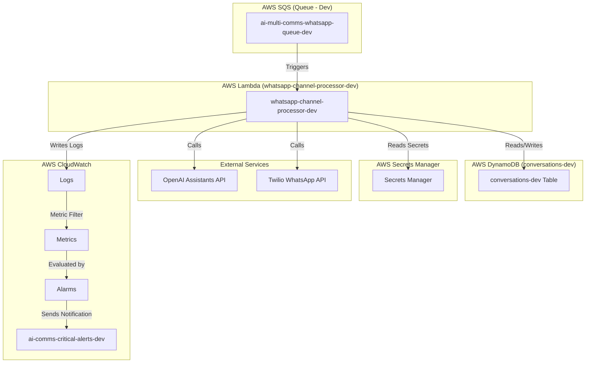
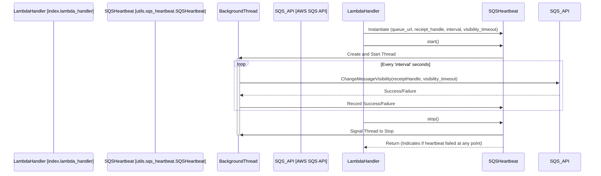
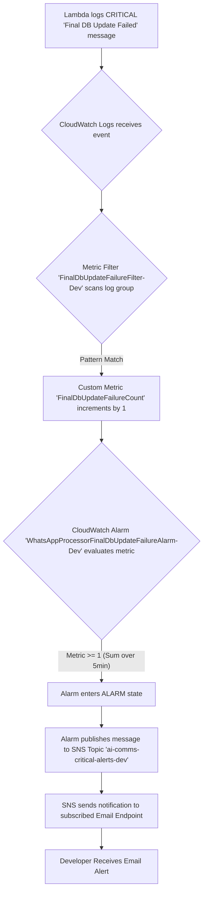
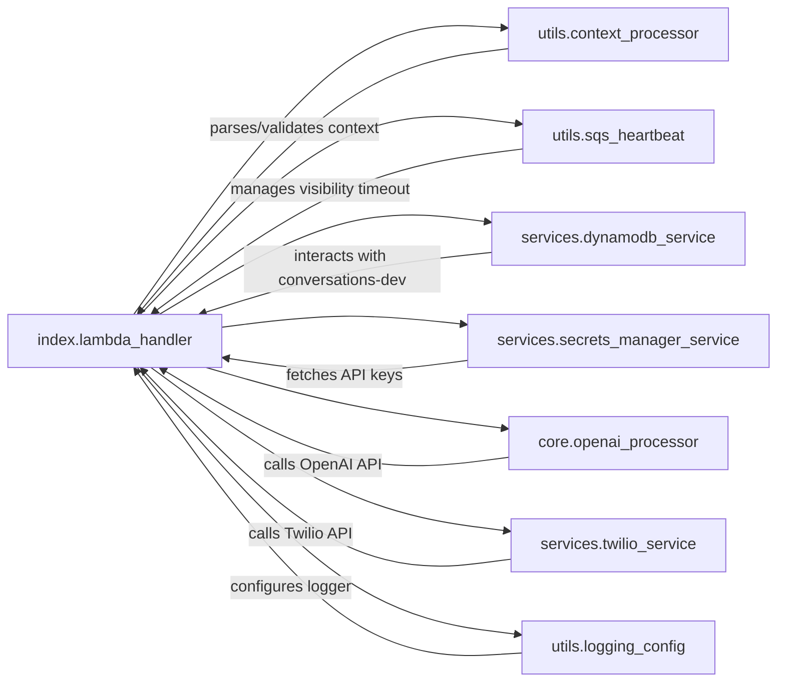

# WhatsApp Channel Processor - Diagrams

This document provides supplementary diagrams visualizing the data flows, structure, and interactions related to the WhatsApp Channel Processor Lambda (`whatsapp-channel-processor-dev`).

## 1. High-Level System Architecture (Development)

This diagram shows the main AWS services and external APIs involved in Part B (WhatsApp Channel Processor).



## 2. Detailed Sequence Diagram (Single Message Processing)

This diagram details the internal processing steps for a single SQS message received by the Lambda.

```mermaid
sequenceDiagram
    participant SQS
    participant Lambda [whatsapp-channel-processor-dev]
    participant HeartbeatThread
    participant DynamoDB [conversations-dev]
    participant SecretsManager
    participant OpenAI
    participant Twilio
    participant CloudWatch

    SQS->>+Lambda: SQS Event (Contains Message Record)
    Lambda->>Lambda: Parse Context Object from Body
    Lambda->>Lambda: Validate Context Object
    Lambda->>+HeartbeatThread: Start Heartbeat (receiptHandle)
    HeartbeatThread-->>Lambda: Heartbeat Started
    Lambda->>+DynamoDB: PutItem (Initial Record, Condition: attribute_not_exists(conversation_id))
    DynamoDB-->>-Lambda: Success or ConditionalCheckFailedException
    Lambda->>+SecretsManager: GetSecretValue (OpenAI Ref)
    SecretsManager-->>-Lambda: OpenAI Key
    Lambda->>+SecretsManager: GetSecretValue (Twilio Ref)
    SecretsManager-->>-Lambda: Twilio Credentials
    Lambda->>+OpenAI: Create/Run Assistant Thread
    OpenAI-->>-Lambda: AI Response
    Lambda->>+Twilio: Send WhatsApp Message
    Twilio-->>-Lambda: Success/Failure (Message SID)
    Lambda->>+DynamoDB: UpdateItem (Final Status, History, Thread ID)
    alt Final DB Update Fails
        Lambda->>Lambda: Log CRITICAL Error
        Lambda->>+CloudWatch: Log Event -> Metric -> Alarm -> SNS
        CloudWatch-->>-Lambda: (Error Logged)
        DynamoDB-->>-Lambda: Update Failure
        Lambda->>-HeartbeatThread: Stop Heartbeat
        Lambda-->>SQS: Return batchItemFailures (incl. this messageId)
    else Final DB Update Succeeds
        DynamoDB-->>-Lambda: Update Success
        Lambda->>-HeartbeatThread: Stop Heartbeat
        Lambda-->>-SQS: Success (AWS deletes message)
    end

```

## 3. SQS Heartbeat Mechanism

This diagram illustrates the operation of the SQS heartbeat utility.



## 4. CloudWatch Critical Alert Flow

Visualizes the flow from a critical log message to an email notification.



## 5. Lambda Module Interactions

Shows the primary call flow between Python modules within the `whatsapp-channel-processor-dev` Lambda.



## 6. Error Handling Flow (SQS Message Outcome)

Illustrates how different processing outcomes affect the SQS message handling.

```mermaid
graph TD
    Start[Lambda receives SQS message record] --> Process{Process Message}

    Process -- Success --> StopHeartbeatSuccess{Stop Heartbeat}
    StopHeartbeatSuccess -- OK --> FinishSuccess[Processing Complete: Message Deleted by AWS]
    StopHeartbeatSuccess -- Heartbeat Failed During Run --> LogHBError[Log Heartbeat Error]
    LogHBError --> ReportFailure[Report batchItemFailure]

    Process -- Validation Error --> ErrorPath{Log Error}
    Process -- Idempotency Check Failed (Already Processed) --> LogWarning[Log Warning]
    LogWarning --> StopHeartbeatWarning{Stop Heartbeat}
    StopHeartbeatWarning --> FinishSuccess 
    Process -- Credential Error --> ErrorPath
    Process -- OpenAI Error --> ErrorPath
    Process -- Twilio Error --> ErrorPath
    Process -- Final DB Update Error (CRITICAL) --> CriticalErrorPath{Log CRITICAL Error}
    Process -- Other DB Error --> ErrorPath

    ErrorPath --> AttemptFinalDBUpdate{Attempt Final DB Status Update (Failed)}
    AttemptFinalDBUpdate --> StopHeartbeatError{Stop Heartbeat}
    StopHeartbeatError --> ReportFailure

    CriticalErrorPath --> TriggerAlarm[Trigger CloudWatch Alarm]
    TriggerAlarm --> AttemptFinalDBUpdate

    ReportFailure --> FinishFailure[Processing Failed: Return messageId in batchItemFailures]
``` 